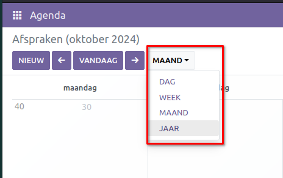
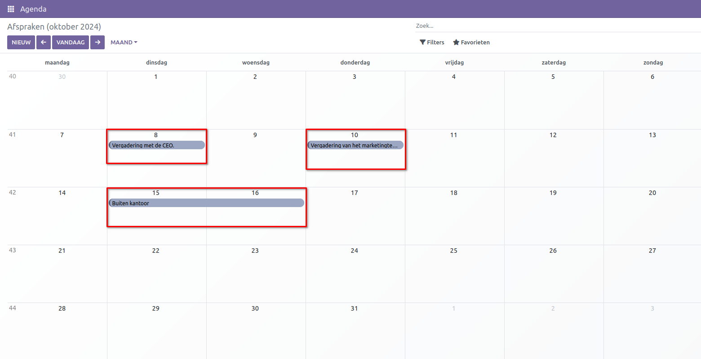
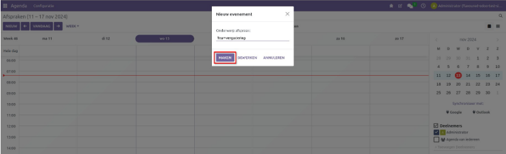
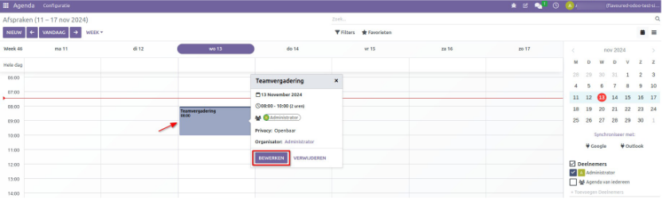
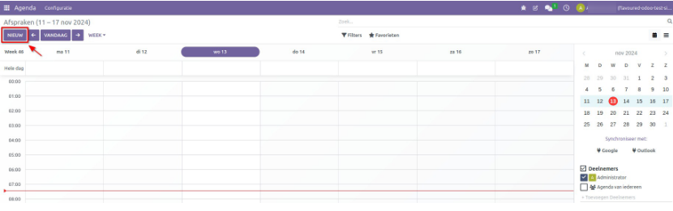
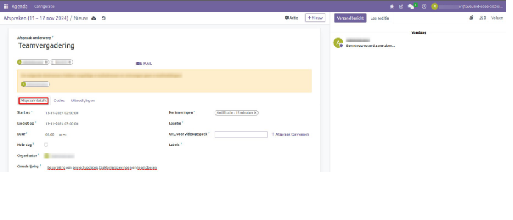
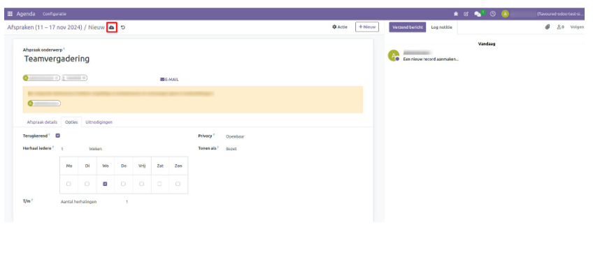
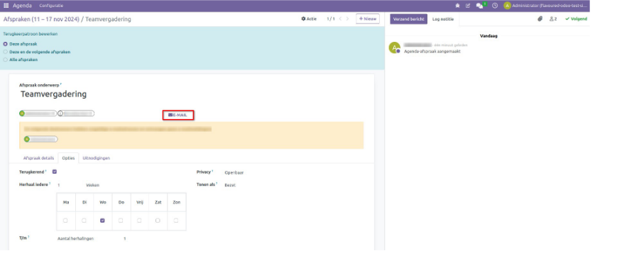
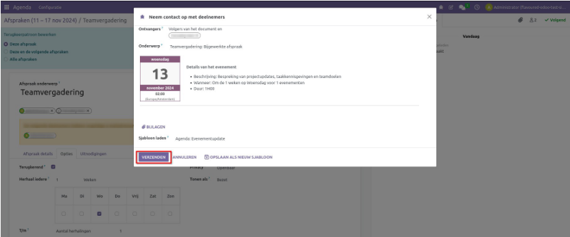
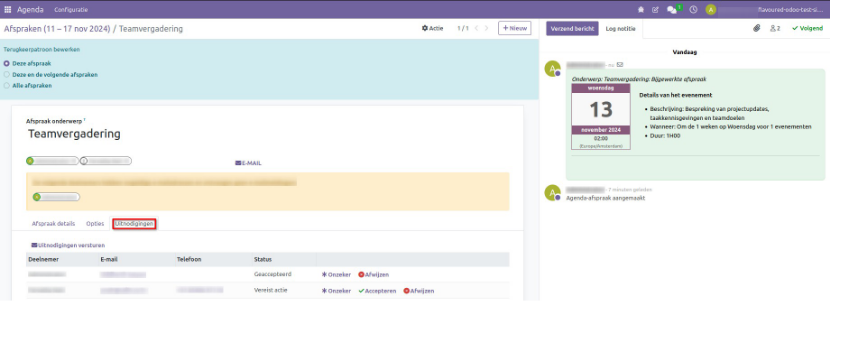

**Kalender**
============
CURQ **Kalender** is een planningsapp die gebruikers in staat stelt om de bedrijfsstroom van een bedrijf te integreren in één beheersplatform. Door integratie met de andere apps in het ecosysteem van CURQ stelt **Kalender** gebruikers in staat om vergaderingen te plannen en te organiseren, evenementen in te plannen, beoordelingsgesprekken voor werknemers te plannen, projecten te coördineren en meer – alles vanuit hetzelfde platform.

Bij het openen van de *Kalender-app* hebben gebruikers een overzicht van hun huidige vergaderingen. De geselecteerde weergave-optie verschijnt als een dropdownmenu voor **Dag, Week, Maand of Jaar**. Onder het dropdownmenu voor weergave-opties kunnen gebruikers ook de optie **'Toon weekenden'** in- of uitschakelen.

**Tip** - Afhankelijk van de geselecteerde weergave-optie kunnen gebruikers op de (links of rechts pijltje) knoppen klikken om tussen dagen, weken, enzovoort te schakelen, en terug te schakelen naar de  huidige dag met de knop Vandaag.

1.2 Een evenement maken en bewerken
====================================

CURQ Calendar stelt je in staat om een evenement op twee manieren te maken:
1.2.1 Dubbelklik op een tijdslot in de overzichtsectie.
1.2.2 Klik op de knop **'Nieuw'** in de overzichtsectie.

1.2.1 Dubbelklik op een tijdslot
--------------------------------

Door op een specifiek tijdslot te dubbelklikken, verschijnt er een nieuw evenement venster op het scherm. Voer **Onderwerp afspraak** en klik op de knop **'Maken'**.

Nadat je hebt geklikt, wordt het nieuwe evenement aangemaakt en zichtbaar in de kalender overzichtsectie. Om het evenement te bewerken, plaats je de cursor op het nieuw aangemaakte evenement, klik je erop en klik je vervolgens op de kn op **"Bewerken"**. Dit opent een formulier waarin je de evenementgegevens kunt invoerenof bewerken.

1.2.2 Van de 'Nieuw' knop in de overzichtsectie
------------------------------------------------

Klik op de knop "Nieuw" in de linkerbovenhoek van de overzichtsectie.

- Een nieuw **Afspraken formulier** verschijnt op het scherm. Voer eerst het **'Afspraak onderwerp'** in het lege veld in. 
- Selecteer vervolgens de mensen die de bijeenkomst zullen bijwonen. 
- Onder het **Afspraken details** tabblad, Selecteer de tijden **'Start op'** en **'Eindig op'** met behulp van de kalenderwidget. 
- Het **duurveld** wordt automatisch berekend op basis van de geselecteerde tijd en datum. 
- Een selectievakje geeft aan of het evenement de **hele dag** duurt. 
- Indien geselecteerd, wordt het duurveld verwijderd uit het **Afspraken formulier**. 
- Het veld Organisator wordt automatisch ingevuld op basis van de gebruikerslogin. 
- Je kunt de **Organisator** wijzigen of aanmaken indien nodig.
- Voeg een **Omschrijving** toe voor het evenement. 
- Stel een **herinnering** in als je wilt, en voer de **locatie** van het evenement in indien van toepassing. 
- Voer de **URL voor videogesprek** in het daarvoor bestemde tekstvak in, en voeg **Labels** toe voor het evenement indien gewenst.

Onder het tabblad **Opties**, als het selectievakje voor **'Terugkerend'** is geselecteerd, Het stelt je in staat om het evenement voor een willekeurig aantal **weken** te herhalen en je kunt ook de **dagen** selecteren waarop de vergadering herhaald moet worden. Je kunt ook het **aantal herhalingen** kiezen, een **einddatum**, of **voor altijd** vanuit de **'T/m'** optie. Selecteer of het **openbaar**, **privé**, of voor **alleen interne gebruikers** is vanuit het **privacy** dropdownmenu. Selecteer of het **beschikbaar** of **bezet** is vanuit het **Tonen als** dropdownmenu.

.. image:: Agenda_Media/Agenda007.png

Klik tenslotte op het opslaan-icoon, weergegeven door een wolk met een omhoog wijzende pijl.

Klik op de **e-mail** knop om de e-mail naar de geselecteerde vergaderingdeelnemer te sturen.

Er verschijnt een nieuw dialoogvenster met de **Afspraken details**. Klik op de knop **'verzenden'** om de e-mail te verzenden, en deze wordt automatisch naar de geselecteerde **ontvangers** gestuurd.

Om de **status** van het evenement te controleren, ga naar het tabblad **Uitnodigingen**.

