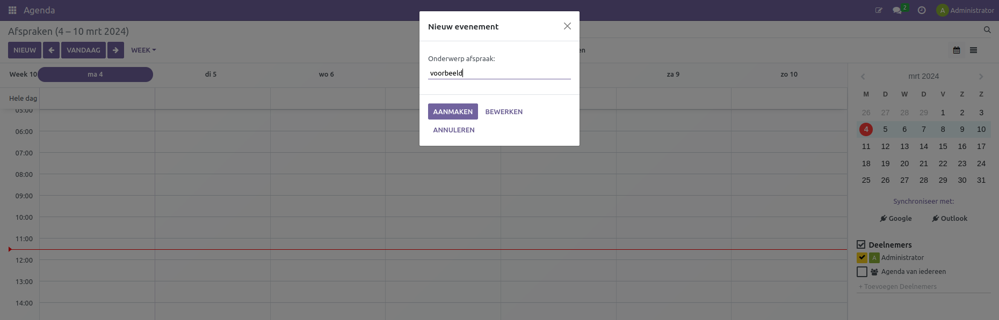
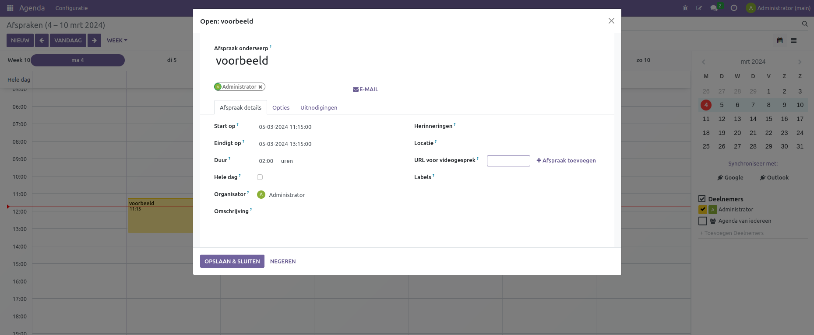
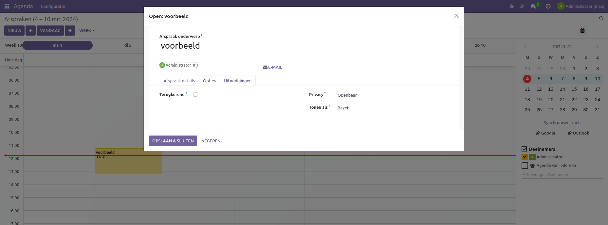
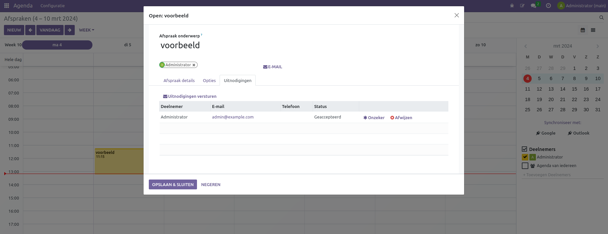

Agenda
====================================================================

De calender module zit door veel van de modules in curq gewoven. De module registreert en beheert alle afspraken, urenstaten en andere gerelateerde informatie.

In de calender module kunnen direct afspraken gemaakt worden. door op een tijdstip dubbel te klikken wordt op dit tijdstip een afspraak aangemaakt worden. we wordt dan een scherm geopend.
Hier kan een naam aan de afspraak gegeven worden.

Door de afspraak te selecteren kunnen aanpassingen gemaakt worden van name de naam en kunnen andere contacten en gebruikers aan de afspraak worden toegevoegd. 
Onder het Afspraak details tabblad worden velden getoont zoals de start, eindtijd en duur. ook kan geselecteerd worden of de afspraak heel de dag duurt.
De organisator kan worden ingestelds met een herinering en locatie, er kan tevens een url worden opgegeven voor een videogesprek.
Als laatst kunnen er labels en een omgschrijving worden opgegeven.

Onder opties kan worden ingesteld of de afspraak terugkerend is, de afspraak openbaar of prive is en of de afspraak getoond wordt als beschikbaar of bezet.

Onder de uitnodigingen tab kunnen alle uitgenoodigde contacten worden bekeken met de e-mail, telefoonnummer en de status van de acceptatie. Door het uitnodigingen versturen kan een email worden verstuurd on de leden uit te nodigen.

De calender kan niet alleen alle afspraken bij houden maar ook de afspraken van nextcloud door een conectie te maken met een nextcloud account. Er kan echter maar een nextcloud profiel worden gekoppeld per gebruiker.
