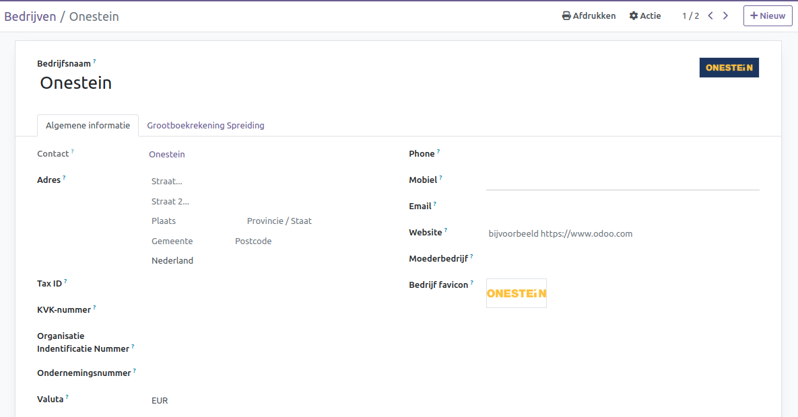
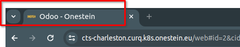
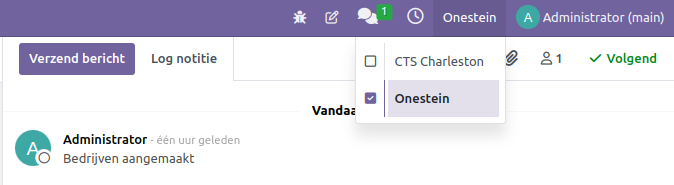
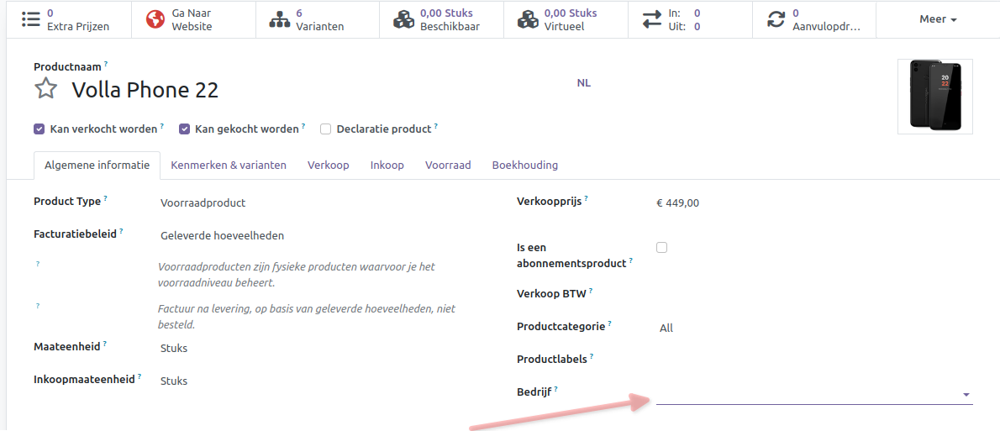
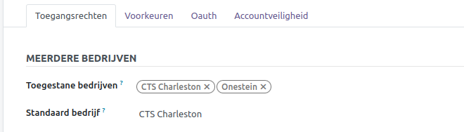
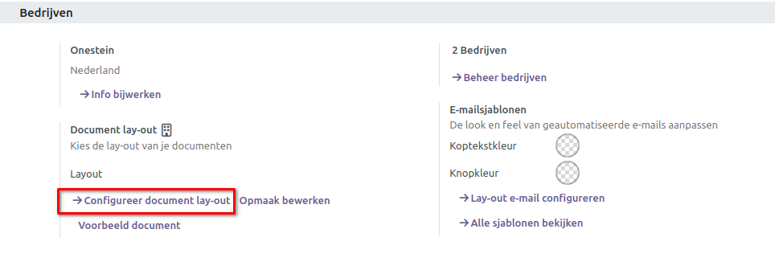

=================
Bedrijven in Curq 
=================

Met een gecentraliseerde beheeromgeving zoals Curq kun je meerdere bedrijven tegelijk selecteren en hun specifieke magazijnen, klanten en contactpersonen instellen. Dit biedt de mogelijkheid om bijvoorbeeld rapporten te genereren zonder van interface te hoeven wisselen, wat de dagelijkse taken en het algehele beheer proces vergemakkelijkt.

Bedrijven en records beheren
----------------------------

Navigeer naar **Instellingen ‣ Bedrijven beheren** en vul het formulier in met de gegevens van het bedrijf. Als een moederbedrijf is geselecteerd, worden records gedeeld tussen de twee bedrijven (zolang beide omgevingen actief zijn).

Tip:
Activeer de ontwikkelaarsmodus om een Favicon te kiezen voor elk van de bedrijven, zodat ze gemakkelijk te herkennen zijn aan de browsertabbladen. Stel de bestandsgrootte van uw favicons in op 16x16 of 32x32 pixels. JPG, PNG, GIF en ICO zijn geaccepteerde bestandsextensies.

Schakelen tussen of selecteren van meerdere bedrijven (v.a. Growth & Professional
---------------------------------------------------------------------------------
Activeer bedrijven door hun selectievakjes in te schakelen om ze te activeren. Het grijs weergegeven bedrijf is de omgeving die momenteel in gebruik is. Klik op de naam van het bedrijf om van omgeving te wisselen. Bijvoorbeeld, in het onderstaande voorbeeld heeft de gebruiker toegang tot twee bedrijven, waarvan er één geactiveerd is en waarbij de omgeving van Onestein momenteel in gebruik is.

Gegevens zoals *Producten* en *Contacten* kunnen worden gedeeld of ingesteld om alleen voor een specifiek bedrijf te worden weergegeven. Een voorbeeld vind je hieronder van een product waarbij je in veld *Bedrijf* kan kiezen tussen:

1. Een leeg veld: het record wordt gedeeld binnen alle bedrijven.
2. Een specifiek bedrijf toevoegen: het record is alleen zichtbaar voor gebruikers die zijn aangemeld bij dat specifieke bedrijf.

Toegang werknemers
------------------

Zodra bedrijven zijn aangemaakt, kun je de toegangsrechten van de medewerkers beheren voor meerdere bedrijven.

Wanneer een gebruiker meerdere bedrijven heeft geactiveerd in zijn database en hij bewerkt een record, wordt de bewerking toegepast op het gerelateerde bedrijf van het record. Bijvoorbeeld, als je een verkooporder bewerkt die is uitgegeven onder bedrijf A terwijl je werkt in de omgeving van bedrijf B, dan worden de wijzigingen toegepast onder bedrijf A (het bedrijf van waaruit de verkooporder is uitgegeven).

Layout van documenten
---------------------

Om de opmaak van documenten per bedrijf in te stellen, kun je de volgende stappen volgen: 

1. Activeer en selecteer het relevante bedrijf.
2. Navigeer naar Instellingen en klik op *Configureer document lay-out*.

Transacties tussen bedrijven (v.a. Growth & Professional)
---------------------------------------------------------

Om transacties tussen bedrijven mogelijk te maken, moet je er eerst voor zorgen dat elk van de bedrijven correct is ingesteld met betrekking tot:

1. Rekeningschema
2. Belastingen
3. Fiscale posities
4. Journalen
5. Fiscale lokalisaties
6. Prijslijsten

Vervolgens heb je de optie *Intercompany transacties* te activeren onder **Instellingen**. Je krijgt de mogelijkheid om transacties tussen bedrijven te synchroniseren op factuurniveau of op verkoop- inkoopniveau.

.. image:: Media/014.png

**Facturen synchroniseren**: Hierbij wordt een factuur gegenereerd wanneer bedrijf A een factuur bevestigt aan bedrijf B. Bijvoorbeeld: een factuur die in bedrijf A is geplaatst voor bedrijf B, maakt automatisch een leveranciersfactuur aan in bedrijf B voor bedrijf A. 

**Verkoop-/inkooporder synchroniseren**: Dit genereert een concept inkoop-/verkooporder met gebruikmaking van het geselecteerde bedrijfsmagazijn wanneer een verkoop-/inkooporder voor het geselecteerde bedrijf wordt bevestigd. Als je wilt dat de inkoop-/verkooporder automatisch wordt gevalideerd in plaats van dat deze wordt opgesteld, schakel je Automatische validatie in. Bijvoorbeeld: wanneer een verkooporder voor bedrijf B wordt bevestigd in bedrijf A, dan wordt er automatisch een inkooporder opgesteld in bedrijf B (en wordt deze bevestigd als de functie Automatische validatie is ingeschakeld).

Note! Producten moeten geconfigureerd worden als *Kan verkocht worden* en gedeeld worden tussen de verschillende bedrijven.

