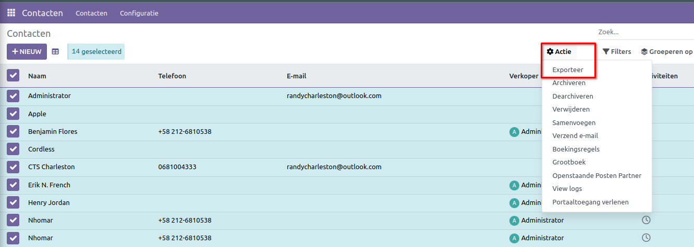
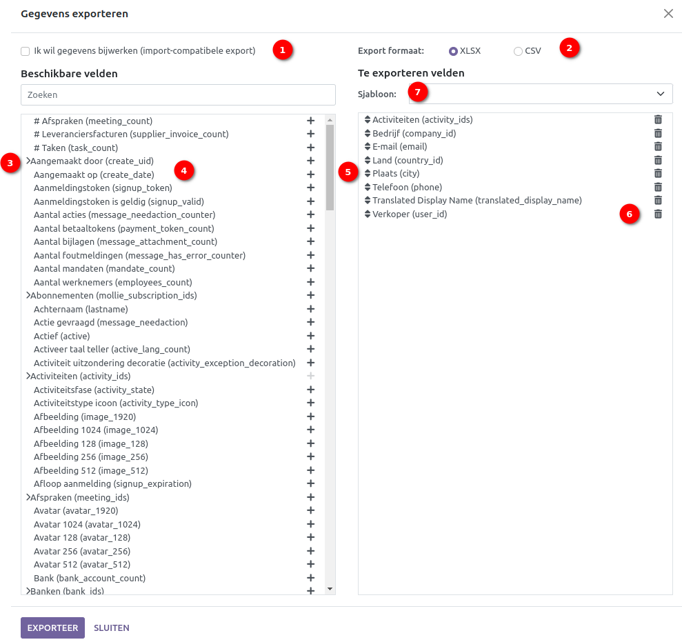
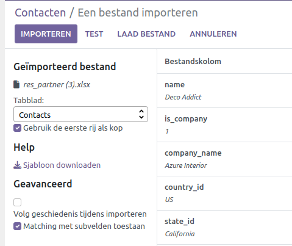
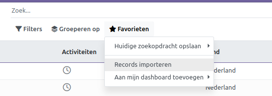
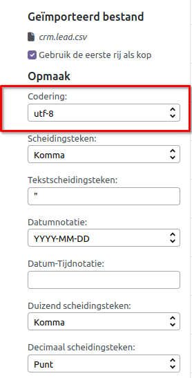
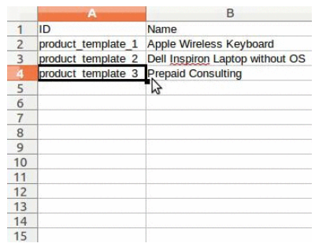
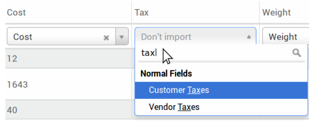

====================
Export & import data
====================

In Curq is het soms nodig om gegevens te exporteren of importeren voor het uitvoeren van rapporten of voor gegevens aanpassingen. Dit document behandelt het exporteren en importeren van gegevens naar en uit Curq. 

*Belangrijk! Soms krijgen gebruikers een 'time-out' foutmelding of wordt een record niet verwerkt vanwege de grootte ervan. Dit kan voorkomen bij grote exports of in gevallen waar het importbestand te groot is. Om deze beperking met betrekking tot de grootte van de records te omzeilen, moet u exports of imports uitvoeren in kleinere batches.*

Gegevens exporteren uit Curq
----------------------------
Bij het werken met een database is het soms nodig om gegevens in een apart bestand te exporteren. Dit kan helpen bij het rapporteren over activiteiten, hoewel Curq een nauwkeurige en eenvoudige rapportagetool biedt bij elke beschikbare toepassing.

Met Curq kunnen de gegevens worden geëxporteerd uit elk veld in elk record. Om dit te doen, activeer je de lijstweergave (☰ (drie horizontale lijnen) icoon) op de items die moeten worden geëxporteerd, en selecteert u vervolgens de records die moeten worden geëxporteerd. Om een record te selecteren, vinkt u het selectievakje aan naast het overeenkomstige record. Klik ten slotte op ⚙️ Actie en vervolgens op Export.

Wanneer je op *Exporteer* klikt, verschijnt er een pop-upvenster *Gegevens exporteren* met verschillende opties voor de 'te exporteren' gegevens:

1. Met optie **Ik wil gegevens bijwerken (exporteren die compatibel zijn met import)** aangevinkt, toont het systeem alleen de velden die kunnen worden geïmporteerd. Dit is handig in het geval dat de bestaande records moeten worden bijgewerkt. Dit werkt ook als een filter. Als het vak niet is aangevinkt, worden veel meer veldopties weergegeven omdat alle velden worden getoond, niet alleen degene die kunnen worden geïmporteerd.

2. Bij het exporteren is er de mogelijkheid om te exporteren in twee formaten: .csv en .xls. Met .csv worden items gescheiden door een komma, terwijl .xls informatie bevat over alle werkbladen in een bestand, inclusief zowel inhoud als opmaak.

3. Dit zijn de items die kunnen worden geëxporteerd. Gebruik het > (rechter pijl) icoon om meer subveld opties weer te geven. Gebruik de zoekbalk om specifieke velden te vinden. Om de zoekoptie efficiënter te gebruiken, klik je op alle > (rechter pijlen) om alle velden weer te geven.

4. Het knopje met het + (plusteken) icoon is aanwezig om velden toe te voegen aan de lijst met te exporteren velden.

5. De ↕️ (omhoog-omlaag pijl) links van de geselecteerde velden kan worden gebruikt om de velden omhoog en omlaag te verplaatsen, om de volgorde te wijzigen waarin ze worden weergegeven in het geëxporteerde bestand. Versleep met behulp van het ↕️ (omhoog-omlaag pijl) icoon.

6. Het 🗑️ (prullenbak) icoon wordt gebruikt om velden te verwijderen. Klik op het 🗑️ (prullenbak) icoon om het veld te verwijderen.

7. Voor terugkerende rapporten is het handig om exportinstellingen op te slaan. Selecteer alle benodigde velden en klik op het sjabloon keuzemenu. Klik vervolgens op *Nieuw* sjabloon en geef een unieke naam aan de zojuist gemaakte export. De volgende keer dat dezelfde lijst moet worden geëxporteerd, selecteer je het gerelateerde sjabloon dat eerder is opgeslagen in het keuzemenu.

*Tip: Het is handig om de externe identificator van het veld te kennen. Bijvoorbeeld, 'Gerelateerd Bedrijf' in de export-gebruikersinterface komt overeen met 'parent_id' (externe identificator). Dit is nuttig omdat dan alleen de gegevens worden geëxporteerd die moeten worden aangepast en opnieuw geïmporteerd.*

Gegevens importeren in Curq
---------------------------
Het importeren van gegevens in Curq is buitengewoon nuttig tijdens implementatie of in tijden waarin gegevens in bulk moeten worden bijgewerkt. We geven in dit hoofdstuk tips die je helpen bij het importeren van gegevens.

*Waarschuwing: Imports zijn permanent en kunnen niet ongedaan worden gemaakt. Het is echter mogelijk om filters (gemaakt op of laatst gewijzigd) te gebruiken om records geïdentificeerd te krijgen die zijn gewijzigd of gemaakt door de import*.

*Tip: Door de ontwikkelaarsmodus te activeren, worden de zichtbare importinstellingen in het linkermenu gewijzigd. Hierdoor wordt een geavanceerd menu onthuld. In dit geavanceerde menu bevinden zich twee opties: 'Volg geschiedenis tijdens importeren' en 'Matching met subvelden toestaan'.*

De optie **Volg geschiedenis tijdens importeren** stuurt meldingen tijdens de import, maar leidt tot een langzamere import.  Bij de optie **Matching met subvelden toestaan** worden alle subvelden die binnen een veld vallen gebruikt om overeenkomsten te vinden onder het corresponderende Curq veld. Dit betekent dat als een veld meerdere subvelden heeft, al die subvelden worden gebruikt om de geïmporteerde gegevens te koppelen aan het juiste veld in Curq.

Aan de slag
-----------
Binnen elke module in Curq kunnen gegevens worden geïmporteerd met behulp van Excel (.xlsx) of CSV (.csv) bestanden. 

Open de weergave van een module waarop de gegevens moeten worden geïmporteerd en klik op ⭐ Favorieten ‣ Records importeren.

Na het klikken op *Records importeren*, verschijnt er een aparte pagina om bestanden te uploaden en waarbij er een sjabloon kan worden gedownload en voorzien is van de juiste kolommen. Dergelijke sjablonen kunnen met één klik worden geïmporteerd, omdat de gegevenskoppeling al is gedaan. Klik om een sjabloon te downloaden op *Importeer sjabloon voor Klanten* in het midden van de pagina (voorbeeld Contacten).

.. image:: Media/022.png

*Belangrijk!  Bij het importeren van een CSV-bestand biedt Curq opmaakopties. Deze opties verschijnen niet bij het importeren van een Excel-bestandstype (.xls, .xlsx).*

Maak de noodzakelijke aanpassingen aan de *opmaakopties* en zorg ervoor dat alle kolommen vrij zijn van fouten. Klik tenslotte op *Importeren* om de gegevens te importeren.

Pas een sjabloon aan
--------------------
Import-sjablonen worden geleverd in de importtool van de meest voorkomende gegevens die kunnen worden geïmporteerd (contacten, producten, bankafschriften, enz.). Open ze met elke type spreadsheetsoftware.  Zodra het sjabloon is gedownload, volg dan deze stappen:

- Voeg, verwijder en sorteer kolommen om de gegevensstructuur het beste aan te passen.

- Het wordt sterk aangeraden om de kolom Externe ID (ID) niet te verwijderen (zie waarom in de volgende sectie).

- Wijs aan elke record een unieke ID toe door de ID-sequentie naar beneden te slepen in de kolom Externe ID (ID).

Wanneer er een nieuwe kolom wordt toegevoegd, kan Curq deze mogelijk niet automatisch toewijzen als de label niet overeenkomt met een veld binnen Curq.  Echter, nieuwe kolommen kunnen handmatig worden toegewezen tijdens het testen van de import. Zoek in het vervolgmenu naar het overeenkomstige veld.

Gebruik vervolgens de label van dit veld in het importbestand om ervoor te zorgen dat toekomstige imports succesvol zijn.

*Tip: Een andere handige manier om de juiste kolomnamen voor import te vinden, is door een voorbeeldbestand te exporteren met de velden die moeten worden geïmporteerd. Op deze manier, als er geen voorbeeld-importsjabloon is, zijn de namen nauwkeurig.*

Importeren uit een andere applicatie
------------------------------------
De Externe ID (ID) is een unieke identificator voor het regelitem. Voel je vrij om er een te gebruiken vanuit eerdere software om de overgang naar Curq te vergemakkelijken.
Het instellen van een ID is niet verplicht bij importeren, maar het helpt in veel gevallen:

- Bijwerken van imports: importeer dezelfde file meerdere keren zonder duplicaten te creëren.
- Importeren van relatievelden.

Om relaties tussen verschillende records opnieuw te maken, moet de unieke identificator vanuit de originele applicatie worden gebruikt om deze te koppelen aan de Externe ID (ID) kolom in Curq.
Wanneer een ander record wordt geïmporteerd dat naar het eerste verwijst, gebruik dan XXX/ID (XXX/Externe ID) voor de originele unieke identificator. Dit record kan ook worden gevonden aan de hand van zijn naam.

*Waarschuwing: Het moet worden opgemerkt dat er een conflict zal ontstaan als twee of meer records dezelfde naam hebben.*

De Externe ID (ID) kan ook worden gebruikt om de originele import bij te werken, als gewijzigde gegevens later opnieuw moeten worden geïmporteerd, daarom is het een goede praktijk om deze altijd te specificeren wanneer mogelijk.

Veld ontbreekt om kolom te koppelen
-----------------------------------
Curq probeert zoekend het type veld voor elke kolom in het geïmporteerde bestand te vinden, op basis van de eerste tien regels van de bestanden. Bijvoorbeeld, als er een kolom is die alleen cijfers bevat, worden alleen de velden met het type *integer* als opties gepresenteerd.

Hoewel dit gedrag in de meeste gevallen gunstig kan zijn, is het ook mogelijk dat het kan mislukken, of dat de kolom wordt gekoppeld aan een veld dat niet standaard wordt voorgesteld. Als dit gebeurt, controleer dan de optie **Toon velden van relatievelden (geavanceerd)**, dan wordt er een volledige lijst met velden beschikbaar voor elke kolom.

