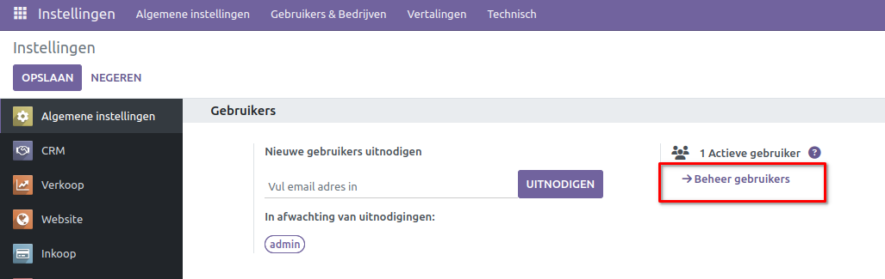
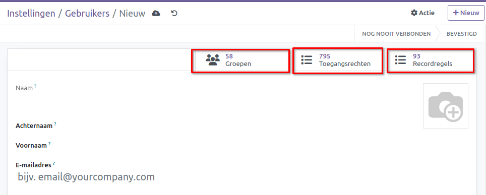
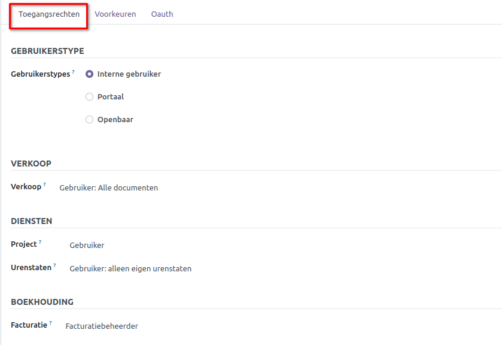
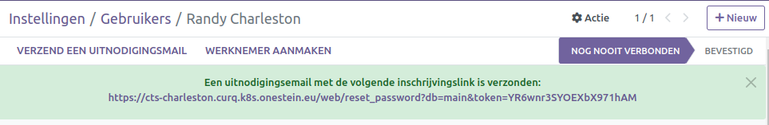
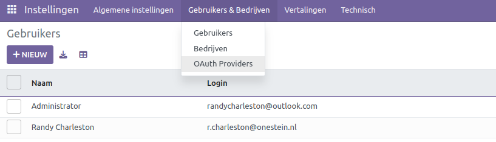
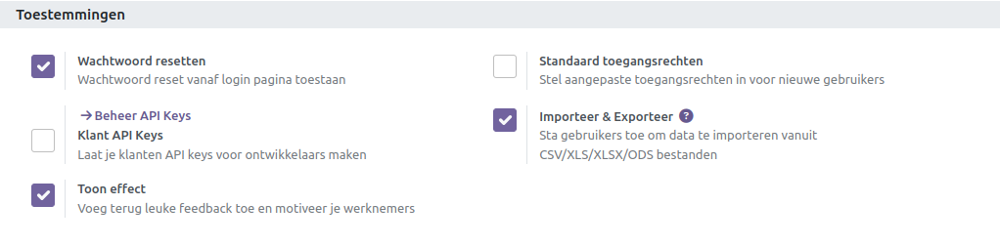
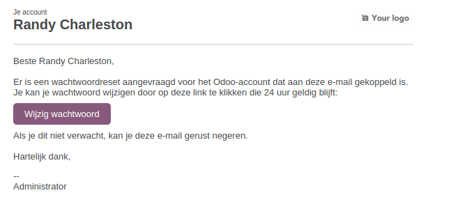

==================
Gebruikers in Curq
==================

Gebruikers
----------
Curq beschouwt een gebruiker als iemand die toegang heeft tot de database om dagelijkse taken uit te voeren. Het aantal gebruikers dat kan worden toegevoegd is onbeperkt, en om de toegang tot specifieke informatie te reguleren, kunnen regels worden toegepast. Het beheer van gebruikers en hun toegangsrechten kan op elk moment worden gewijzigd. 

Om individuele gebruikers toe te voegen, navigeer je naar **Instellingen ‣ Beheer Gebruikers** en klik je op de knop *Nieuw*.  

Vul het formulier in met de vereiste gegevens. Bovenin vind je 3 verschillende *Smart buttons* die aangeven welke toegangsrechten de gebruiker heeft. Standaard staat alles op *Beheerder*. Advies is om dit aan te passen naargelang de gebruiker toegang moet krijgen tot de diverse apps.

Kies onder het tabblad *Toegangsrechten* de relevante groepen binnen elke applicatie waar de gebruiker toegang tot moet hebben. Standaard staat gebruikerstype op *Interne gebruiker*. Note: de gebruikerstype wordt zichtbaar als de *Ontwikkelaarsmodus* is geactiveerd.

De opties **Portaal** en **Openbaar** bieden geen mogelijkheid om toegangsrechten te kiezen. Leden met deze specifieke rechten hebben doorgaans aangepaste privileges, zoals recordregels en beperkte menuopties, en maken doorgaans geen deel uit van de standaard Curq groepen.

De lijst met applicaties wordt automatisch gegenereerd op basis van de geïnstalleerde applicaties in de database. 
Nadat de pagina is bewerkt en opgeslagen, wordt er automatisch een uitnodigingsmail naar de gebruiker gestuurd. De gebruiker moet deze uitnodiging accepteren en een login aanmaken om toegang te krijgen tot het systeem.

**Gebruikers deactiveren:**
Om een gebruiker te deactiveren, navigeer je naar **Instellingen ‣ Gebruikers & Bedrijven ‣ Gebruikers**. Selecteer de gebruiker die je wilt deactiveren, klik op *Actie* en vervolgens op *Archiveren*.

Let op:
Het is van cruciaal belang om **NOOIT** de hoofdgebruiker (admin) te deactiveren.

Beheer wachtwoorden
-------------------

**Wachtwoorden resetten:**
Het is mogelijk om wachtwoord reset direct vanaf de aanmeldingspagina in te schakelen. Om dit in te stellen, ga je naar **Instellingen ‣ Toestemmingen**, activeer *Wachtwoord resetten* en klik op *Opslaan*.

**Reset Instructies naar gebruikers sturen:**
Om reset instructies voor het wachtwoord naar gebruikers te sturen, ga je naar **Instellingen ‣ Gebruikers & Bedrijven ‣ Gebruikers**. Selecteer de specifieke gebruiker uit de lijst en klik op *Actie 
 - Instructies voor het resetten van wachtwoorden verzenden* op het gebruikersformulier. Hierdoor wordt automatisch een e-mail met de reset instructies naar de gebruiker verzonden.

Opmerking:
De knop *Instructies voor het resetten van wachtwoorden verzenden* verschijnt alleen als de gebruiker de Curq uitnodigingsemail al heeft bevestigd. 

Deze e-mail bevat alle nodige instructies om het wachtwoord opnieuw in te stellen, evenals een link die de gebruiker doorverwijst naar een inlogpagina.

**Wachtwoorden van gebruikers wijzigen:**
Om het wachtwoord van een gebruiker direct te wijzigen in Curq, ga je naar Instellingen ‣ Gebruikers & Bedrijven ‣ Gebruikers en selecteer de betreffende gebruiker om zijn formulier te openen. Klik vervolgens op de knop *Actie* en selecteer *Wachtwoord wijzigen*.
Voer het nieuwe wachtwoord in en bevestig door op *Wachtwoord wijzigen* te klikken.

Meerdere bedrijven:
------------------
In het veld *Meerdere Bedrijven* kun je instellen tot welke van de databases met meerdere bedrijven de gebruiker toegang heeft. Deze optie wordt pas zichtbaar als er 2 of meerdere bedrijven zijn aangemaakt.

.. image:: Media/008.png

Opmerking:
Het is belangrijk op te merken dat onjuist gebruik van dit veld kan leiden tot inconsistent gedrag bij meerdere bedrijven. Neem bij vragen contact op met Onestein.

