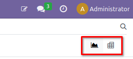
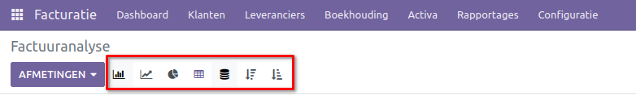
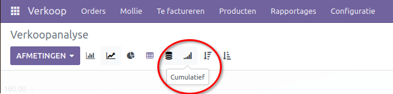
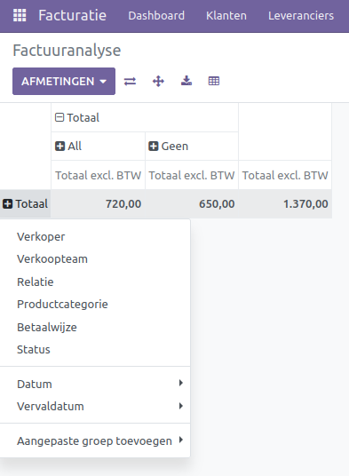
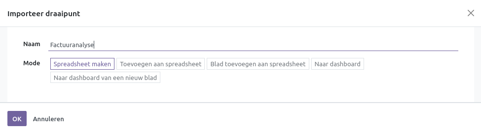

Rapportages
===========

Binnen Curq kan in elke applicatie gebruik worden gemaakt van de rapportagefunctionaliteit. Binnen deze functie kan met verschillende opties in één oogopslag de opgevraagde informatie worden waargenomen. Dit kan bijvoorbeeld handig zijn voor het genereren van een diagram dat de omzet van het afgelopen jaar weergeeft, of het aantal gewerkte uren per werknemer per project. De rapportagefunctionaliteit biedt twee manieren om de informatie te bekijken: via een diagram of een draaitabel.

Diagrammen
----------
Via de diagramfunctionaliteit kan geselecteerde informatie worden weergegeven in verschillende diagrammen:

* Staafdiagram
* Lijndiagram
* Taartdiagram

Bovendien kan de informatie worden geëxporteerd als een spreadsheet. Onder het staafdiagram kan de informatie op verschillende manieren worden weergegeven:

* Gestapeld: wanneer deze functie is geactiveerd, worden de gegevens op elkaar gestapeld (bijvoorbeeld verschillende inkomsten van diverse producten). Uitgeschakeld toont de informatie naast elkaar.
* Aflopend: hier worden de gegevens van hoog naar laag weergegeven.
* Oplopend: hier worden de gegevens van laag naar hoog weergegeven.

In het lijndiagram zijn de opties vergelijkbaar met die van het staafdiagram. De gestapelde optie wordt iets anders weergegeven onder het lijndiagram. Bij uitschakeling van de gestapelde optie worden de verschillende lijnen naast elkaar weergegeven. Ook is de optie voor cumulatief aanwezig, waarbij alle informatie aan elkaar wordt toegevoegd.

De functie voor de taartdiagram heeft geen van deze opties.
Onder de afmetingenknop zijn diverse methoden beschikbaar om de grafieken te interpreteren.

Draaitabel
----------

In de draaitabel kunnen snel en specifieke spreadsheets worden gegenereerd. De draaitabel is onderverdeeld in twee assen. Wanneer de totaalknop wordt geselecteerd, verschijnt een dropdownmenu met verschillende opties om de velden te selecteren waarin de spreadsheet wordt onderverdeeld. 

Linksboven in het schema zijn tevens enkele opties beschikbaar:

* As wisselen: hier worden de verticale en horizontale assen omgewisseld.
* Alles uitvouwen: alle velden worden zo ver mogelijk uitgebreid.
* Download xlsx: spreadsheets kunnen hier worden geïmporteerd.
* Toevoegen aan spreadsheet: een pop-upmenu wordt weergegeven met verschillende opties:

	* Spreadsheet maken: genereert een spreadsheet die vervolgens geëxporteerd kan worden.
	* Toevoegen aan spreadsheet: voegt de draaitabel toe aan een bestaande spreadsheet.
	* Blad toevoegen aan spreadsheet: voegt de draaitabel toe aan een nieuw blad van een bestaande spreadsheet.
	* Naar dashboard: voegt de draaitabel toe aan een geselecteerd dashboard.
	* Naar dashboard van een nieuw blad: genereert een nieuwe spreadsheet en voegt deze toe aan een nieuw blad.
	

