contacten
====================================================================

Een contact in Odoo kan meerdere functies hebben. Dit kan een klant zijn, een leverancier, of beide. Een contact kan tevens een persoon of bedrijf zijn en verschillende informatie bevatten, afhankelijk van het type contact.
Om een contact aan te maken, ga naar de Contacten-pap en binnen Curq. Dit scherm is ook bereikbaar via veel van de andere apps, bijvoorbeeld via Facturatie > Klanten > Klanten, waar je een scherm ziet met alle contacten die als klant worden beschouwd.
Eenmaal in het Contacten-venster, zoek en klik op de knop 'Nieuw' in de linkerbovenhoek van het scherm.

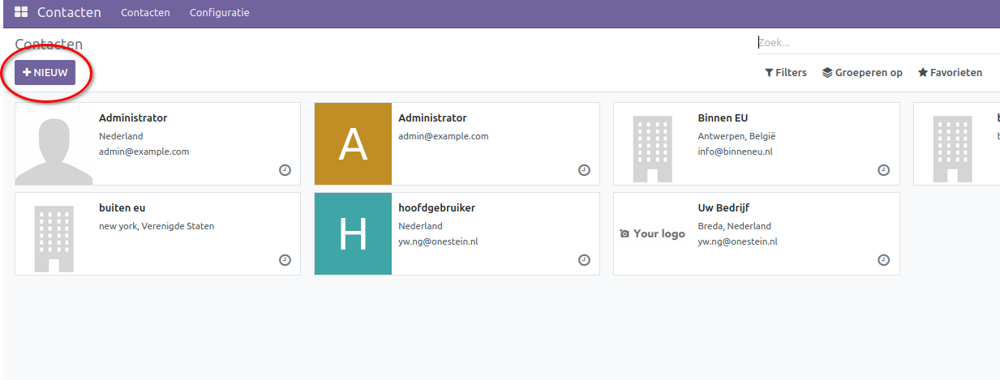

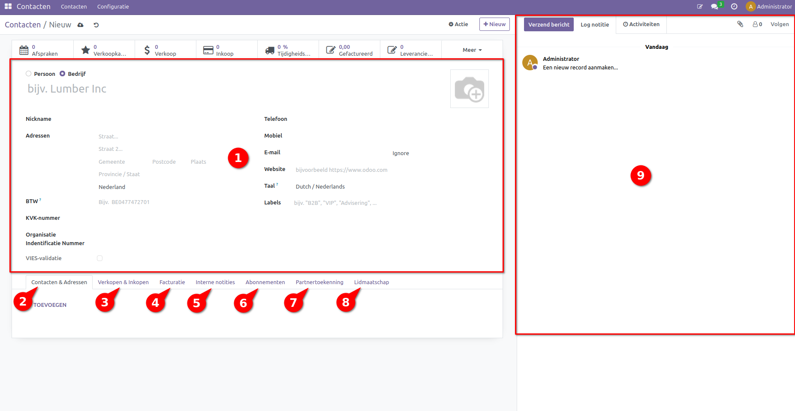

Vul de relevante informatie in:
---------------------------------------------------------------------------------------------------
Voer alle benodigde informatie van het hoofd veld in voor de nieuwe klant, zoals naam, type (individu of bedrijf), adres, contactgegevens, de website, de taal waarmee het contact wordt benaderd en labels om contacten te identificeren en groeperen. Ook kan een foto toegevoegd worden.
Let op land of type specifieke velden zoals het KvK- of BTW-nummer, indien van toepassing.

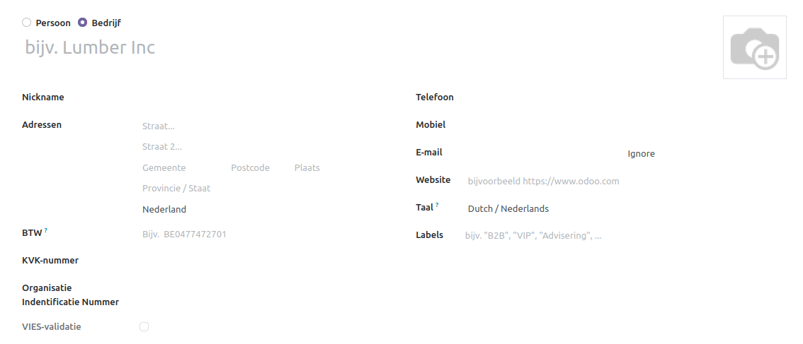

Contacten en adressen:
---------------------------------------------------------------------------------------------------
Om een contact of adres toe te voegen, selecteer 'Toevoegen' in het venster Contacten & Adressen, onderaan het scherm. Dit opent een nieuw venster waarin je kunt kiezen tussen het aanmaken van een contact of een van de opgegeven adres types.

Dit kan wenselijk zijn wanneer je werknemers van een bedrijf aan het bedrijf wilt toevoegen, vooral als het factuur- of afleveradres verschilt van het eerder opgegeven adres. Bijvoorbeeld, als de factuur naar het hoofdkantoor moet worden gestuurd, maar het product of de dienst naar een ander pand wordt verzonden. Ook als het contact meerdere adressen heeft of als er verwezen moet worden naar het privéadres van de contactpersoon.

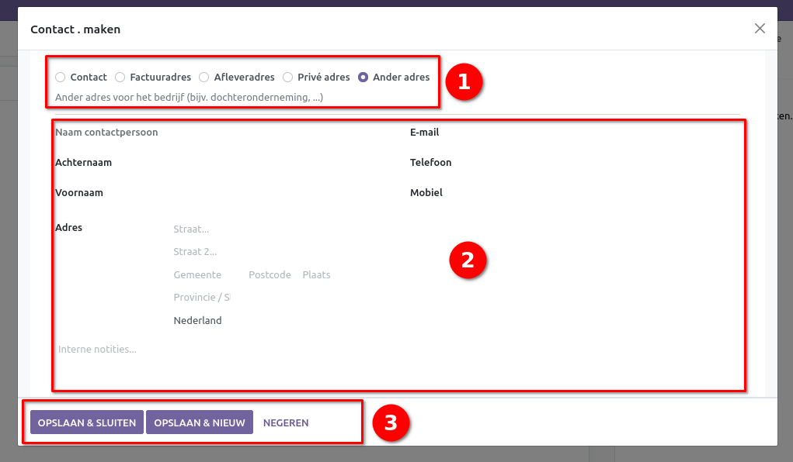

Bij het in vullen van het veld wordt bij alle opties gevraagd om de voor- en achternaam van het contact persoon en de contactgegevens op te geven. Bij een contact wordt ook gevraagd om de titel (Dhr, de heer, mevrouw) en de functie (CEO, CFO Verkoopdirecteur), bij een adres wordt om de adres gegevens gevraagd. In elk geval kunnen er ook interne notities gemaakt worden. 
Na dat alle informatie is ingevuld kun het contact of adres worden opgeslagen en en gesloten worden, er ik ook de optie om meteen een nieuw contact of adres aan te maken.

verkoop en inkoop:
---------------------------------------------------------------------------------------------------

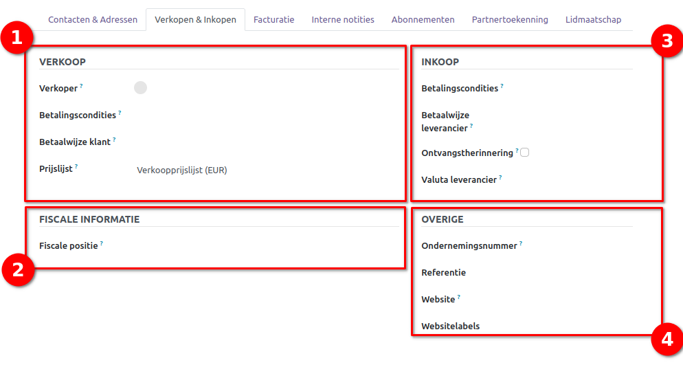

Verkoop
---------------------------------------------------------------------------------------------------
In het veld Verkoper wordt een specifieke verkoper aan een klant gekoppeld om het contact met de klant soepeler te laten verlopen.
Bij de betaalcondities kunnen voorwaarden worden ingesteld voor wanneer een factuur betaald moet zijn. Dit kan direct zijn binnen een bepaald aantal dagen of na het einde van de volgende maand. Daarnaast is het mogelijk om tijdelijke kortingen toe te passen en een einddatum in te stellen.
Om het betaalproces voor de klant te vereenvoudigen en versnellen, kan een specifieke betaalwijze worden ingesteld.
Onder het kopje "Verkoop" vindt u tevens de prijslijst. Met een prijslijst kunnen specifieke aanpassingen worden gemaakt aan de prijs, zoals kortingen voor vaste klanten of voor bepaalde landen. Voor meer informatie over het aanmaken van prijslijsten, raadpleeg de prijslijst documentatie.

Fiscale informatie
---------------------------------------------------------------------------------------------------
Onder "Fiscale informatie" wordt de fiscale positie aangegeven, wat betreft de berekening van de btw. Dit kan bijvoorbeeld binnen de EU zijn, voor particulieren of voor bedrijven.
Voor het inkoopproces kunnen de volgende gegevens worden ingevuld:
Inkoop
---------------------------------------------------------------------------------------------------
* **Betaalcondities:** Die door de leverancier zijn ingesteld.
* **Betaalwijze:** Die door de leverancier wordt gebruikt.
* **Ontvangstherinnering:** Mogelijkheid tot inschakelen van een herinnering bij ontvangst. Hiermee wordt een e-mail verstuurd x dagen voordat de levering wordt verwacht, om bevestiging te vragen.
* **Valuta leverancier:** Instelling van de valuta die de leverancier accepteert.

Overige
---------------------------------------------------------------------------------------------------
* **Ondernemingsnummer:** Voor wanneer er een registratie nummer is die verschild van het BTW nummer
* **Referentie:** Dit veld kan gebruikt worden voor het snel zoeken naar het contact.
* **Website:** Hier kan het contact gelinkt naar de website module om snel contact op te nemen.
* **Websitelabels:** Hier kan het contact worden gegroepeerd in de website.
* **Industrie:** Het type industrie waar het bedrijf onder valt(alleen zichtbaar wanneer het contact een bedrijf is).

Facturatie:
---------------------------------------------------------------------------------------------------
onder Facturatie kun je de bankrekening van het contact invullen dit gaat over de velden,
op welke bank de rekening staat, wat het nummer van de rekening is en of geld automatisch overgemaakt kan worden.
Ook kunnen de grootboekrekeningen aan de rechter zijde gevonden worden. Deze zijn standaard ingesteld naar de algemene debiteur en crediteur rekeningen en er wordt geadviseerd dezen zo te laten staan tenzij het contact een specifieke rekening nodig heeft.

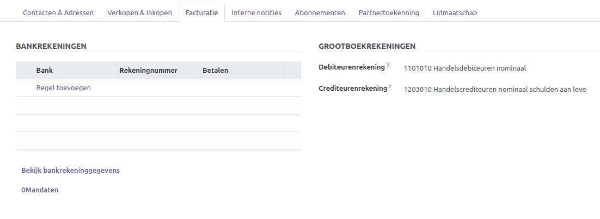

Notieties:
maak de nodige interne notities over het contact.

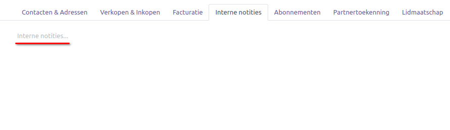

Abonomenten(optioneel):
---------------------------------------------------------------------------------------------------
onder het abonomenten veld staan alle abonomenten waar het contact op geaboneerd is met de volgde kopjes

* **Abonomenten:** Hier worden de namen van de abonomenten weergegeven
* **beschrijving:** Hier staat een korte beschrijving van het abonoment.
* **Hoeveelheid:** Het aantal keer dat het contact het abonoment heeft aangeschaft.
* **begin datum:** De datum vanaf waneer het cocact op het product geaboneerd is.
* **Volgende betalingsdatum:** Hier wordt aangegeven waneer het contact de volgende betaling moet leveren. Dit kan een perodieke betaling gedurende het lopen van het abonoment of een betaling om het abonoment te vernieuwe.
* **Status:** De status waar het abonoment zich nu in verkeerd bijvoorbeeld.

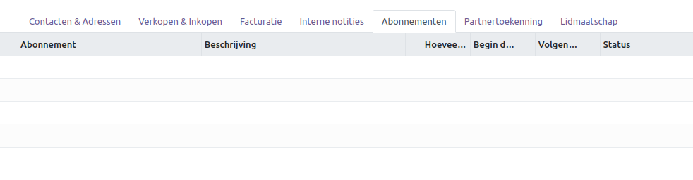

partnertoekenning(optioneel):
---------------------------------------------------------------------------------------------------

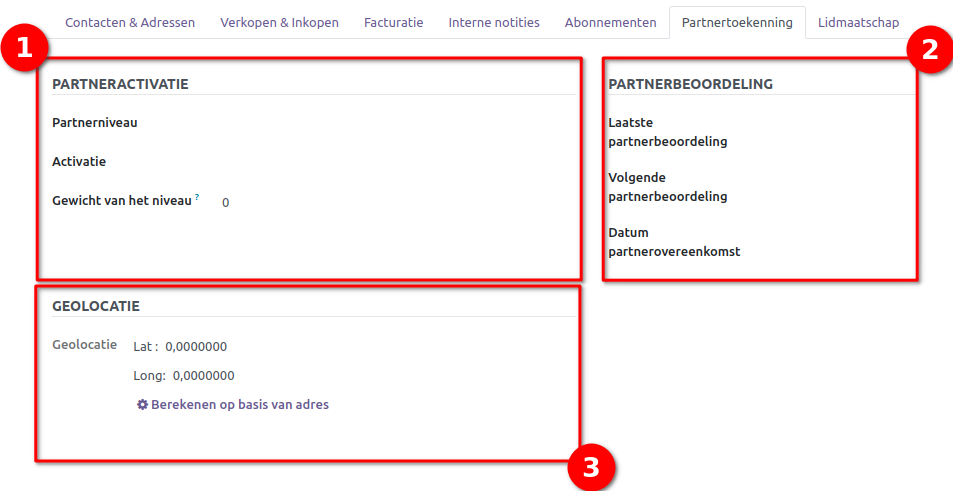

Dit veld bevat drie cruciale secties voor effectief partnermanagement:

1. **Partneractivatie:**
	
	* **Partnerniveau:** Definieer het niveau van partners, zoals brons, zilver, of goud.
	* **Activatiestadium:** Houd bij in welk stadium van activatie de partner zich bevindt.
	* **Gewicht van het niveau:** Bepaal de mate van invloed die de partner heeft op besluitvorming.
	
2. **Partnerbeoordeling:**
	
	* **Laatste Partnerbeoordeling:** Registreer de datum van het laatste beoordelingsgesprek.
	* **Volgende Partnerbeoordeling:** Plan de datum voor het komende beoordelingsgesprek.
	* **Datum partnerovereenkomst:** Noteer de startdatum van de partnerovereenkomst.
	
3. **Geolocatie:** Voer de coördinaten van het contact in voor efficiënte routeplanning naar verschillende locaties. Coördinaten worden berekend op basis van het ingevoerde adres.
	
Litmaatschap(optioneel):
---------------------------------------------------------------------------------------------------
Onder het lidmaatschapveld staat alle informatie die van toepassing is met betrekking tot de ledenmodule voor het contact. 
Heeft het lid een gratis lidmaatschap? Onder welke categorie is het contact lid? Vanuit waar is het contact lid geworden (zoals via een formulier op de website of handmatig door een werknemer)? Onder welke status is het lid (enkele voorbeelden zijn gratis lid, betaald lid, gefactureerd lid - hier is het lidmaatschap aangemaakt maar nog niet betaald) en waar is het lid een associate member van? Dit is het geval als het contact lid is geworden via een contract met een ander bedrijf. Deze informatie wordt automatisch ingevuld en geüpdatet wanneer er wijzigingen in het lidmaatschap van het lid worden gemaakt. 

Onder deze informatie staan drie vakken. In het eerste vak staat algemene informatie over het lidmaatschap, zoals vanaf wanneer en tot wanneer het lidmaatschap geldig is, het type lid, of een factuur betaald is, en wat de status van het lidmaatschap is. 
In het tweede vak staat onder welke sectie het contact valt en of het contact de sectie volgt, er mee samenwerkt of beide. 
In het laatste vak wordt weergegeven of het contact in een commissie zit en zo ja, in welke. Voor meer informatie over leden ga naar onze leden documentatie.

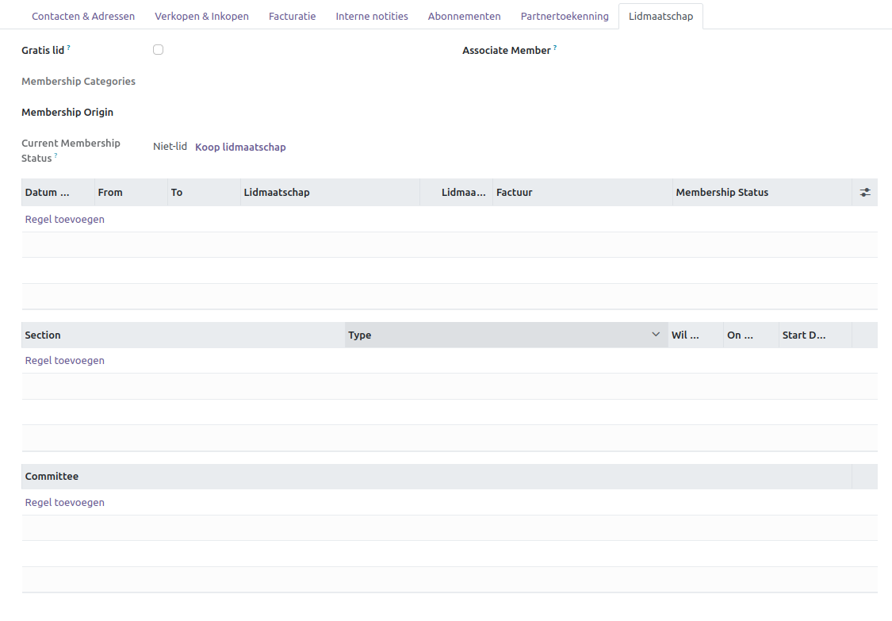

Chat functie:
---------------------------------------------------------------------------------------------------
Alle belangrijke wijzigingen met betrekking tot het contact worden hier bijgehouden. Je ziet hier ook de e-mails die zijn verzonden. Als je ook gebruikmaakt van de volledige integratie met mailfunctionaliteit, verschijnt hier ook het antwoord van de klant als hij reageert op de mail.

* **Verzend bericht:** Hiermee verzend je een mail naar het contact.
* **Log notitie:** Dit is een interne notitie die alleen intern zichtbaar is. Voor het contact is deze niet zichtbaar.
* **Activiteiten:** Je kunt een bepaalde activiteit inplannen voor iemand. Dit kan een to-do zijn, maar ook een afspraak.

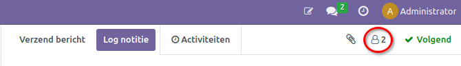

* **Volgers:** Contacten en medewerkers kunnen volgers zijn van het document. Afhankelijk van hun aanmelding worden deze volgers op de hoogte gehouden van wijzigingen in verbant met het contact.

sneltoetsen
---------------------------------------------------------------------------------------------------
Bovenaan het scherm zijn sneltoetsen te vinden die toegang bieden tot essentiële contactinformatie:

* **Afspraken:** Controleer geplande afspraken met de klant.
* **Verkoopkansen:** Bekijk gegenereerde verkoopkansen voor mogelijke deals.
* **Verkopen aan de klant:** Raadpleeg informatie over wat aan de klant is verkocht.
* **Aankopen van de klant:** Overzicht van wat de klant heeft aangekocht.
* **Betrouwbaarheid van de levertijd:** Beoordeel de betrouwbaarheid van levertijden voor het contact.
* **Verkoopfacturen:** Toegang tot de verkoopfacturen van het contact.
* **Leveranciersfacturen:** Bekijk de facturen van leveranciers voor het contact.
* **Locatie op de kaart:** Visualiseer de locatie van het contact op een kaart.
* **Routes van het contact:** Ontdek de routes waar het contact bij inbegrepen is.
* **Verkoop- en inkoopcontacten:** Zie overzichten van verkoop- en inkoopfacturen van het contact.
* **Mailcontacten:** Toegang tot e-mailgesprekken met het contact.
* **Mass mailing groepen:** Bekijk de mass mailing groepen waar het contact aan is gekoppeld.
* **Websitepagina van het contact:** Navigeer naar de specifieke pagina van het contact op de website.

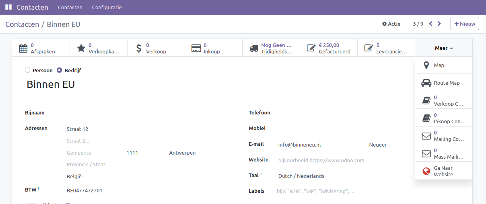

Automatische opslag van de klantgegevens:
---------------------------------------------------------------------------------------------------
Merk op dat de klant automatisch wordt opgeslagen wanneer je de pagina verlaat. De gegevens worden automatisch opgeslagen. 

Handmatig opslaan via het wolkpictogram (optioneel):
---------------------------------------------------------------------------------------------------
Als je ervoor kiest om handmatig op te slaan, zoek dan naar het wolkpictogram en selecteer om de klantgegevens op te slaan.

Controleer de nieuwe klant:
---------------------------------------------------------------------------------------------------
Ga terug naar het klantenoverzicht om te bevestigen dat de nieuwe klant succesvol is toegevoegd.
Afhangend aan welke modules op uw curq omgeving zijn geinstaleerd kunnen de kopjes en sneltoetsen die voor jou zichtbaar zijn verschillen.
