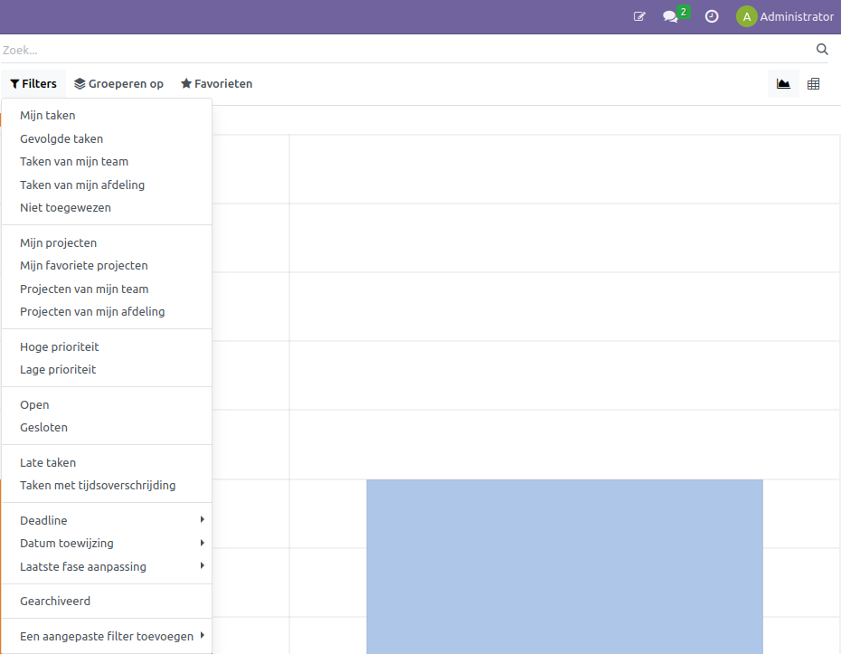
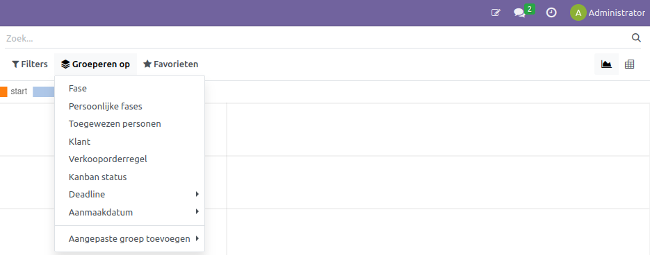
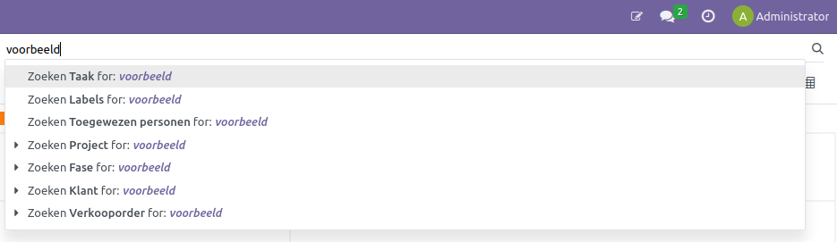
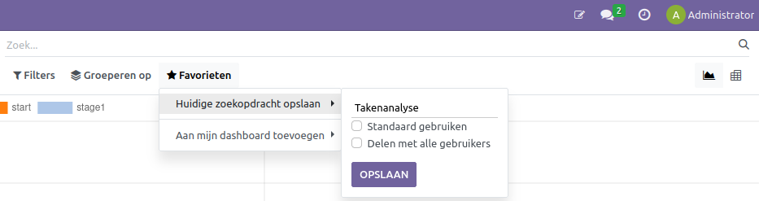
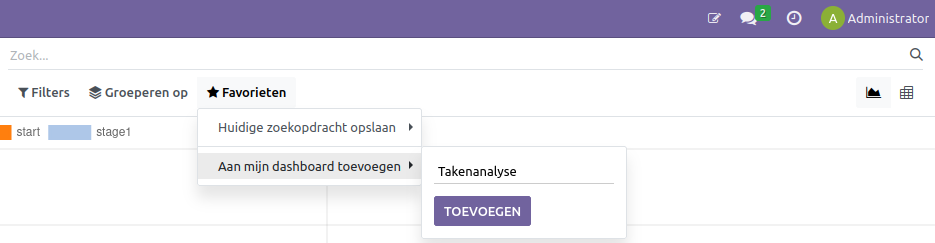

Zoek- en filterfunctie
====================================================================

Binnen de Curq zijn drie opties beschikbaar om specifiekere informatie te kunnen vinden: filteren, groeperen en de zoekbalk. De specifieke mogelijkheden binnen deze opties verschillen tussen de modules waarin de zoekfunctie zich bevindt.

.. image:: Zoeken_filtreren/Zoeken&filtreren001.png

Onder de filteroptie kan de weergegeven informatie worden gefilterd, zoals vanaf wanneer de informatie geldt of alleen de informatie van een specifieke werknemer.

Onder groeperen kan de manier waarop de informatie wordt getoond worden aangepast. Denk hierbij aan een lijndiagram met het aantal producten per maand, onderverdeeld onder productcategorieën, zoals in het voorbeeld bovenaan de pagina.

In de zoekbalk kan specifieker worden gezocht naar variabelen, zoals wanneer er gezocht wordt naar een specifiek product. Vul hierbij de naam in en selecteer de optie "zoek product voor:".

Door het combineren van de verschillende opties kunnen de gewenste rapportages worden samengesteld. Wanneer deze rapportages zijn samengesteld, kunnen ze op verschillende manieren worden opgeslagen, bijvoorbeeld via "huidige zoekopdracht opslaan" en "aan mijn dashboard toevoegen".
Bij "huidige zoekopdracht opslaan" kan de naam worden geselecteerd, evenals of de zoekopdracht als standaard getoond moet worden en of de zoekopdracht gedeeld mag worden met andere gebruikers binnen het bedrijf.

Bij "aan mijn dashboard toevoegen" kan de rapportage aan de dashboardapplicatie worden toegevoegd.

