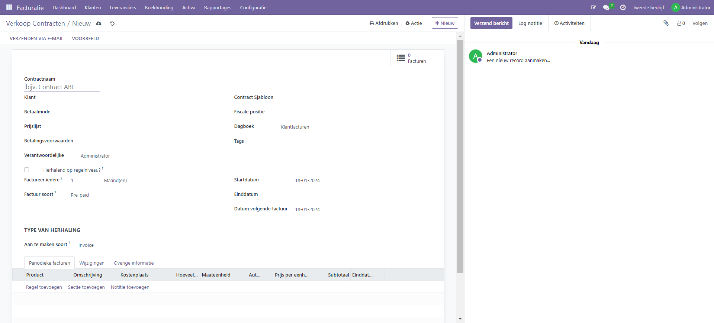
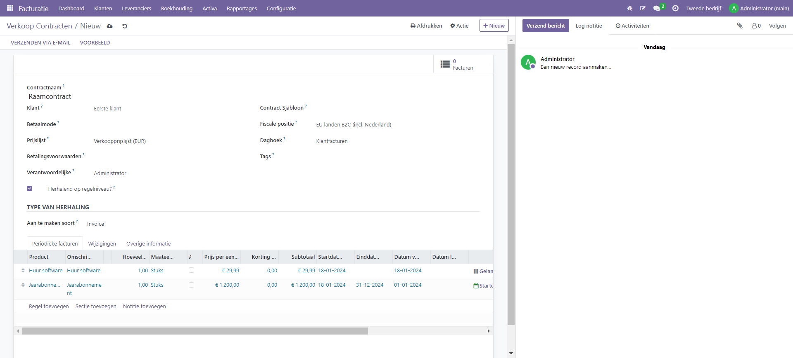
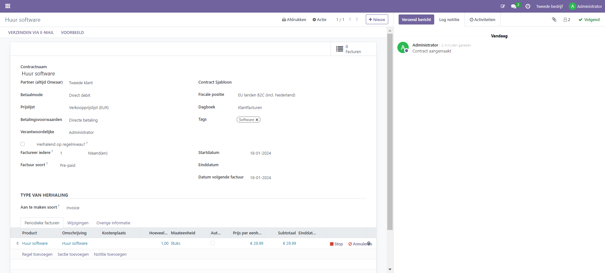

Contracten
====================================================================
Met de contractenmodule kun je diensten en of producten als abonnement verkopen aan klanten. Je klant kan dit abonnement zelf inzien via de klanten portal. Na aanmaken van een contract zal Curq op basis van de ingegeven startdatum automatisch de periodieke factuur genereren.

Je kunt een contract los invoeren, maar dit kan ook door eerst een sjabloon aan te maken. Heb je een vaak terugkerend abonnement dan is het aan te raden om met sjablonen te werken.

De werkwijze van invoeren van een contract bestaat uit de volgende stappen:

#. Maak een contract aan, eventueel gebaseerd op een contractsjabloon
#. Geef aan hoe vaak en voor welke periode je het abonnement wil laten lopen
#. Voeg minimaal de verplichte velden aan en voeg de dienst(en) en /of producten die je wil gaan factureren
#. Na ingeven van de velden zal Curq de factuur genereren via een automatisch proces. Voor de eerste factuur kun je ervoor kiezen deze meteen aan te maken via menu 'Handmatig factureren verkoopcontracten'.
#. Na ingeven van alle gegevens kun je via de knop 'verzenden via mail' de klant het contract mailen.

Aanmaken verkoopcontract
---------------------------------------------------------------------------------------------------
Contracten zijn voor klanten te vinden in Facturatie -> Klanten -> Klant en Facturatie  en voor leveranciers onder Leveranciers -> Leverancierscontracten.

Algemene gegevens contract
---------------------------------------------------------------------------------------------------
Vul bij het maken van een contract de velden in voor het selecteren van de factureringsparameters:

**Contractnaam**
**Klantnaam**. Hier kies je de klant.

**Betaalmode**. Wanneer je met de klant afpreekt dat je het abonnement iedere maand incasseert, dan kun je kiezen voor betaalwijze 'Direct debit'. Voor deze betaalwijze dien je dan wel een mandaat te hebben ingesteld via menu Facturatie -> klanten-> bankmandaten.

**Prijslijst (optioneel)**. Indien je afwijkende prijsafspraken wil vastleggen, dan kun je de aangepaste prijslijst hier kiezen (dit kan ook via het contractsjabloon).
Verantwoordelijke

facturatie instellingen
---------------------------------------------------------------------------------------------------
**Herhalend op regelniveau**. Wanneer je dit vinkje aanzet, dan kun je op regelniveau de herhalingsinstellingen aanpassen. Met deze optie wordt het mogelijk om verschillende abonnementen onder 1 contract vast te leggen. Curq zal op basis van de regel een factuur genereren. In het schermvoorbeeld hieronder is een maand en een jaarabonnement op 1 contract gezet.

**Factureer iedere**. de herhalingsparameters: interval (dagen, weken, maanden, maanden laatste dag of jaren), begindatum, datum van de volgende factuur (automatisch berekend, kan worden gewijzigd) en einddatum (optioneel)

**Factuursoort**. Pre-paid (factuur aan het begin van de periode) of post-paid (factuur aan het begin van de volgende periode)

**Datum eerste factuur**. Datum van de eerste factuur. De factuurdatum van de tweede factuur wordt bepaaald op basis van de gekozen factuursoort

**Einddatum factuur**. Optioneel veld om te vullen

Type van herhaling
---------------------------------------------------------------------------------------------------
Dit onderdeel gaat over de inhoud van het contract; welke producten en/of diensten wil je aanbieden aan de klant?

**Aan te maken soort**. Bij verkoopcontracten zal hier 'invoice staan', bij leverancierscontracten 'vendorbill'. 

Voeg de regels toe waarmee gefactureerd moet worden:

Abonnementsproduct
---------------------------------------------------------------------------------------------------
Het product met een beschrijving, een hoeveelheid en een prijs

**auto-price**.  Om automatisch een prijs uit de prijslijst te laten halen

#START# of #END# in het beschrijvingsveld om de begin-/einddatum van de gefactureerde periode weer te geven in de beschrijving van de factuurregel

**Stop**. Met deze knop kun je het contract van de regel stopzetten. Je kan hierbij de reden van opzegging invoeren en een einddatum van het contract.

De "Generate Recurring Invoices from Contracts" cron draait dagelijks om de facturen te genereren. Als je je in debugmodus bevindt, kun je op de knop voor het aanmaken van facturen klikken.

De snelkoppeling Toon terugkerende facturen op contracten toont alle facturen die zijn aangemaakt op basis van het contract.

Het contractoverzicht kan worden afgedrukt via het menu Afdrukken.

Het contract kan per e-mail worden verzonden met de knop Verzenden per e-mail

Hieronder zie je een voorbeeld van een ingevoerd voorbeeld abonnement:

.. toctree::
    :maxdepth: 2

    verkoopcontracten_sjablonen
    verkoopcontracten_beeindigen
    verkoopcontracten_factureren
    verkoopcontracten_vernieuwen
