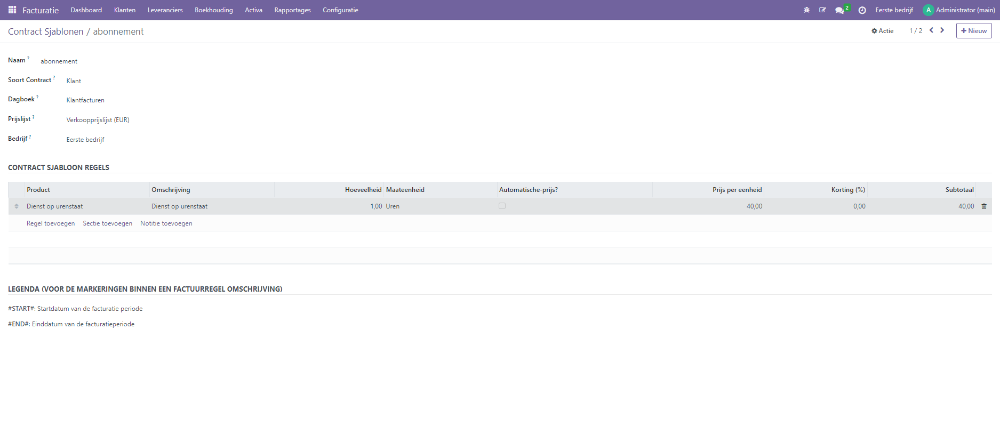
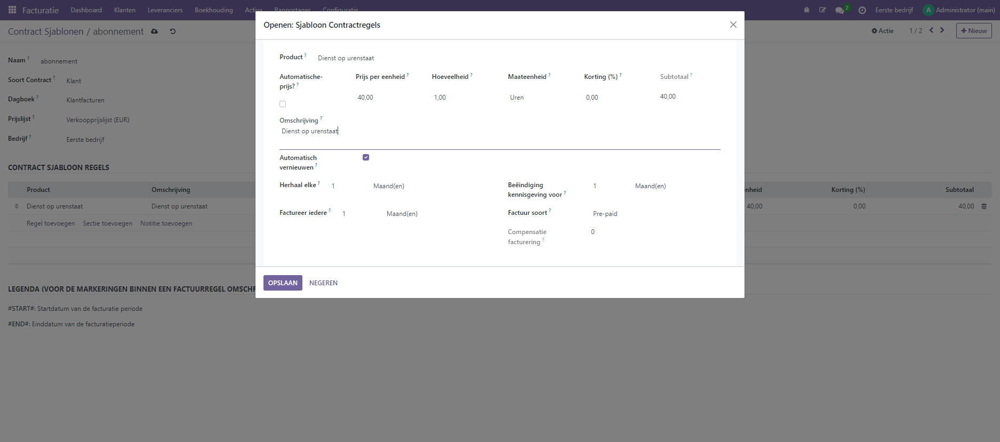

Contractsjablonen
-----
Contractsjablonen kunnen worden aangemaakt via het menu Configuratie -> Contracten -> Contractsjablonen. Hiermee kunnen standaard journaal, prijslijst en regels worden gedefinieerd bij het maken van een contract. Om ze te gebruiken, selecteer je gewoon het sjabloon op het contract en de velden worden automatisch ingevuld.

Als je op een rgel klikt dan kun je vervolgens de details van het abonnement verder inrichten. Je kan aangeven met welke termijnen je de regel wil doorbelasten, of je het abonnement automatisch wil verlengen. Ook kun je aangeven hoe ver vantevoren je de klant wil inlichten dat het abonnement vervnieuwd gaat worden.

