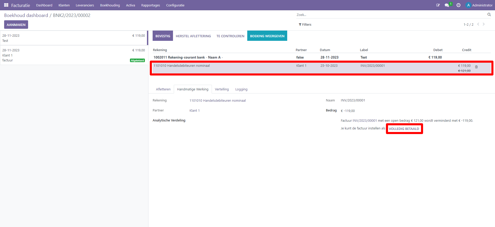
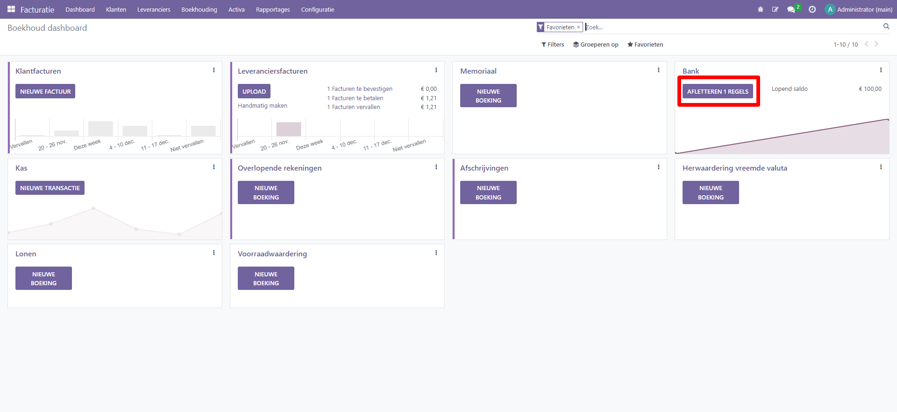

Afletteren in Odoo
===========
| Bank reconciliatie is het proces van het matchen van je
  banktransacties met je bedrijfsadministratie, zoals klantenfacturen,
  leveranciersfacturen en betalingen.
| Dit is niet alleen verplicht voor de meeste bedrijven, maar het biedt
  ook verschillende voordelen, zoals minder risico op fouten in
  financiële rapporten, detectie van frauduleuze activiteiten en
  verbeterd cashflowbeheer.
| Dankzij de reconciliatiemodellen kan Curq de overeenkomende boekingen
  automatisch vinden en afletteren..

Algemeen
----
Via het boekhoud dashboard kun je via de bank(en) zien of er af te
letteren regels zijn. Wij adviseren om gebruik te maken van de MyPonto
koppeling waarmee je bank transactieregels automatisch vanuit je
bankomgeving naar Curq synchroniseert.

Naast automatisch synchroniseren is het ook mogelijk om een Camt bestand
te downloaden in uw bankapplicatie (Curq ondersteunt de formaten
camt.053.001.02, Camt.054.001.02). Dit Camt bestand kun je vervolgens
uploaden in het overeenkomstige bankdagboek in Curq.

|image1|\ Je kunt alle transactieregels ook benaderen via de drie
puntjes rechts in de tegel:

.. image:: Afletteren/media/image2.png
   :width: 6.69306in
   :height: 3.08125in

| klik op de naam van het dagboek (bijv. Bank) om alle transacties
  weer te geven, inclusief de transacties die eerder zijn afgeletterd.
| klik op de knop Afstemmen om alle transacties weer te geven die Odoo
  vooraf heeft geselecteerd voor afstemming. Je kunt de filter Niet
  gematcht uit de zoekbalk verwijderen om ook eerder afgeletterde
  transacties weer te geven.

.. image:: Afletteren/media/image3.png
   :width: 6.69306in
   :height: 3.08125in

Afletteren van een volledig betaalde factuur
----

Wanneer de klant bij de transactieregel staat ingevuld, het bedrag
overeenkomt, dan zal Curq de regel automatisch afletteren met de
openstaande factuur. Je kunt er zelfs voor kiezen ook deze laatste stap
te automatiseren. Curq zal dan de gevonden regel direct afletteren. Ook
dit stel je in bij de afletterregels

.. image:: Afletteren/media/image4.png
   :width: 6.69306in
   :height: 3.08125in

.. image:: Afletteren/media/image5.png
   :width: 6.69306in
   :height: 3.08125in

BTW in combinatie met een af te letteren regel
----
Het kan voorkomen dat er een afschriftregel is met een betaling zonder
onderliggende factuur, maar wel met BTW. Na kiezen van de juiste
kostenrekening is het vervolgens mogelijk om in het BTW de juiste BTW
code te selecteren. Curq rekent dan automatisch de juiste bedragen uit.
De extra regel die wordt aangemaakt voor verwerken van de BTW is terug
te vinden op de BTW aangifte.

Aflettermodellen
----
Met aflettermodellen kun je het proces van afletteren verder
automatiseren. Curq heeft zelf een aantal standaard aflettermodellen
ingericht, je vind deze onder menu afletterregels.

Je kunt met 3 doeleinden een afletter regel aanmaken:

1. Als je direct een tegenboeking van de af te letteren transactieregel
   wil genereren

2. Als je zelf wil bepalen of je het model wilt gebruiken. Je maakt in
   dit geval een knop aan waarmee je de tegenrekening laat toevoegen

3. Als je automatisch inkoop-en of verkoopfacturen wil matchen en door
   Curq wil laten afletteren. Optie 3 wordt standaard in Curq toegepast.

Extra controle, terugdraaien aflettering
----
Wanneer je een extra controle wil uitvoeren op de af te letteren regel.,
dan kun je bij de regel aangeven met de knop ‘te controleren’.

Mocht je een fout hebben gemaakt, dan is het mogelijk om een
afgeletterde regel terug te draaien. De na te kijken regel kan
vervolgens op diverse plekken in de boekhouding nagekeken worden (zoals
hieronder bij de boekingsregel).

.. image:: Afletteren/media/image7.png
   :width: 6.69306in
   :height: 3.08125in

.. image:: Afletteren/media/image8.png
   :width: 6.69306in
   :height: 3.08125in

**Na controle van de regel klik je op ‘stel in als gecontroleerd’ om**

.. image:: Afletteren/media/image9.png
   :width: 6.69306in
   :height: 3.08125in

.. image:: Afletteren/media/image10.png
   :width: 6.69306in
   :height: 3.08125in

Diverse uitzonderingen
----

Uiteraard kan het zijn dat de betaalregel niet volledig overeenkomt met
een af te letteren factuur. Ook kunnen er andere uitzonderingen in het
afletterproces zijn. Hieronder volgen een aantal; uitzonderingen.

Wat te doen als het bedrag dat de klant betaalt en je of het openstaande
bedrag direct wil afboeken?

Eerst zoek je juiste factuur op die wil afletteren.

|image2|\ Vervolgens wil je het restbedrag ook direct afboeken, je doet
dit door de regel aan te klikken zoals je hieronder ziet in het
schermvoorbeeld. Hiermee wordt de optie zichtbaar om de factuur op
volledig betaald te zetten. Je kunt er vervolgens voor kiezen om het
restbedrag af te schrijven op een andere grootboekrekening.

.. |image2| image:: Afletteren/media/image11.png
   :width: 6.69306in
   :height: 3.08125in
