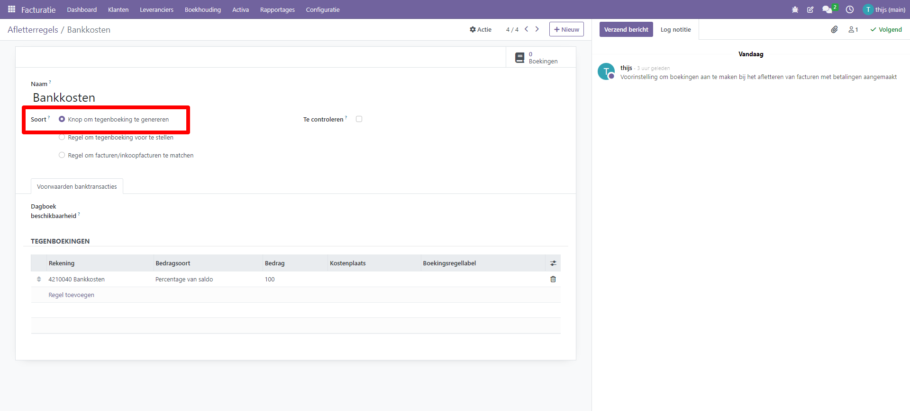
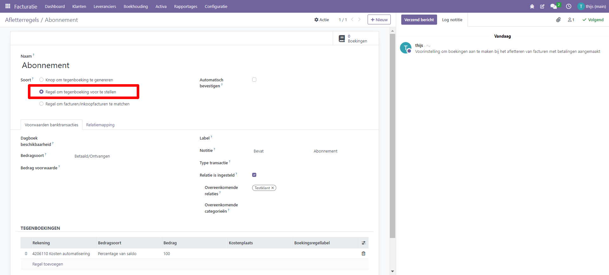
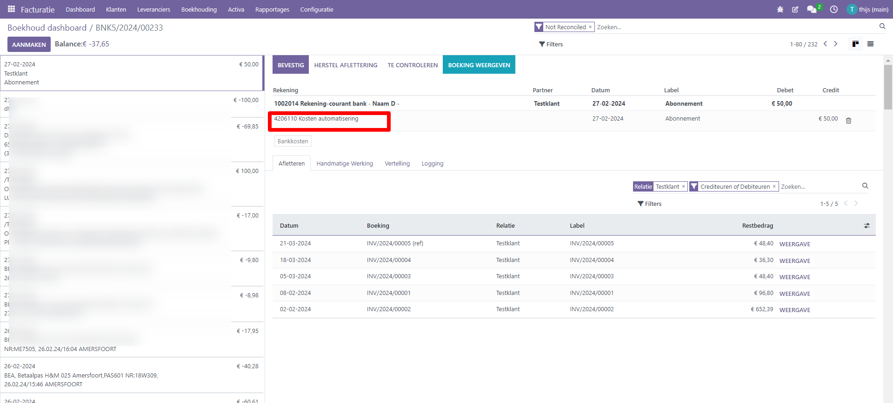
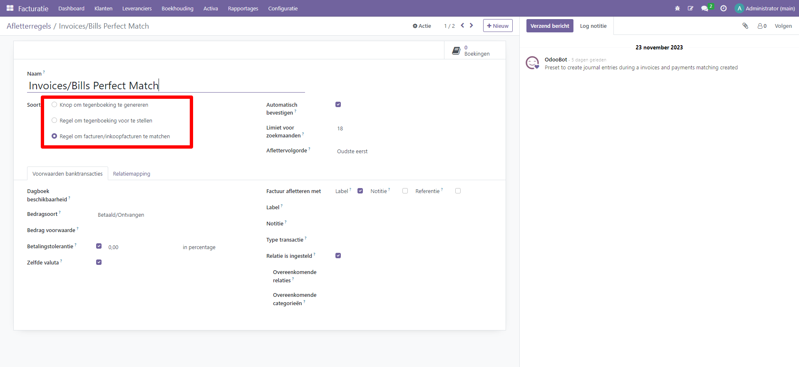
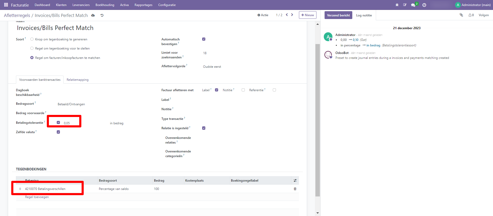
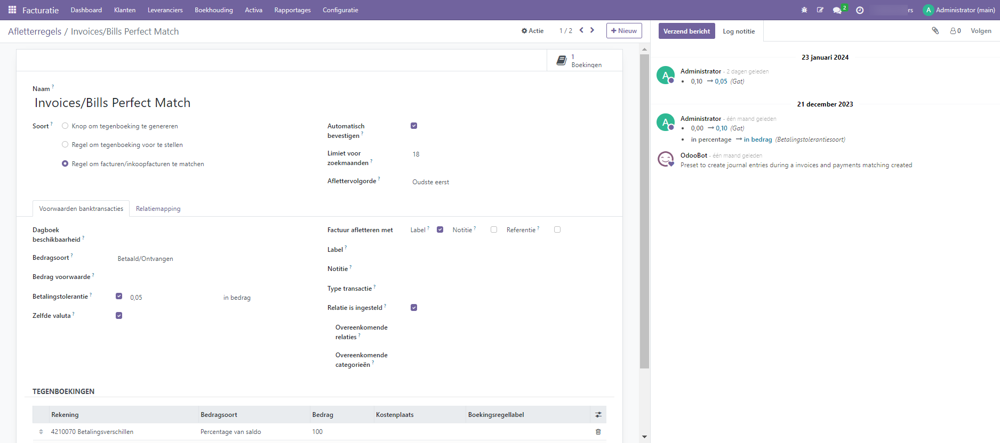

Aflettermodellen
=========================================================================

Met aflettermodellen kun je het proces van afletteren verder automatiseren. Curq heeft zelf een aantal standaard aflettermodellen
ingericht, je vind deze onder menu 'afletterregels'.

Je kunt met 3 doeleinden een afletter regel aanmaken:

1. Als je zelf wil bepalen of je het model wilt gebruiken. Je maakt in
   dit geval een knop aan waarmee je de tegenrekening laat toevoegen.

2. Als je direct een tegenboeking van de af te letteren transactieregel
   wil genereren.

3. Als je automatisch inkoop-en of verkoopfacturen wil matchen en door
   Curq wil laten afletteren. Optie 3 wordt standaard in Curq toegepast.

Hieronder zie je een voorbeeld van een afletter knop (optie 1). In dit voorbeeld is het model gekoppeld aan bankrekening 'Bankkosten'.

In het afletterscherm vind je de knop terug op onderstaand schermvoorbeeld:

.. image:: Media/bank_aflettermodellen_knop.png
       :width: 6.3in
       :height: 2.93264in

Hieronder zie je een voorbeeld van een aflettermodel waarmee direct een tegenboeking wordt gegenereerd (optie 2).

Met als resultaat dat bij een transactieregel waarbij in de notitie de tekst 'Abonnement' staat en bij de relatie 'Testklant' direct de juiste grootboekregel staat:

Tenslotte zie je hieronder een voorbeeld van de 'perfect match' optie. Curq kan op basis van de klant/leveranciersnaam en het bedrag de factuur direct matchen.

.. Note::
  Wanneer je te maken krijgt met kleine betalingsverschillen op facturen dan kun je die middels een aanpassing aan het standaard aflettermodel standaard wegboeken.
  In onderstaand voorbeeld staat dat bij een afwijking onder de 5 cent het verschil automatisch op een verschillenrekening wordt weggeboekt.

Uitleg velden aflettermodel
-------------------------------------------------------------------------

**Dagboek beschikbaarheid** 

Hiermee kun je aangeven voor welke dagboeken de regel van toepassing is. Als je dit veld leeg laat dan geldt de regel voor alle dagboeken.

**Bedragsoort** 

Hiermee kun je aangeven of de regel alleen geldt voor ontvangen of te betalen bedragen.

**Betalingstolerantie**

Zie de uitleg eerder in dit onderdeel, met deze optie kun je betalingsverschillen direct weg laten boeken.

**Automatisch bevestigen**

Wanneer je deze optie aan zet, dan zal Curq de gematchte regel direct bevestigen. Gebruik deze optie alleen als je zeker weet dat je de juiste instellingen gebruikt.

**Limiet voor zoekmaanden**

Je kunt het aantal maanden terug waarvoor de regel geldt beperken met deze regel. 

**Factuur afletteren met** 

Gebruik deze optie als je specifiek op een vaste omschrijving of tekst wil zoeken om de match te zoeken

**Overeenkomstige relaties**

Met deze regel kun je een aflettermodel specifiek voor een klant of leverancier maken.

Tabblad Relatiemapping
----------------------------------------------------------

Relatie mapping maakt het mogelijk om regels vast te stellen voor het automatisch koppelen van transacties aan de juiste relatie, wat tijd bespaart en het risico op fouten vermindert die kunnen optreden tijdens handmatige aflettering. Je kunt bijvoorbeeldrelatie mappingregel maken voor inkomende betalingen met specifieke referentienummers of trefwoorden in de transactiebeschrijving. Wanneer een inkomende betaling aan deze criteria voldoet, koppelt Curq deze automatisch aan de overeenkomstige relatie.

Om een relatie mappingregel te maken, ga naar het tabblad relatie mapping en voer de tekst in om te vinden in het label, de tekst om te vinden in de notities en de partner.
