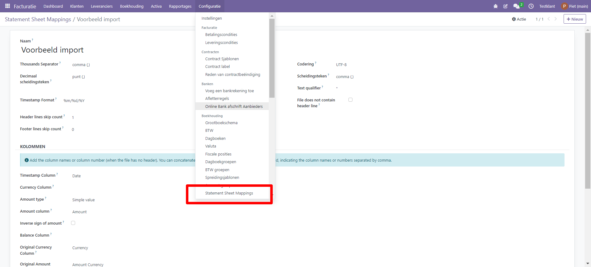
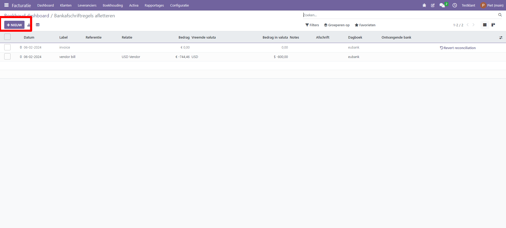

Importeren bank transacties
========================================================================

Door transacties uit je bankafschriften te importeren, kun je deze afletteren met de transacties in je boekhouding.
Bank synchronisatie automatiseert dit proces. Als je dit echter niet wilt gebruiken of als je bank dit proces niet ondersteunt, zijn er nog andere opties:

* Importeren van door je bank aangeleverde banktransacties
* Banktransacties handmatig registreren.

.. Note::
   Het groeperen van transacties per afschrift is optioneel.

Transacties importeren
------------------------------------------------------------------------

Curq ondersteunt meerdere bestandsformaten om transacties te importeren:

* SEPA aanbevolen Cash Management formaat (CAMT.053)
* SEPA aanbevolen Cash Management formaat (CAMT.054)
* Import via een .csv of .xlsx bestand

Om een bestand te importeren, ga je naar het Boekhouddashboard en klik in het Bankjournaal op de knop 'Import (OCA)'.

.. image:: Media/banktransacties_importeren.png
       :width: 6.3in
       :height: 2.93264in

Importeren via .csv of Excel
------------------------------------------------------------------------

In Curq is het ook mogelijk om transacties via een .csv of .xlsx bestand in te lezen. Omdat iedere bank zijn eigen export formaat heeft, adviseren wij om per bank vast te leggen wat het vaste importformaat is. Je doet dit onder menu Facturatie > Configuratie > Statement sheet mappings. Omdat de inrichting voor iedere bank verschillend kan zijn, verzoeken wij je contact op  te nemen met onze helpdesk als je ondersteuning nodig hebt met opmaken van de sjablonen. 

Banktransacties handmatig registreren
------------------------------------------------------------------------
Je kunt je banktransacties ook handmatig registreren. Ga hiervoor naar het Boekhouddashboard, klik op de naam van de bank in de tegel van Bankjournaal en vervolgens op Nieuw bij Transacties. Zorg ervoor dat je de velden Partner en Label invult om het reconciliatieproces te vergemakkelijken.

Afschriften
------------------------------------------------------------------------
Een bankafschrift is een document van een bank of financiële instelling met een overzicht van de transacties die hebben plaatsgevonden op een bepaalde bankrekening gedurende een bepaalde periode.

In Curq is het optioneel om transacties te groeperen per bijbehorend afschrift. Om een lijst met afschriften te openen, ga je naar het Boekhouddashboard, klik je op de verticale ellips (⋮) naast het bank- of kasjournaal dat je wilt controleren en vervolgens op Afschriften.

Start saldo bankrekening
------------------------------------------------------------------------
Als je de eindsaldi van je bankafschriften wilt vergelijken met de eindsaldi van je financiële administratie, vergeet dan niet om een openingstransactie te maken om het saldo van de bankrekening vast te leggen vanaf de datum dat je begint met het synchroniseren of importeren van transacties. Hiermee zorg je ervoor dat je in de tegel altijd het juiste saldo ziet staan. Je maakt handmatig een transactieregel aan met het startsaldo. Deze transactie regel letter je vervolgens af tegen een beginbalansrekening. Hierdoor zorg je ervoor dat het saldo op de rekening in Curq overeenkomt met het startsaldo van je bank.