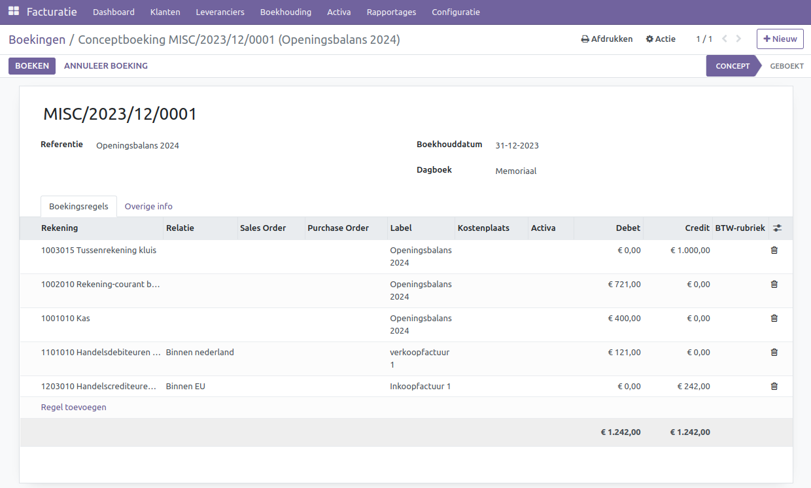

Openingsbalans
==============

Als je begint met het opzetten van een boekhouding, is het gebruikelijk om te starten met een openingsbalans. Dit vormt financieel gezien het vertrekpunt van de boekhouding en wordt vaak in samenwerking met een boekhouder opgesteld.

Indien je een startende ondernemer bent, is het mogelijk dat je een deel van je vermogen investeert in je bedrijf; dit wordt vervolgens opgenomen in je openingsbalans. Voor bestaande bedrijven die willen overstappen naar Curq, kan de boekhouding worden overgedragen met behulp van een openingsbalans.

Een openingsbalans wordt opgesteld in het memoriaal dagboek. Zo'n memoriaalboeking maak je via Facturatie > Boekhouding > Boekingen.

.. image:: Media/boekhouding_starten_beginbalans001.png

Klik vervolgens op de knop [NIEUW]. Het volgende scherm verschijnt.

- **Referentie:** Geef hier een duidelijke omschrijving mee, zodat je weet waar deze boeking voor bedoeld is.
- **Boekhouddatum:** Dit is de datum van deze boeking. Voor een openingsbalans wordt vaak het einde van een periode gekozen, meestal 31 december voor de meeste bedrijven. Als je ergens in het jaar overgaat, kies dan de laatste dag van de vorige maand. Mocht je twijfelen, overleg dan met je boekhouder welke datum geschikt is.
- **Dagboek:** Kies hier het memoriaal dagboek dat hiervoor bestemd is.

Op de boekingsregels geef je de details van de boeking in.

.. image:: Media/boekhouding_starten_beginbalans003.png

- **Rekening:** Vul hier de grootboekrekening in.
- **Relatie:** Voeg een relatie toe als je ook openstaande posten of facturen in de openingsbalans opneemt. Maak per relatie een regel aan, zowel voor klanten als leveranciers. Als je veel regels moet invoeren, is het voor overzichtelijkheid aan te raden om meerdere openingsbalansboekingen te maken. Je kunt bijvoorbeeld een aparte boeking maken voor klanten en een aparte voor leveranciers.
- **Label:** Geef hier een duidelijke omschrijving zodat je weet waar deze boekingsregel voor bedoeld is. Als je openstaande facturen meeneemt, vul dan hier de factuurnummers in.
- **Debet:** Bedrag aan de debetzijde.
- **Credit:** Bedrag aan de creditzijde.

Je kunt de openingsbalansboeking pas opslaan wanneer deze in balans is. Controleer voordat je de boeking opslaat of het totaalbedrag aan zowel de debet- als creditzijde gelijk is. Curq toont het totaal van beide kolommen onderaan.
