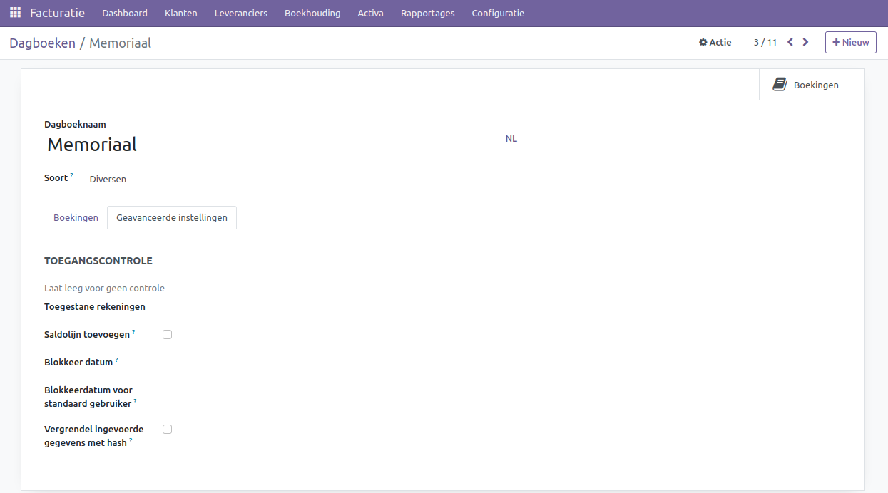

Dagboeken
====================================================================

Dagboeken vormen essentiële onderdelen van een gedegen boekhoudsysteem, waarbij elk dagboek een specifieke subadministratie vertegenwoordigt. Het bankboek behandelt zorgvuldig alle banktransacties, het verkoopboek geeft overzichtelijke informatie over verkoopfacturen, het inkoopboek registreert gedetailleerd inkoopfacturen, en het memoriaalboek vangt alle overige transacties op die niet elders passen.

De beheerfunctie voor dagboeken is te vinden onder Facturatie > Configuratie > Dagboeken. In Curq zijn de meest gangbare dagboeken alvast voor je ingesteld.

.. image:: Media/boekhouding_starten_dagboeken001.png

Bank
---------------------------------------------------------------------------------------------------

Het bankboek fungeert als een gedetailleerd financieel dagboek waarin alle banktransacties worden vastgelegd, waaronder stortingen, opnames en afschrijvingen. Het zorgvuldig bijhouden van deze transacties via het bankboek biedt niet alleen de mogelijkheid om financiële bewegingen nauwkeurig te monitoren, maar speelt tevens een cruciale rol bij het vaststellen van budgetten en het analyseren van uitgavenpatronen.

.. Note::
    Een bankrekening moet worden toegevoegd via Facturatie > Configuratie > Voeg een bankrekening toe.

De configuratie van het bankboek ziet er als volgt uit.

.. image:: Media/boekhouding_starten_dagboeken002.png

- **Bankrekening:** Koppel de juiste grootboekrekening aan de bank hier.
- **Afletteringsmodus:** Bepaal of het mogelijk is om een aflettering op de bank ongedaan te maken na uitvoering.

 * Boekingsbewerking: Afletteringen kunnen ongedaan worden gemaakt en bewerkt. 
 * Tussenrekening behouden: Het is niet mogelijk om een aflettering ongedaan te maken.

- **Tussenrekening:** Bankafschriftregels worden tijdelijk hier geboekt totdat de daadwerkelijke aflettering plaatsvindt.
- **Winstrekening:** Deze rekening behandelt positieve kasverschillen in het eindsaldo van de POS-app
- **Verliesrekening:** Deze rekening behandelt negatieve kasverschillen in het eindsaldo van de POS-app.
- **Specifieke betalingsvolgorde:** Vink dit aan als je niet dezelfde nummerreeks wilt gebruiken voor betalingen en banktransacties die in dit dagboek zijn geboekt.
- **Korte code:** Een korte code voor de weergave. Daarnaast worden transacties voorzien van dit voorvoegsel.
- **Valuta:** De valuta van dit dagboek. Als je een dollarbankrekening hebt, vul dan hier de US dollar in.
- **Rekeningnummer:** Jouw bankrekeningnummer. Maak dit hier aan of koppel jouw rekening.
- **Bank feeds:** Dit bepaalt de manier waarop bankafschriften worden ingelezen. 
  
 * Importeer(TXT/CSV/XSLX, camt.053.001.02, camt.054.001.02): Handmatig importeren van een TXT, CSV, XLSX, CAMT-bestand. Je kunt dit bestand bij de meeste banken downloaden.
 * Nog niet gedefinieerd: Handmatig of nog onbekend.
 * Mollie Synchronization: Via Mollie payment provider. Meer informatie over Mollie vind je in de Mollie handleiding.
 * Online (OCA): Synchronisatie via een online dienst. In Nederland wordt Ponto gebruikt.

Op het tabblad "Inkomende betalingen" kun je aangeven welke betalingsmethoden beschikbaar zijn in dit dagboek. Als je van plan bent om facturen van je klanten te innen, kun je gebruikmaken van Sepa Direct Debit, dat standaard al voor je is geactiveerd.

.. image:: Media/boekhouding_starten_dagboeken003.png

Op het tabblad "Uitgaande betalingen" kun je aangeven welke betalingsmethoden beschikbaar zijn in dit dagboek. Als je van plan bent om je leveranciers via de boekhouding te betalen, kun je gebruikmaken van Sepa Credit Transfer. Hiermee genereer je een bestand dat je vervolgens kunt uploaden naar je bank. Daarna kun je de betaling verder afhandelen in je bankomgeving. Hiermee voorkom je dubbele invoer en fouten die kunnen optreden bij handmatige betalingsverwerking.

.. image:: Media/boekhouding_starten_dagboeken004.png

Op het tabblad "Geavanceerde instellingen" kun je de volgende instellingen configureren.

.. image:: Media/boekhouding_starten_dagboeken005.png

- **Saldolijn toevoegen:** Voegt een extra regel toe aan het bankafschrift voor het saldo.
- **Blokkeer datum:** Vergrendelt het dagboek volledig, zodat niemand wijzigingen kan aanbrengen na de opgegeven datum.
- **Blokkeerdatum voor standaard gebruiker:** Alleen de facturatiebeheerder kan nog wijzigingen aanbrengen in dit dagboek. Dit is handig als de boekhouder wel wijzigingen mag aanbrengen, maar een standaard gebruiker niet.

Verkoop
---------------------------------------------------------------------------------------------------

In het verkoopboek wordt gedetailleerde informatie bijgehouden over alle verkopen. Het omvat niet alleen de datum van de verkoop, maar ook de naam van de klant, de aard van de verkochte goederen of diensten, en het ontvangen bedrag. Dit specifieke dagboek is met name van belang voor bedrijven die frequent goederen of diensten verkopen. Het verkoopboek vormt niet alleen een beheersinstrument voor de cashflow, maar levert ook waardevolle gegevens voor het opstellen van toekomstige verkoopprognoses en het formuleren van doeltreffende bedrijfsstrategieën.

De configuratie van het verkoopboek ziet er als volgt uit.

.. image:: Media/boekhouding_starten_dagboeken006.png

- **Standaard omzetrekening:** De standaard grootboekrekening die wordt gebruikt wanneer een factuur wordt aangemaakt. Als er vanuit andere processen geen specifieke omzetrekening wordt opgegeven, zal deze standaardrekening worden gebruikt.
- **Specifieke creditfactuur reeks:** Vink dit aan als je niet dezelfde nummerreeks wilt gebruiken voor creditfacturen die in dit dagboek zijn geboekt. 
- **Korte code:** Een korte code voor de weergave. Daarnaast worden transacties voorzien van dit voorvoegsel.
- **Chronologie controleren?:** Als de datum van een boeking niet chronologisch opvolgt, kan de boeking niet worden bevestigd. Dit voorkomt onbedoelde boekingen in de verkeerde periode.
- **Valuta:** De valuta van dit dagboek. In de meeste gevallen is dit leeg voor verkoop. Als je een factuur in een andere valuta wilt opstellen, kun je dat direct op de factuur instellen.

Op het tabblad "Geavanceerde instellingen" kun je de volgende instellingen configureren.

.. image:: Media/boekhouding_starten_dagboeken007.png

- **Saldolijn toevoegen:** Deze is alleen van toepassing voor het bankboek.
- **Blokkeer datum:** Vergrendelt het dagboek volledig, zodat niemand wijzigingen kan aanbrengen na de opgegeven datum.
- **Blokkeerdatum voor standaard gebruiker:** Alleen de facturatiebeheerder kan nog wijzigingen aanbrengen in dit dagboek. Dit is handig als de boekhouder wel wijzigingen mag aanbrengen, maar een standaard gebruiker niet.
- **Vergrendel ingevoerde gegevens met hash:** Zodra een factuur wordt geboekt, wordt deze vergrendeld. Achteraf aanpassingen maken op de factuur is hierdoor niet mogelijk.
- **E-mailservers configureren:** Hiermee kun je een mailbox koppelen aan je verkoopfacturen. Curq leest dan automatisch je e-mails uit en maakt de factuur automatisch aan. Je hoeft de PDF dan niet apart in Curq te uploaden. 
Dit is handig als je verkoopfacturen elders worden aangemaakt.
- **Elektronische facturatie:** Je kunt een factuur ook via XML of EDI versturen. Je hebt de keuze tussen NLCIUS of Peppol BIS Billing 3.0 formaat. De ontvangende partij kan hierdoor sneller jouw factuur invoeren als ze hiervan gebruik maken. Alle factuurgegevens zijn dan opgeslagen in het XML- of EDI-formaat.
- **Communicatiesoort:** Bepaalt hoe de referentie op de factuur zal verschijnen, zodat de klant beter zijn betaling kan uitvoeren.
- **Standaard communicatie:** Bepaalt hoe de referentie wordt opgebouwd. Standaard staat deze instelling op Odoo.
- **Plan activiteit:** Hiermee kun je een activiteit laten inplannen op de vervaldag van de factuur. Dit kan helpen om het betalingsproces te verbeteren en je facturen beter op te volgen.

Inkoop
---------------------------------------------------------------------------------------------------

Het inkoopboek richt zich op alle aankopen van goederen en diensten door het bedrijf. Het zorgvuldig noteren van gegevens zoals de aankoopdatum, leveranciersnaam, aard van de gekochte goederen en diensten, en het betaalde bedrag biedt waardevol inzicht in de uitgaven van het bedrijf. Het inkoopboek komt vooral van pas voor bedrijven die nauwgezet hun uitgaven willen volgen en financiële gegevens op georganiseerde wijze willen beheren. Dit resulteert niet alleen in een beter begrip van de cashflow, maar versterkt ook de controle over de budgetten.

De configuratie van het verkoopboek ziet er als volgt uit.

.. image:: Media/boekhouding_starten_dagboeken008.png

- **Standaard kostenrekening:** De standaard grootboekrekening die wordt gebruikt wanneer een factuur wordt aangemaakt. Als er vanuit andere processen geen specifieke kostenrekening wordt opgegeven, zal deze standaardrekening worden gebruikt.
- **Specifieke creditfactuur reeks:** Vink dit aan als je niet dezelfde nummerreeks wilt gebruiken voor creditfacturen die in dit dagboek zijn geboekt. 
- **Korte code:** Een korte code voor de weergave. Daarnaast worden transacties voorzien van dit voorvoegsel.
- **Chronologie controleren?:** Als de datum van een boeking niet chronologisch opvolgt, kan de boeking niet worden bevestigd. Dit voorkomt onbedoelde boekingen in de verkeerde periode.
- **Valuta:** De valuta van dit dagboek. In de meeste gevallen is dit leeg voor inkoop. Als je een factuur in een andere valuta wilt opstellen, kun je dat direct op de factuur instellen.

.. image:: Media/boekhouding_starten_dagboeken009.png

- **Saldolijn toevoegen:** Deze is alleen van toepassing voor het bankboek.
- **Blokkeer datum:** Vergrendelt het dagboek volledig, zodat niemand wijzigingen kan aanbrengen na de opgegeven datum.
- **Blokkeerdatum voor standaard gebruiker:** Alleen de facturatiebeheerder kan nog wijzigingen aanbrengen in dit dagboek. Dit is handig als de boekhouder wel wijzigingen mag aanbrengen, maar een standaard gebruiker niet.
- **Vergrendel ingevoerde gegevens met hash:** Zodra een factuur wordt geboekt, wordt deze vergrendeld. Achteraf aanpassingen maken op de factuur is hierdoor niet mogelijk.
- **E-mailservers configureren:** Hiermee kun je een mailbox koppelen aan je inkoopfacturen. Curq leest dan automatisch je e-mails uit en maakt de factuur automatisch aan. Je hoeft de PDF dan niet apart in Curq te uploaden.

Diversen / Memoriaal
---------------------------------------------------------------------------------------------------

Een bijzonder dagboek is het dagboek memoriaal, dat fungeert als een veelzijdig administratief instrument. Dit dagboek komt van pas voor boekingen die geen specifieke thuisbasis hebben in andere dagboeken. Voorbeelden hiervan zijn correcties, het verrekenen van openstaande en oninbare facturen, salarisboekingen en standaardboekingen.

De configuratie van het verkoopboek ziet er als volgt uit.

.. image:: Media/boekhouding_starten_dagboeken010.png

- **Korte code:** Een korte code voor de weergave. Daarnaast worden transacties voorzien van dit voorvoegsel.
- **Valuta:** De valuta van dit dagboek. In de meeste gevallen is dit leeg voor memoriaal.
  

- **Saldolijn toevoegen:** Deze is alleen van toepassing voor het bankboek.
- **Blokkeer datum:** Vergrendelt het dagboek volledig, zodat niemand wijzigingen kan aanbrengen na de opgegeven datum.
- **Blokkeerdatum voor standaard gebruiker:** Alleen de facturatiebeheerder kan nog wijzigingen aanbrengen in dit dagboek. Dit is handig als de boekhouder wel wijzigingen mag aanbrengen, maar een standaard gebruiker niet.
- **Vergrendel ingevoerde gegevens met hash:** Zodra een boeking wordt geboekt, wordt deze vergrendeld. Achteraf aanpassingen maken op de boeking is hierdoor niet mogelijk.
