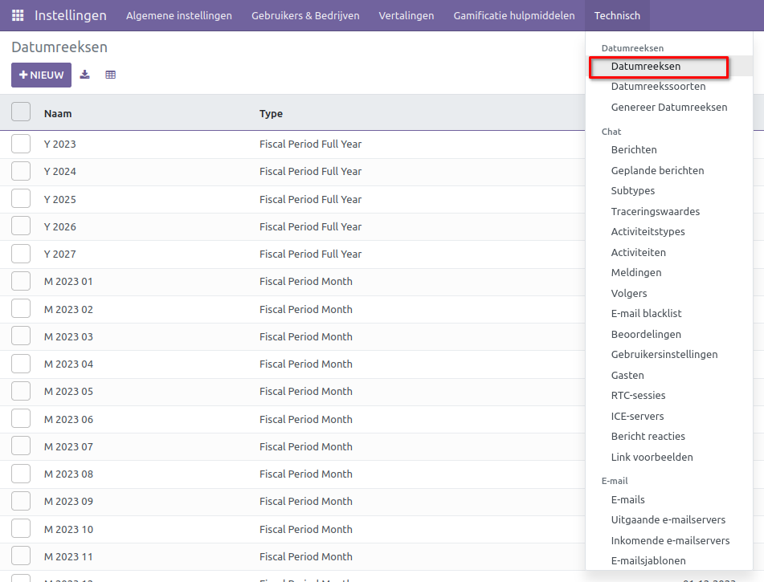
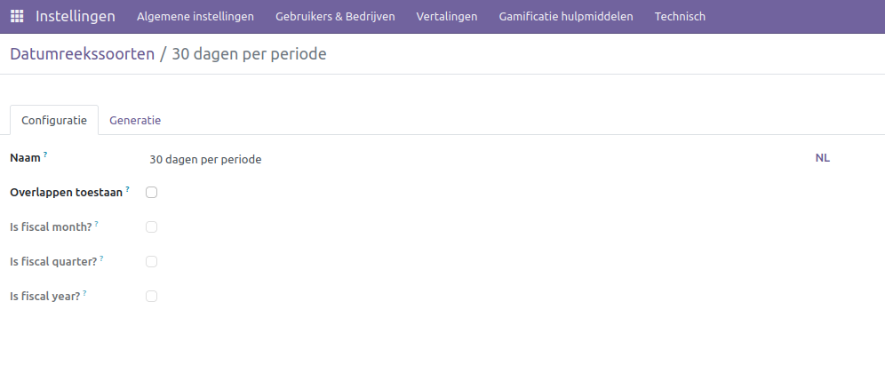
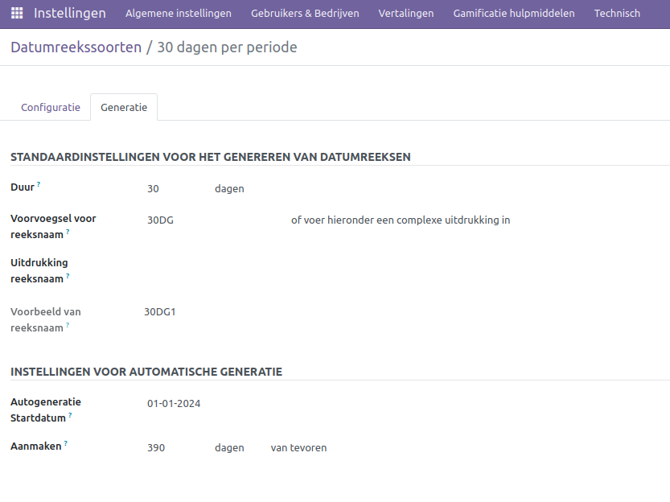
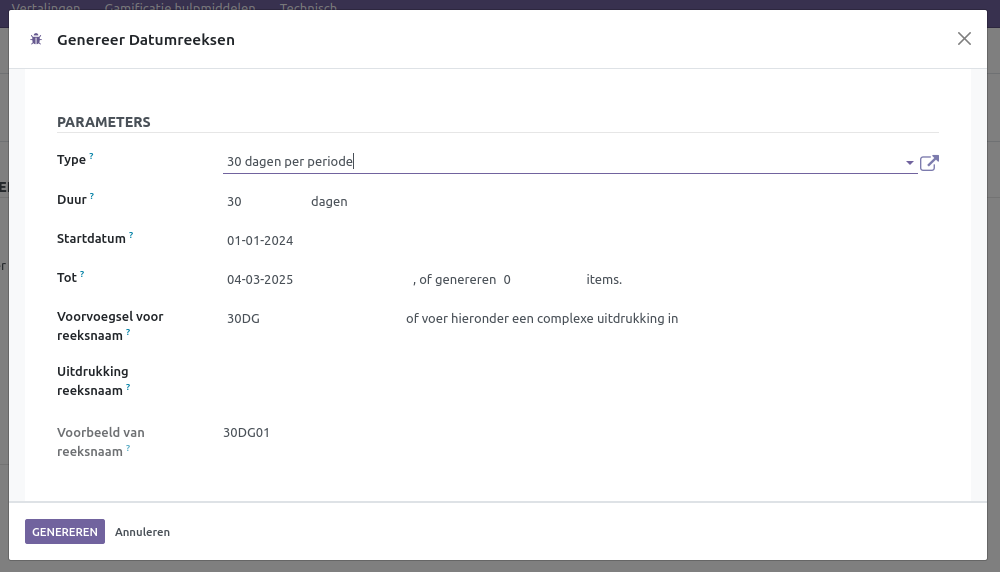

Datumreeksen
============

Curq is volledig gebaseerd op datums in de administratie, zonder gebruik te maken van specifieke boekhoudperiodes. In plaats daarvan worden datumreeksen ingezet om zowel de invoer als het genereren van overzichten te vergemakkelijken. Deze benadering biedt flexibiliteit en gestructureerd beheer van financiële informatie.

Datumreeksen beheren
--------------------

Curq zal jaarlijks automatisch de datumreeksen met maanden, kwartalen en jaren bijwerken. Gebruikers hebben ook de mogelijkheid om deze reeksen handmatig te beheren. Om toegang te krijgen tot de beheersfunctie, is het noodzakelijk om eerst de ontwikkelaarsmodus in te schakelen. Datumreeksen kunnen worden aangepast via Instellingen > Technisch > Datumreeksen.

In dit venster kun je direct de gegevens aanpassen of klikken op [NIEUW] om een nieuwe reeks te creëren.

.. Note::
    Houd er rekening mee dat als je op 'NIEUW' klikt, je cursor automatisch naar beneden springt.

- **Naam:** Voer hier de naam in voor jouw datumreeks.
- **Type:** Maak een keuze tussen Jaar, Kwartaal of Maand.
- **Startdatum:** Startdatum van jouw reeks.
- **Einddatum:** Einddatum van jouw reeks.
- **Actief:**  Schakel dit vinkje in als je de datumreeks wilt tonen.

.. Note::
    De onderstaande secties zijn uitsluitend bedoeld voor situaties waarin afwijkende configuraties vereist zijn. De meeste bedrijven zullen hier geen behoefte aan hebben.

Datumreekssoorten beheren
-------------------------

Via Instellingen > Technisch > Datumreekssoorten kun je verschillende soorten configureren die van toepassing zijn op jouw datumreeksen of die gebruikt kunnen worden bij het genereren ervan.

- **Naam:** Geef hier de naam op voor de datumreekssoort.
- **Overlappen toestaan:** Datumreeksen met deze soort mogen elkaar overlappen qua datum.
- **Is fiscal month?** Niet van toepassing.
- **Is fiscal quarter?** Niet van toepassing.
- **Is fiscal year?** Niet van toepassing.

Op tabblad [Generatie] kun je de configuratie wijzigen voor het automatisch genereren van datumreeksen.

- **Duur:** Standaard tijdsduur voor dit type.
- **Voorvoegsel voor reeksnaam:** Deze tekst wordt toegevoegd aan de namen van de datumreeksen als een voorvoegsel. Elke datumreeks begint dan met deze specifieke tekst.
- **Uitdrukking reeksnaam:** Hier kun je met behulp van een formule de reeksnaam op een slimme manier instellen.
- **Aanmaken:** Hier kun je aangeven hoe ver van tevoren een reeks moet worden aangemaakt.

Genereer Datumreeksen
---------------------

Als je een groot aantal reeksen tegelijk wilt genereren, kun je gebruikmaken van de optie om een datumreeks te laten genereren. Ga hiervoor naar Instellingen > Technisch > Genereer Datumreeksen.

Zodra je een bepaald type hebt geselecteerd, worden de instellingen overgenomen van de betreffende datumreekssoort. De uitleg van de meeste velden staat hierboven.

- **Startdatum:** Vanaf deze datum worden de datumreeksen gegenereerd.
- **Tot:** Tot deze datum worden de datumreeksen gegenereerd.
- **of genereren .. items:** Als je geen specifieke datum invoert, kun je hier aangeven hoeveel reeksen er gegenereerd moeten worden.
