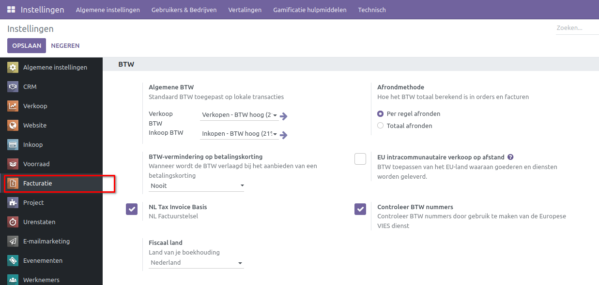

Belastingen
====================================================================

Als ondernemer wil je dat de belastingen zo goed mogelijk worden bepaald. Curq kan je hierbij helpen. We stellen eerst de basisinstellingen goed in. De basisinstellingen vind je terug in de app Instellingen > links in het menu bij Facturatie.

Belastinginstellingen

- **Algemene BTW:** Bepaal welke BTW-code standaard wordt gebruikt bij jouw facturen en orders, zowel voor Verkoop als Inkoop.
- **BTW-vermindering op betalingskorting:** Wanneer wordt er BTW verminderd als je een betalingskorting aanbiedt? Stel je hebt een factuur van 100,- met 21,- BTW. Als je binnen 7 dagen betaalt, ontvang je 2% korting.

**Altijd:**

* Binnen 7 dagen = 118,58 (98 + (21% van 98))
* Na 7 dagen = 120,58 (100 + (21% van 98))

**Bij vroege betaling:**

* Binnen 7 dagen = 118,58 (98 + (21% van 98))
* Na 7 dagen = 121,00 (100 + (21% van 100))

**Nooit:**

* Binnen 7 dagen = 119,00 (100 + (21% van 100))
* Na 7 dagen = 121,- (100 + (21% van 100))

Weet je niet zeker welke methode je moet gebruiken, overleg dan met je accountant. 

.. Note::
    Op de website van de Belastingdienst vind je ook meer informatie over hoe je moet omgaan met BTW en betalingskortingen. `Belastingdienst - Kortingen bij tijdige betaling <https://www.belastingdienst.nl/wps/wcm/connect/bldcontentnl/belastingdienst/zakelijk/btw/administratie_bijhouden/facturen_maken/factuureisen/aangepaste_regels_facturen/u_geeft_korting_voor_tijdige_betalingen>`_

- **NL Factuurstelsel:** Gebruik deze optie als je verplicht bent om via het factuurstelsel BTW te laten berekenen. Dit zal in de meeste gevallen zijn als je verplicht bent om een factuur te versturen. Val je onder het kasstelsel, dan zet je deze uit. Mocht je het niet weten, vraag het dan na bij je accountant of kijk op de website van de Belastingdienst. `Belastingdienst - Hoe berekent u het btw-bedrag? <https://www.belastingdienst.nl/wps/wcm/connect/bldcontentnl/belastingdienst/zakelijk/btw/btw_aangifte_doen_en_betalen/bereken_het_bedrag/hoe_berekent_u_het_btw_bedrag/>`_

- **Fiscaal land:** Vul hier het land in van jouw boekhouding.
- **Afrondmethode:** In de meeste gevallen rond je je BTW af per regel.
- **EU intracommunautaire verkoop op afstand:** Is alleen van toepassing als je veel handelt met het buitenland. Met deze optie activeer je ook de One-Stop Shop (OSS) en per land binnen de EU de BTW Codes en Fiscale Posities. Overleg met je accountant om na te gaan of je in aanmerking komt voor OSS.
- **Controleer BTW nummers:** Activeer de controle van de BTW via de dienst VIES.

.. toctree::
    :maxdepth: 2

    belastingen_vies
    belastingen_fiscale_posities
    belastingen_B2B_B2C
    belastingen_afstandsverkopen_EU
