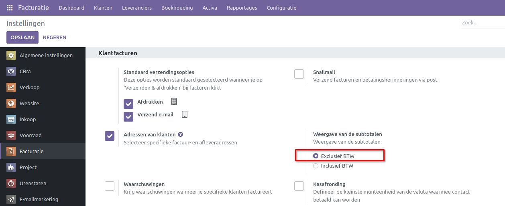
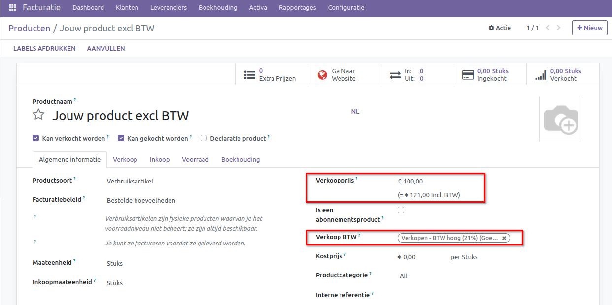

Belastingen B2C en B2B
====================================================================

Als bedrijf opereer je vaak binnen twee verschillende modellen: B2C of B2B.

B2C staat voor "Business to Consumer," en B2B staat voor "Business to Business." Deze termen verwijzen naar verschillende modellen van zakelijke transacties:

**B2C (Business to Consumer):**
Dit model beschrijft transacties waarbij een bedrijf direct producten of diensten aan individuele consumenten verkoopt. Bijvoorbeeld, wanneer je online kleding verkoopt, ben je betrokken bij een B2C-transactie. De kledingwinkel is het bedrijf dat rechtstreeks aan de consument verkoopt.

**B2B (Business to Business):**
In dit model verkoopt een bedrijf producten of diensten aan andere bedrijven. Een groothandel in elektronische componenten die producten levert aan een fabrikant van elektronica is een voorbeeld van een B2B-transactie. Het betreft hier bedrijven die met elkaar zakendoen.

In essentie draait het bij B2C om de verkoop aan individuele consumenten, terwijl B2B verwijst naar transacties tussen twee bedrijven. Beide modellen hebben hun eigen specifieke kenmerken, en dit heeft invloed op hoe je belastingen inricht in Curq.

Curq ondersteunt beide manieren om de BTW toe te passen. Het is het eenvoudigst als je slechts één van de twee modellen gebruikt. Echter, als je in een gemengde vorm werkt, dien je specifieke instellingen te configureren. In dit geval zullen we ons beperken tot de modellen B2C en B2B, aangezien een gemengde vorm complex is en het beheer ervan foutgevoelig kan zijn.

B2C
---------------------------------------------------------------------------------------------------
Voor B2C worden de prijzen meestal inclusief BTW weergegeven. Stel, je verkoopt jouw product voor €100,- en er wordt 21% BTW over gerekend, dan ziet de consument €121,-. Dit is het uiteindelijke bedrag dat de consument moet afrekenen.

Met de volgende instellingen kun je jouw omgeving configureren voor B2C. Ga naar Instellingen > Facturatie > BTW. Zorg ervoor dat je bij de algemene BTW-instelling een BTW-code met inclusief BTW kiest voor **Verkoop BTW**.

.. image:: Media/belastingen_b2c_b2b001.png

De tweede instelling kun je configureren via Instellingen > Facturatie > Klantfacturen. Zorg ervoor dat deze op **inclusief BTW** staat.

.. image:: Media/belastingen_b2c_b2b002.png

Zodra je een product aanmaakt, vul je daar de verkoopprijs in, inclusief het BTW-bedrag, bijvoorbeeld €121,-. Je ziet meteen ook het bedrag exclusief BTW, bijvoorbeeld €100,-. Op basis van jouw instellingen stelt Curq nu automatisch de BTW-code met inclusief BTW in voor elk product.
Ook op je facturen en verkooporders zal je nu op de regels het bedrag inclusief het BTW zien.

.. image:: Media/belastingen_b2c_b2b003.png

B2B
---------------------------------------------------------------------------------------------------
Voor B2B worden de prijzen meestal exclusief BTW weergegeven. Stel, je verkoopt jouw product voor €100,- en er wordt 21% BTW over gerekend, dan ziet jouw klant €100,- + €21,-. Jouw klant betaalt uiteindelijk €121,- en door de splitsing weet jouw klant wel bedrag hij kan opgeven aan de belastingdienst.

Met de volgende instellingen kun je jouw omgeving configureren voor B2B. Ga naar Instellingen > Facturatie > BTW. Zorg ervoor dat je bij de algemene BTW-instelling een BTW-code met exclusief BTW kiest voor **Verkoop BTW**.

.. image:: Media/belastingen_b2c_b2b004.png

De tweede instelling kun je configureren via Instellingen > Facturatie > Klantfacturen. Zorg ervoor dat deze op **exclusief BTW** staat.

Zodra je een product aanmaakt, vul je daar de verkoopprijs in, exclusief het BTW-bedrag, bijvoorbeeld €100,-. Je ziet meteen ook het bedrag inclusief BTW, bijvoorbeeld €121,-. Op basis van jouw instellingen stelt Curq nu automatisch de BTW-code met exclusief BTW in voor elk product.
Ook op je facturen en verkooporders zal je nu op de regels het bedrag exclusief het BTW zien.

