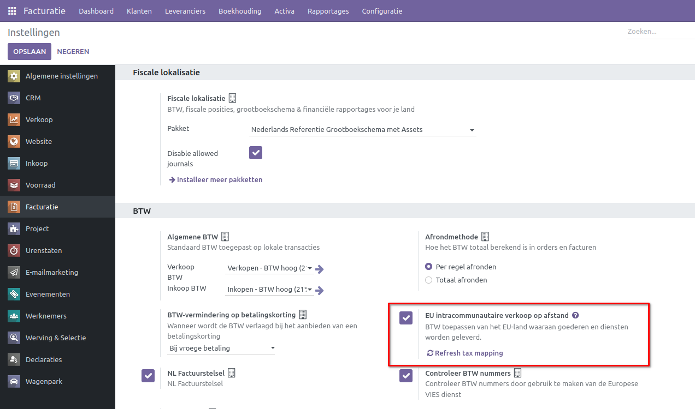
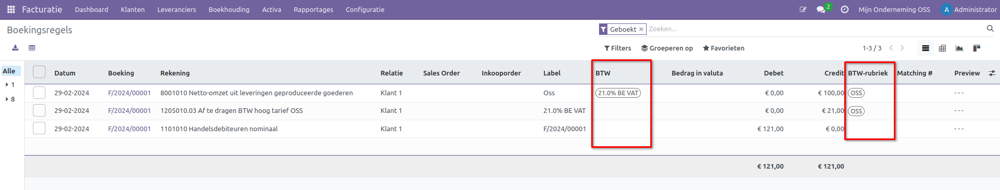

Afstandsverkopen binnen de EU
====================================================================

Afstandsverkopen binnen de EU omvatten de handel in goederen en diensten van bedrijven naar consumenten (B2C), waarbij de verkoper geregistreerd is voor BTW-doeleinden in een EU-lidstaat en de koper zich bevindt in een andere EU-lidstaat. Deze transacties, veelal via online platforms, postorders, telefoon of andere communicatiemiddelen, vormen een vorm van grensoverschrijdende handel binnen de Europese Unie.

Bij verkoop van goederen in de EU aan klanten zonder btw-aangifte te doen, dient doorgaans de btw te worden aangegeven in het EU-land van ontvangst, waarbij het tarief van dat specifieke EU-land wordt toegepast. Een alternatieve, vereenvoudigde aanpak is beschikbaar via de 'Unieregeling' binnen het éénloketsysteem (One Stop Shop, OSS), waarmee de btw op een centrale wijze kan worden afgehandeld.

Klanten die geen btw-aangifte doen, zoals particulieren, ondernemers met alleen vrijgestelde prestaties en niet-ondernemende rechtspersonen, vallen onder deze regeling. Voor deze groep geldt echter een drempel; wanneer hun aankopen het drempelbedrag overschrijden, zijn zij verplicht btw-aangifte te doen en kunnen zij geen gebruik maken van de Unieregeling.

.. Note::
    Meer informatie vind je hier op de website van de belastingdienst `Afstandsverkopen, zoals e-commerce, binnen de EU <https://www.belastingdienst.nl/wps/wcm/connect/bldcontentnl/belastingdienst/zakelijk/btw/zakendoen_met_het_buitenland/afstandsverkopen-zoals-e-commerce-en-diensten-voor-particulieren-in-andere-eu-landen/afstandsverkopen-zoals-e-commerce-binnen-de-eu/>`_

Activeren BTW voor EU intracommunautaire verkoop op afstand
---------------------------------------------------------------------------------------------------

Curq vergemakkelijkt afstandsverkopen binnen de EU door vooraf BTW-codes per land te definiëren. Deze functionaliteit is beschikbaar via Facturatie > Configuratie > Instellingen. Schakel de optie "EU intracommunautaire verkoop op afstand" in om hiervan gebruik te maken.

Curq genereert momenteel BTW-codes en fiscale posities per land. Je kunt deze gegevens terugvinden onder Facturatie > Configuratie > BTW of Fiscale Posities.

.. image:: Media/belastingen_afstandsverkopen_EU002.png

De BTW-codes zijn te onderscheiden aan de hand van het percentage en de landcode, en ze kunnen direct worden toegepast. Het is echter verstandig om de BTW-codes te verifiëren en ervoor te zorgen dat de instellingen in lijn zijn met jouw boekhouding. Dit kun je bespreken met je accountant of boekhouder.

.. image:: Media/belastingen_afstandsverkopen_EU003.png

Fiscale posities kunnen worden geïdentificeerd aan de hand van "OSS B2C" in de naam. Elke fiscale positie is verbonden met een specifiek land, waardoor Curq automatisch de correcte BTW kan bepalen op basis hiervan.

Rapportages
---------------------------------------------------------------------------------------------------

Voor afstandsverkopen biedt Curq geen specifieke rapportage aan. De relevante gegevens worden vastgelegd op de boekingsregels, inclusief een BTW-code en de bijbehorende BTW-rubriek. Met deze informatie kan een overzicht worden gegenereerd voor de belastingdienst.

