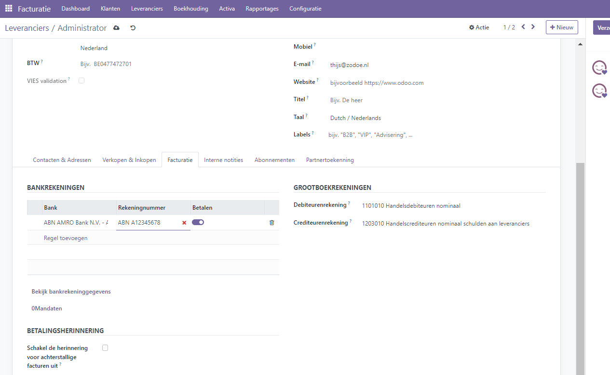
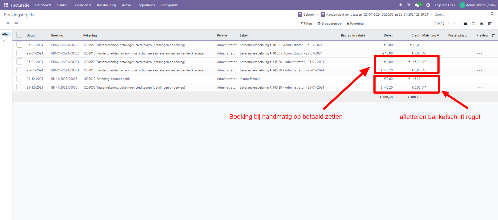
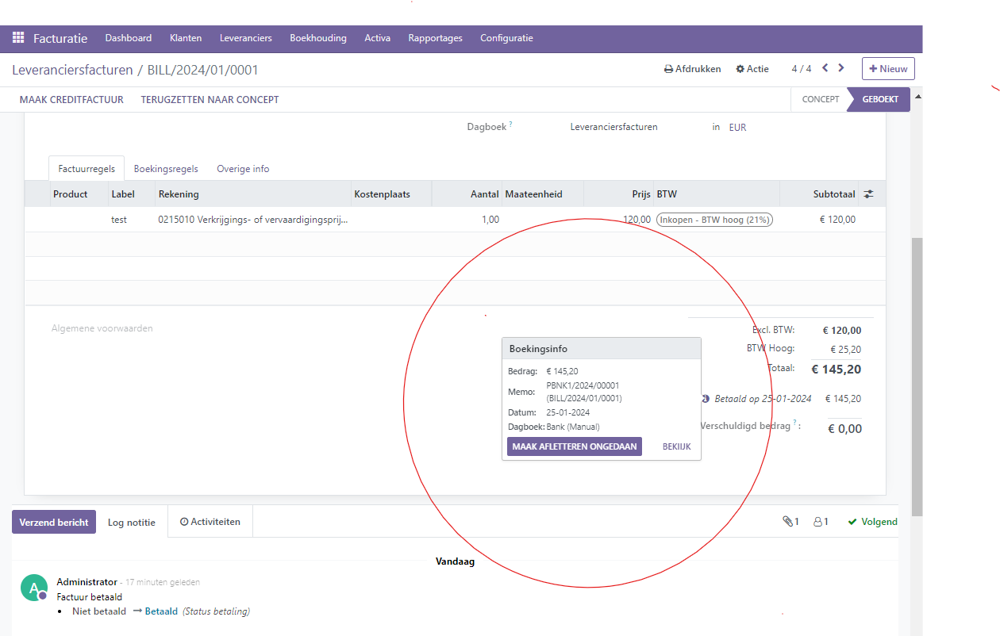
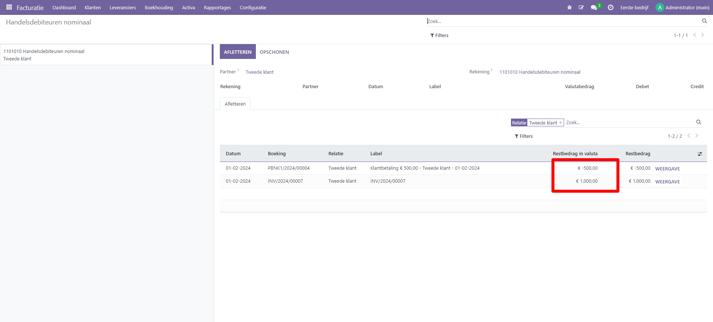

Betalingen
----
In Curq kunnen betalingen automatisch worden gekoppeld aan een factuur of rekening. Daarnaast kunnen het ook los staande records zijn voor gebruik op een later tijdstip. De betaling wordt in dat geval via de debiteuren- of crediteurenrekening aan de klant/leverancier gekoppeld. 

Als een betaling is gekoppeld aan een factuur of nota, dan wordt het verschuldigde bedrag van de factuur verlaagd/verrekend. Je kunt meerdere betalingen aan dezelfde factuur koppelen.

Als een betaling niet aan een factuur of rekening is gekoppeld, dan heeft de klant ofwel een openstaand krediet bij je bedrijf, of heeft je bedrijf een openstaand debet bij een leverancier. Je kunt deze openstaande bedragen gebruiken om onbetaalde facturen/rekeningen te verlagen/vereffenen. Hoe je dit doet vind je terug in het onderdeel 'afletteren'.

Gebruikelijk is om de factuur direct op betaald te zetten als deze binnenkomt op je bankrekening en je deze aflettert, maar Curq ondersteunt ook de mogelijkheid om de (inkoop)factuur handmatig op betaald te zetten. 

Wanneer je inkoopfacturen via SEPA bestanden bij je bank verwerkt, kijk dan bij het onderdeel SEPA in de handleiding hoe je deze betalingen verwerkt. Dit gaat in Curq niet via de knop Betalingen maar via menu Facturatie-> Leveranciers-> Uitgaande betalingen.

Bankrekening controle
----

Zorg er altijd voor dat je bij aanmaken van een nieuwe leverancier controleert of de gegevens correct zijn. Curq helpt je met controleren van het banknummer. Ook is er een aparte knop waarmee je expliciet aangeeft dat het nummer gecontroleerd is en betalingen gedaan kunnen worden. In onderstaand voorbeeld zie je dat het ingevoerde nummer geen officieel IBAN nummer is. 

Curq controleert hierop maar omdat er ook niet-IBAN nummers toegevoegd kunnen worden, is dit geen blokkerende melding.
Als de schuif 'Betalen' aan staat dan kun je de rekening gebruiken bij betalingen.

Betaling registreren van een factuur of rekening
----

Wanneer je klikt op 'Betaling registreren' in een klant- of leveranciersfactuur, dan wordt een nieuwe journaalpost gegenereerd en wordt het verschuldigde bedrag gewijzigd overeenkomstig het betalingsbedrag. De tegenboeking wordt weergegeven op een rekening voor uitstaande ontvangsten of betalingen. Op dat moment wordt de klant- of leveranciersfactuur gemarkeerd als 'Betaald'. 

Wanneer de openstaande rekening vervolgens wordt afgeletterd met een bankafschriftregel, dan zal Curq automatisch het bedrag op de uitstaande ontvangst of betalingen rekening afboeken en op- of afboeken op de bankrekening.

Hieronder zie je de 4 boekingen die Curq maakt bij het op betaald zetten van de factuur en verwerken van de dagafschriftregel.

Het informatiepictogram naast de betalingsregel geeft meer informatie over de betaling weer. Je hebt toegang tot aanvullende informatie, zoals het bijbehorende journaal, door op 'bekijk' te klikken. 

Vanuit dit informatiescherm kun je de aflettering ook ongedaan maken, Dit doe je bijvoorbeeld als je een betaling aan een verkeerde factuur hebt gekoppeld. Na ontkoppelen van de betaling kun je deze eventueel ook verwijderen in het menu Facturatie-> Klanten of leveranciers-> Betalingen.

Gedeeltelijke betaling
----

Om een gedeeltelijke betaling te registreren, klik je op 'Betaling registreren' op de betreffende factuur of rekening en voer je het ontvangen of betaalde bedrag in. Nadat je het bedrag hebt ingevoerd, wordt er gevraagd of je de factuur of rekening open wilt houden of als volledig betaald wilt markeren. Selecteer Openhouden en klik op Betaling aanmaken. De factuur of rekening is nu gemarkeerd als Gedeeltelijk betaald. Selecteer Markeer als volledig betaald als je de factuur of rekening wilt vereffenen met een verschil in het bedrag.

Het kan ook zijn dat je op je bankafschrift een deelbetaling van een factuur ontvangt. Je kunt het resterende bedrag open laten staan op de debiteuren- of crediteurenrekening of je kan ervoor kiezen om het resterende bedrag weg te boeken op een verschillenrekening. Meer informatie over dit onderwerp vind je in het handleiding onderdeel 'afletteren'.

Afletter menu
----

Je vind dit menu onder Boekhouding -> Afletteren. In dit onderdeel zie je alle openstaande handmatig aangemaakte, niet-afgeletterde betalingen- of ontvangsten. in onderstaand voorbeeld is een handmatige ontvangst geregistreerd en staat er ook een verkoopfactuur open. In dit menu kun je de betaling en de factuur aan elkaar matchen. De verkoopfactuur zal op gedeeltelijk betaald komen te staan na afletteren.

.. toctree::
    :maxdepth: 2

betalingen_direct_debit
betalingen_interne_transfers
betalingen_online_betalingen_Mollie
betalingen_sepa
