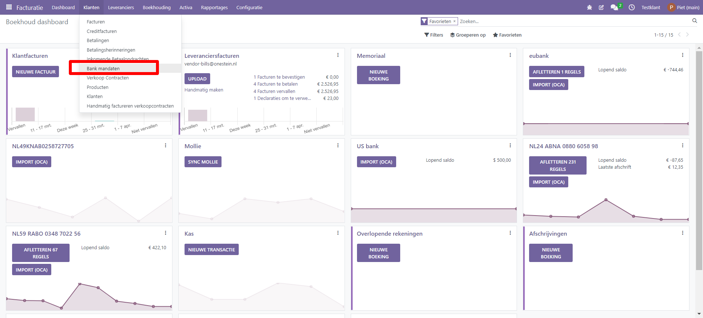
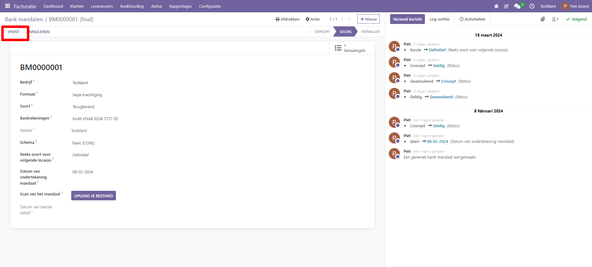
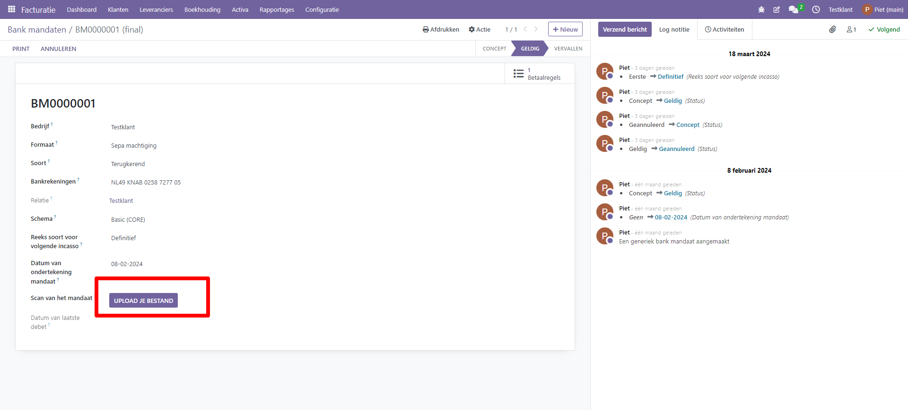
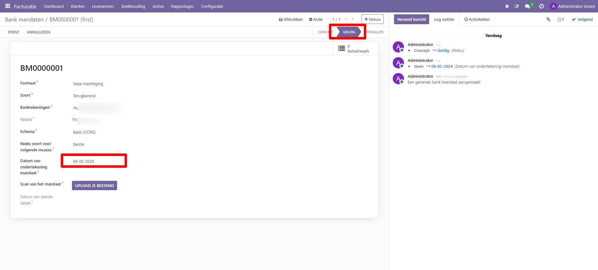
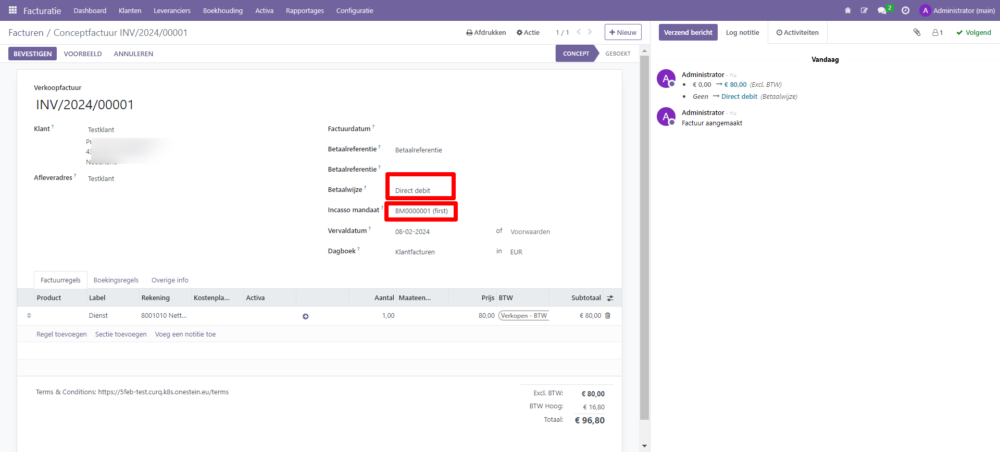
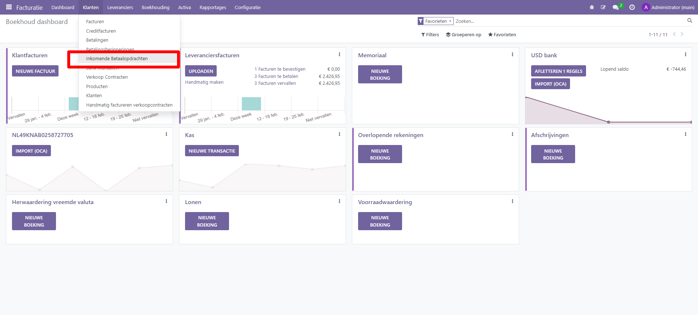
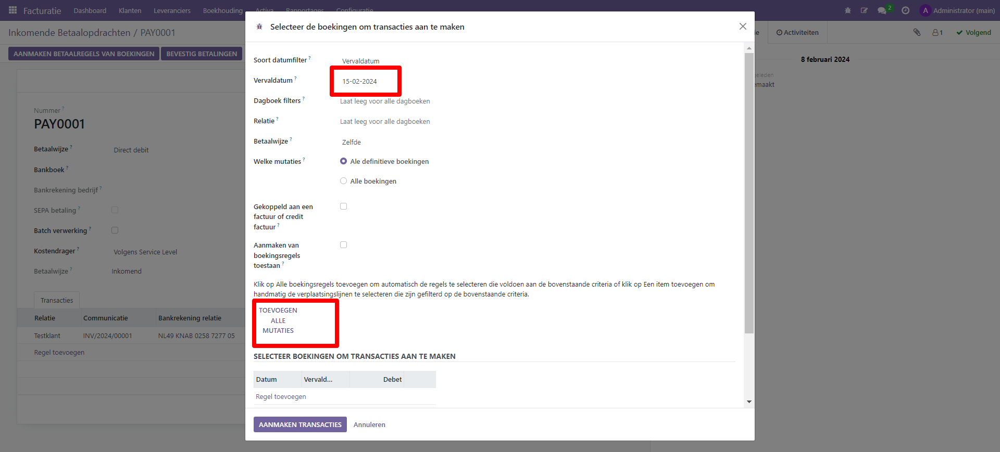
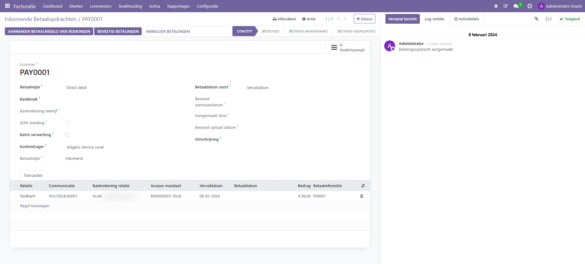
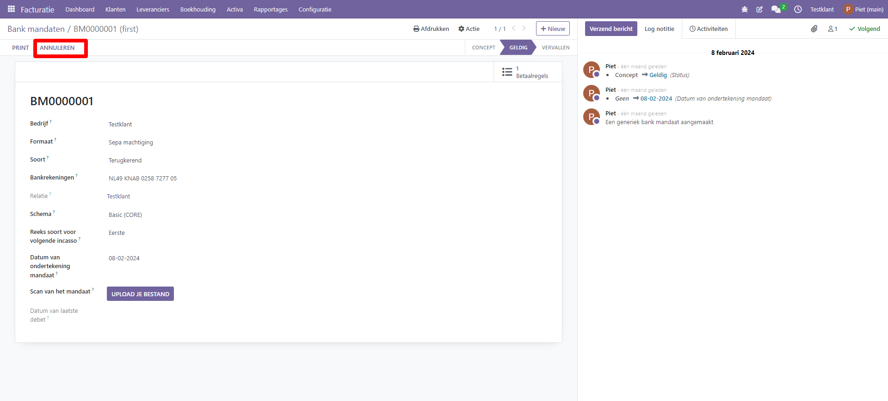

Batch payments: SEPA Direct Debit (SDD)
=========================================================================

SEPA, de Single Euro Payments Area, is een betalingsintegratie-initiatief van de Europese Unie voor vereenvoudiging van bankoverschrijvingen in euro's. 

Met SEPA Direct Debit (SDD) kunnen je klanten een mandaat ondertekenen dat jou machtigt om toekomstige betalingen van hun bankrekeningen te innen. Dit is vooral handig voor terugkerende betalingen op basis van een abonnement.

Je kunt klantmandaten vastleggen in Curq. Vervolgens kun je .xml-bestanden genereren op basis van te innen verkoopfacturen. Het XML bestand kun je vervolgens bij je bank uploaden.

Mandaat instellingen
-------------------------------------------------------------------------

De functie SEPA-incasso kan worden geactiveerd via het menu Instellingen van de boekhoudmodule, zoals hieronder weergegeven. Voer na het activeren van deze functie de Creditor Identifier van je bedrijf in de daarvoor bestemde ruimte in.

.. image:: Media/direct_debit_incassant_id.png
       :width: 6.3in
       :height: 2.93264in

Aanmaken en bevestigen mandaat van een klant
-------------------------------------------------------------------------
Je kunt nu een nieuw incassomachtiging configureren vanuit het menu Facturatie > Klanten > Bank mandaten. Na ingeven van de klantgegevens kun je vervolgens een document afdrukken via de knop 'Print'. Dit document kan de klant vervolgens ondertekenen. Via de knop 'Upload' kun je het ondertekende formulier bij het record opslaan.

Menu

Invullen machtiging
-------------------------------------------------------------------------
In het mandaat zelf vul je de volgende gegevens in:

* Formaat. kies hier voor 'Sepa'.
* Soort. Hier geef je aan of het een eenmalig, terugkerend of generiek mandaat is. Bij een abonnement kies je voor 'terugkerend'.
* Bankrekening. Hier kies je het banknummer van de klant van het het mandaat.
* Schema. Kies voor Core, B2B is een variant voor zakelijke incasso. Bij de B2B variant kan de debiteur de incasso niet storneren. Niet alle banken ondersteunen B2B, Core wordt wel altijd ondersteund.
* Dit veld wordt alleen gebruikt voor herhalende machtigingen, niet voor eenmalige machtiging. De standaard waarde is 'eerste' om aan te geven dat de eerstvolgende incasso de eerste van een reeks is.
* Datum ondertekening. Voer hier de datum in van ondertekening van het mandaat door de klant.

Printen van de machtiging:

Voorbeeld van de te ondertekenen machtiging

.. image:: Media/direct_debit_voorbeeld_mandaat.png
       :width: 6.3in
       :height: 2.93264in

Uploaden document

Na opslaan en bevestigen van het mandaat ziet de definitieve machtiging er alsvolgt uit:

Zodra een factuur is gemaakt in Curq voor een klant met een mandaat actief op de factuurdatum, zal de validatie ervan de automatische betaling activeren, en je hoeft dan alleen nog maar een SEPA Direct Debit (SDD) XML-bestand te genereren met deze bewerking en het naar je bank te sturen.

Aanmaken verkoopfactuur
-------------------------------------------------------------------------
Zorg dat bij de klant als standaard incassowijze 'direct debit' staat. Wanneer je een verkoopfactuur voor de klant met machtiging ingeeft, dan neemt Curq de gegevens automatisch over naar de factuur. Je ziet dan ook de machtiging staan bij de verkoopfactuur.

Aanmaken incasso batch
-------------------------------------------------------------------------
Vanuit menu Boekhouding-> klanten-> betaalopdracht maak je de incassobatch aan. Je kunt binnen via de optie 'Aanmaken van betaalregels van boekingen' regels toevoegen waarbij je kunt filteren op vervaldatum. Via de knop 'Toevoegen alle mutaties' en daarna 'Aanmaken transacties'voegt Curq automatisch alle regels aan die in aanmerking komen voor incasso (zie onderstaande derde schermprint).

Na bevestigen van het betaalbestand verandert de status en zal een XML bestand worden aangemaakt. Dit bestand kun je downloaden in inlezen in je bankapplicatie. De status 'bestand geupload bij de bank' geef je aan zodra het bestand is ingelezen bij je bank. Dit is de controle of je daadwerkelijk alle stappen van het proces hebt uitgevoerd.

Afletteren van incassobatch via bank
-------------------------------------------------------------------------
Wanneer de bedragen zijn geincasseerd en bijgeschreven op je bankrekening, dan kun je deze betaalregel vervolgens aflettteren en worden de betalingen op de facturen op de juiste manier afgeboekt.

Beeindigen van een incasso mandaat
-------------------------------------------------------------------------

Je beeindigt een incassomandaat door op de knop annuleren te klikken

