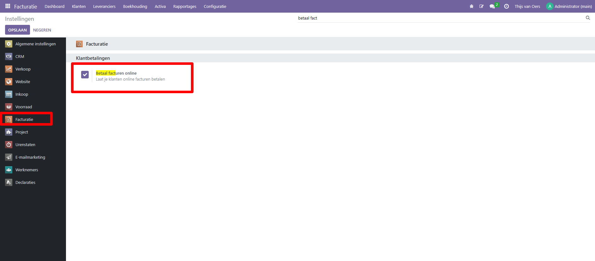
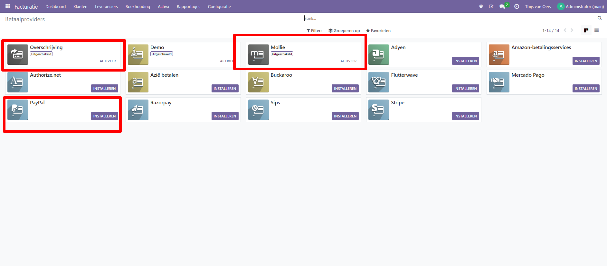
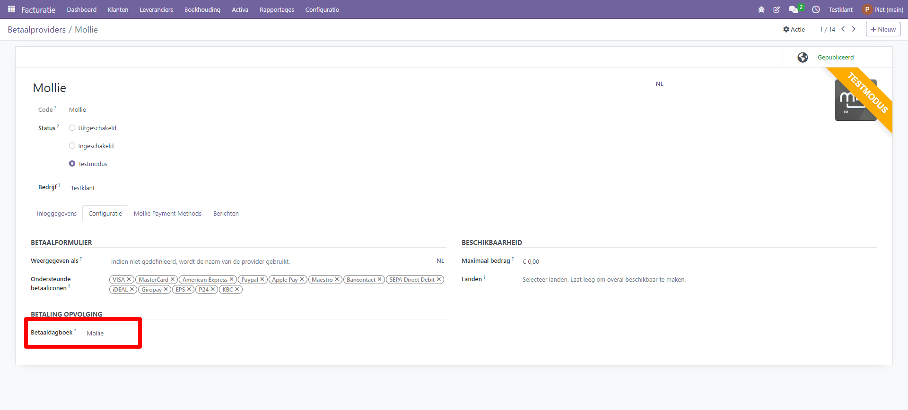
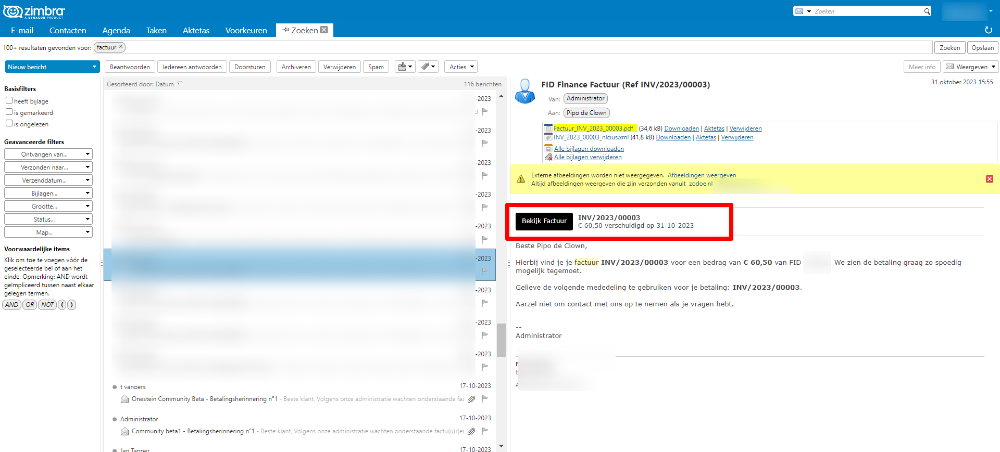
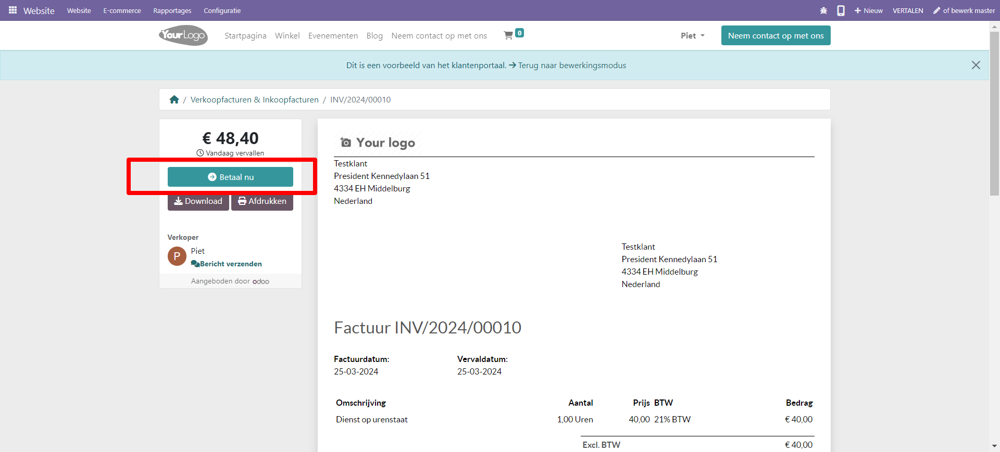
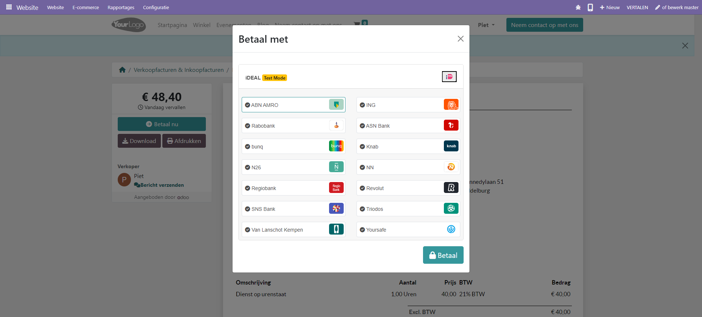
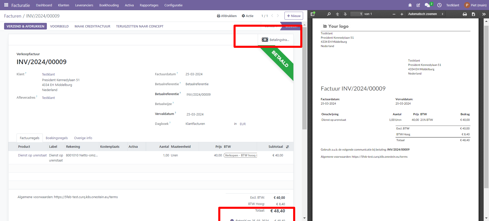

Online betalen facturen
=========================================================================

Om het voor je klanten nog gemakkelijker te maken om openstaande facturen te betalen, kun je de functie 'Factuur online betalen' activeren. Deze functie voegt een knop 'Nu betalen' toe aan het klantenportaal. Klanten kunnen hun facturen online bekijken en direct betalen met hun favoriete betaalmethode, waardoor het betalingsproces veel eenvoudiger wordt.

Om Facturen Online Betalen te activeren, ga je naar Boekhouding ‣ Configuratie ‣ Instellingen ‣ Klantbetalingen, schakel 'Betaal facturen online' en klik op Opslaan.

Betaalproviders
-------------------------------------------------------------------------

Curq ondersteunt een aantal betalingsproviders, met de Mollie koppeling kun je de klant de factuur laten betalen met iDeal.

Inrichting Mollie koppeling
-------------------------------------------------------------------------

Activeer eerst Mollie als betalingsprovider via Boekhouding ‣ Configuratie ‣ Betalingsproviders

Voer de API keys en de credentials in (je vind deze op je Mollie dashboard).

.. image:: Media/betalingen_mollie_apisleutel.png
       :width: 6.3in
       :height: 2.93264in

Klik op de 'Mollie Payment Methods' tab and klik op de 'Sync payment method' knop. De beschikbare betaalmethodes zijn nu zichtbaar (waaronder iDeal).

.. image:: Media/online_betalen_mollie_sync_betalingswijze.png
       :width: 6.3in
       :height: 2.93264in

Vergeet niet om op het tabblad 'Configuratie' het dagboek dat je hebt aangemaakt voor Mollie te koppelen aan de betaalprovider. Op dit tabblad kun je ook aangeven welke betaaliconen je ondersteunt, in welke landen de betalingswijze gedaan kan worden. Ook kun je hier een maximum bedrag ingeven waarvoor deze provider beschikbaar is. Laat leeg voor geen maximum.

Klaar! je klanten kunnen nu direct betalingen doen via het klantenportaal van Curq.

Betaling klantenportaal en status factuur
---------------------------------------------------

Wanneer je een factuur hebt aangemaakt en de klant vanuit Curq een e-mail stuurt, dan zit bij die e-mail een link naar het klantenportaal. De factuur kan vervolgens direct via het klantenportaal worden betaald. 
Je klant betaalt de factuur door op de knop 'Betaal nu' te klikken en een van de eerder gedefinieerde betaalwijzes te kiezen.

Mail versturen vanuit Curq:

.. image:: Media/online_betalen_factuur_mailen.png
       :width: 6.3in
       :height: 2.93264in

De klant kan direct naar het klantenportaal gaan vanuit de ontvangen e-mail.

Via de link vanuit de e-mail komt je klant in het klantenportaal.

Je klant kiest nu de gewenste bank en betaalt de factuur.

Na afronding van de betaling ziet je klant direct dat deze factuur is betaald. 

.. image:: Media/online_betalen_mollie_factuur_betaald.png
       :width: 6.3in
       :height: 2.93264in

In Curq zelf zie je ook dat de factuur op betaald is gezet. Ook zie je dat er een betalingstransactie is gekoppeld aan de betaalde factuur.

