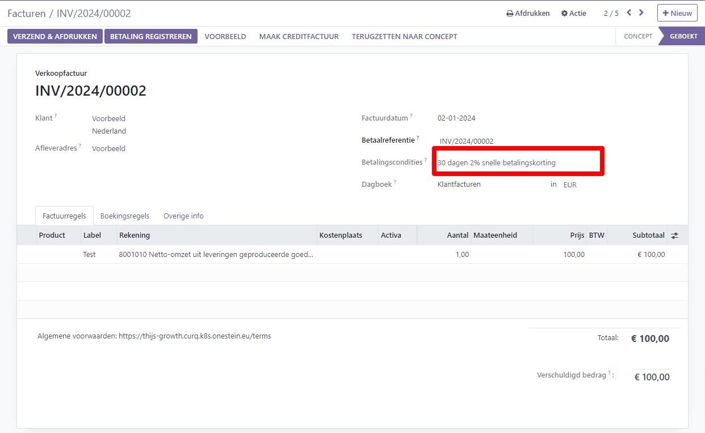

Betalingskortingen klant en inkoopkorting leveranciers
----

Betalingskortingen zijn kortingen op het bedrag dat een klant moet betalen voor goederen of diensten als stimulans voor het snel betalen van de factuur. Inkoopkortingen zijn kortingen die je afspreekt met je leverancier als je zelf binnen een afgesproken termijn betaalt. 

Deze kortingen zijn meestal een percentage van het totale factuurbedrag en worden toegepast als de klant binnen een bepaalde tijd betaalt. Betalingskortingen kunnen een bedrijf helpen om een regelmatige cashflow te behouden. inkoopkorting levert direct resultaat op, het verlaagt immers het bedrag van je inkoopfactuur.

Om kortingen in contanten te kunnen registreren, moet je eerst de winst- en verliesrekeningen controleren. In Curq zijn deze velden standaard ingevuld.

Configureer vervolgens de betalingsvoorwaarden en voeg een betalingskorting toe door het selectievakje Vroegtijdige korting in te schakelen en het kortingspercentage, de kortingsdagen en de velden voor belastingvermindering in te vullen. de betingsvoorwaarden kun je voor zowel de verkoop- als ook de inkoopfacturen gebruiken.

Voorbeeld
----

Je maakt een factuur van €100,- op 2 januari. De volledige betaling moet binnen 30 dagen worden voldaan en je biedt ook een korting van 2% als de klant binnen vijf  dagen betaalt.
De klant kan €98,- betalen tot 7 januari. Daarna zou hij €100,- moeten betalen op 31 januari.

Hieronder zie je rekeningen waarop de verschillen worden geboekt. Daaronder zie je hoe het beschreven voorbeeld er in Curq uitziet.

.. image:: My-Ponto-Bank-Feed-Media/instellingen_betalingskorting.png
   :width: 6.3in
   :height: 2.90069in

.. image:: My-Ponto-Bank-Feed-Media/voorbeeldbetalingskorting.png
   :width: 6.3in
   :height: 2.90069in

Pas een korting in contanten toe op een klantfactuur door de betalingsvoorwaarden te selecteren die je hebt gemaakt. Odoo berekent automatisch de juiste bedragen, belastingbedragen, vervaldatums en boekhoudgegevens.

Op het tabblad Boekingsregels kun je de details van de korting weergeven door op de knop "Wisselen" te klikken en de kolommen Kortingsdatum en Kortingsbedrag toe te voegen.

.. image:: My-Ponto-Bank-Feed-Media/voorbeeld_verkoopfactuur.png
   :width: 6.3in
   :height: 2.90069in

Het kortingsbedrag en de vervaldatum worden ook weergegeven op de gegenereerde factuur die naar de klant wordt gestuurd. 
Als de klant het met de korting gereduceerde bedrag overmaakt, dan zal Odoo automatisch voorstellen om het verschil af te boeken op de betalingsverschillen rekening. Dit wrdt alleen gedaan als de klant op tijd betaalt.

