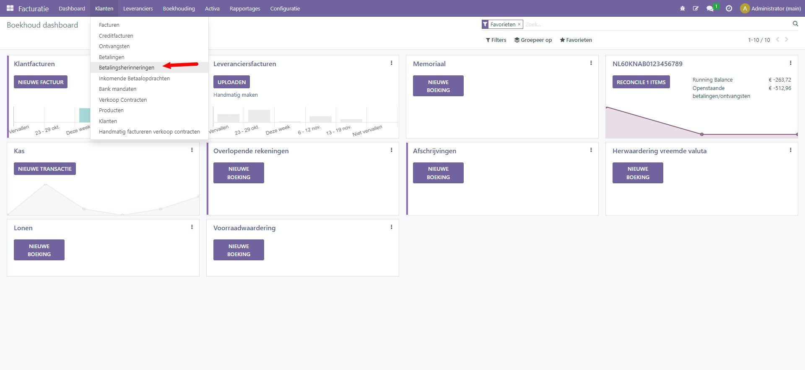

Herinneringen in Curq
=====================

Via menu Klanten -> Betalingsherinneringen kunt u vervallen
klantfacturen opvolgen.

Via dit menu start u een wizard die u door het herinneringenproces heen
helpt. In de wizard kunt u aangeven welke klanten u wilt herinneren
(geen keuze betekent dat Curq alle in aanmerking komende relaties zal
presenteren). Ook kunt u in de wizard aangeven naar wie de herinnering
toe wordt gestuurd.

Bij Filters kunt u op klant en/of verkoper filteren.

Bij opties kunt u aangeven of u alle herinneringen 1 voor 1 wil
afhandelen of in 1 keer. Ook kunt u hier het aantal dagen aangeven dat
tussen de volgende herinnering zit.

Na selectie start u het proces op door op ‘Start’ te klikken

.. image:: Herinneringen-in-Curq-Media/image2.png
   :width: 6.3in
   :height: 2.90069in

Het resultaat wordt per klant weergegeven. U kunt ervoor kiezen om
facturen van de lijst te verwijderen. Indien gewenst kunt u de email
tekst per klant aanpassen.

.. image:: Herinneringen-in-Curq-Media/image3.png
   :width: 6.3in
   :height: 2.90069in

.. image:: Herinneringen-in-Curq-Media/image4.png
   :width: 6.3in
   :height: 2.90069in

Met de knop ‘valideren’ verstuurt u de mail en werkt Curq de status
automatisch bij.

Bij de factuur zelf kunt u zien dat deze vervallen is en op het tabblad
‘Betalingsherinnering’ kunt u de status zien. Ook kunt u hier
aanvullende informatie kwijt, bijvoorbeeld als u de klant gaat nabellen.

.. image:: Herinneringen-in-Curq-Media/image5.png
   :width: 6.3in
   :height: 2.90069in
