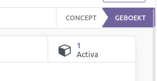
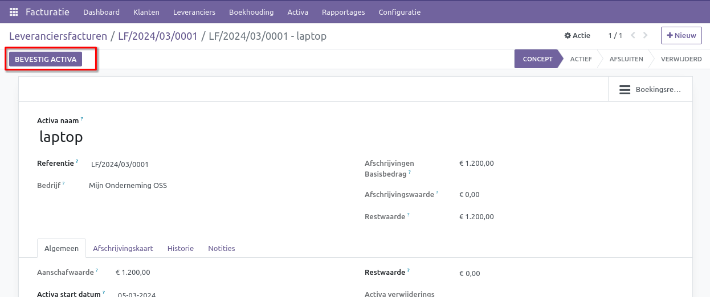

Activa vanuit leveranciersfactuur
=================================

Binnen Curq kun je eenvoudig een activum aanmaken vanuit een leveranciersfactuur. Hiervoor dien je de factuur te boeken op een specifieke grootboekrekening voor activa. Zorg ervoor dat deze rekening is gekoppeld aan een bijbehorend activa profiel.

.. image:: Media/Leveranciersfacturen_activa001.png

Genereer een nieuwe factuur via het menu Facturatie > Leveranciers > Leveranciersfacturen. Nadat je de leveranciersgegevens hebt ingevuld, voer je op de factuurregels de grootboekrekening voor activa in. Als de instellingen correct zijn, zal de kolom voor het Activa Profiel automatisch worden ingevuld.

.. image:: Media/Leveranciersfacturen_activa002.png

Zodra de factuur wordt bevestigd, wordt het activum automatisch gegenereerd en aan jouw factuur gekoppeld.

Controleer vervolgens of het activum correct is aangemaakt. Activeer het actief daarna met de [BEVESTIG ACTIVA]-knop.

