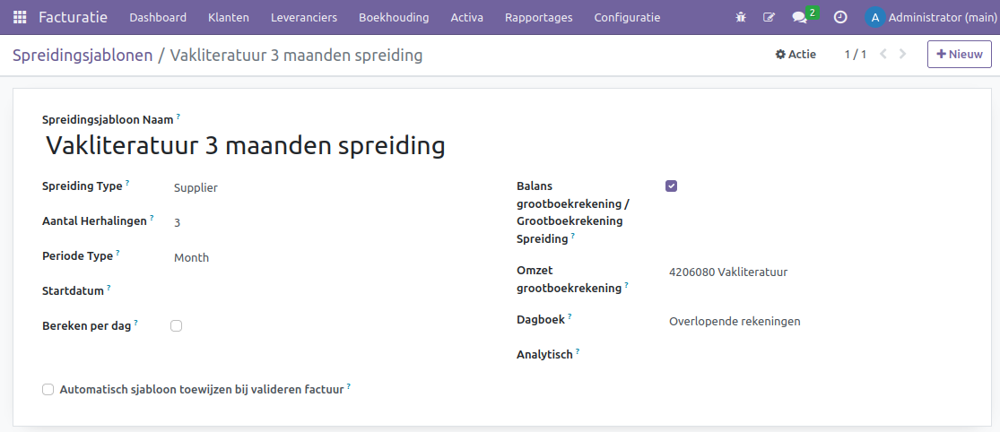
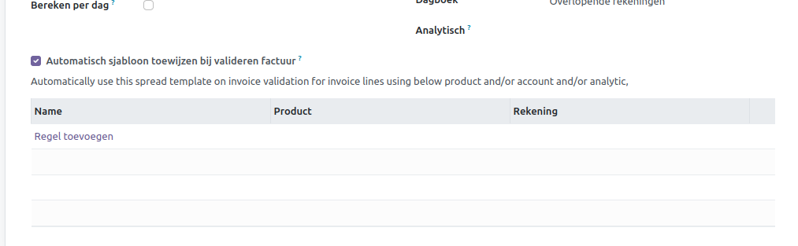
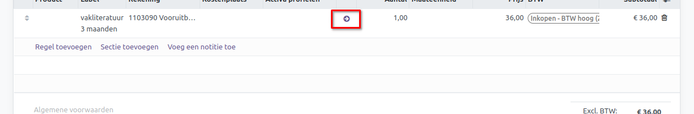
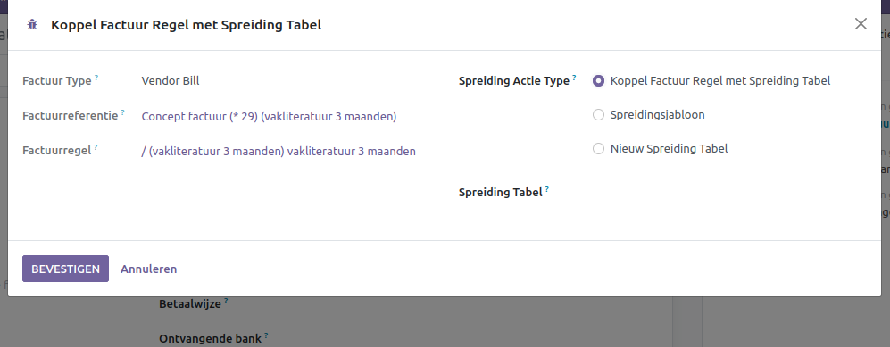
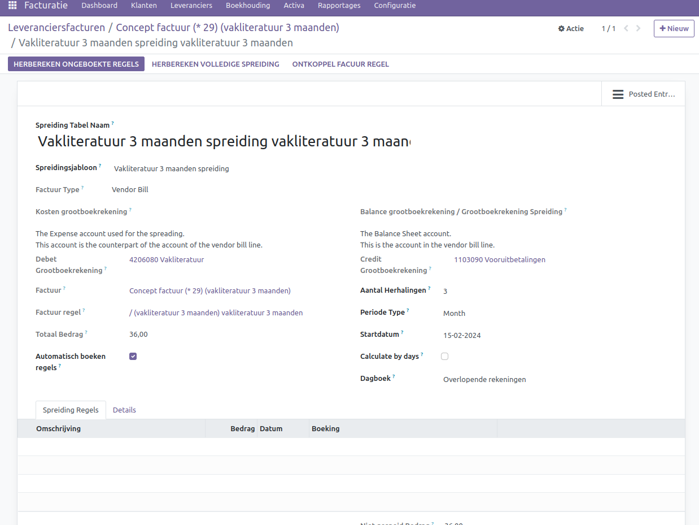
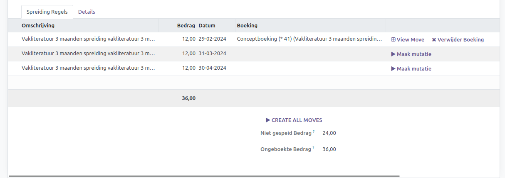

Spreiden van kosten
====================================================================

Uitgestelde uitgaven zijn kosten die al zijn gemaakt voor producten of diensten die nog moeten worden ontvangen. Denk hierbij aan bijvoorbeeld juridische kosten of investeringsbankkosten bij het uitgeven van obligaties. Deze kosten worden gelijkmatig afgeschreven over de levensduur van de obligatie (bijvoorbeeld 20 of 30 jaar). Aan de andere kant zijn vooruitbetaalde uitgaven aankopen die een bedrijf vooraf doet en die binnen een jaar na aankoop worden gebruikt of opgebruikt. Denk hierbij aan verzekeringen, huur of belastingen. Deze vooruitbetaalde kosten worden op de balans vermeld als een huidig activum totdat het voordeel van de aankoop wordt gerealiseerd. Kortom, uitgestelde uitgaven zijn voor langere tijd, terwijl vooruitbetaalde uitgaven binnen een jaar worden gebruikt of opgebruikt.

Curq biedt ondersteuning bij het spreiden van langdurige kosten. Hierdoor kunnen bedrijven de impact van dergelijke kosten over meerdere periodes verdelen, waardoor een nauwkeuriger financieel beeld ontstaat. Het is een handige methode om de financiële rapportage te verbeteren en de effecten van grote uitgaven te verzachten.

Voorbeeld: Stel dat je jaarlijks €1200 aan verzekeringen betaalt. Deze kosten zijn bedoeld voor het gebruik van de verzekering gedurende het hele jaar. Als je deze kosten in één maand zou laten vallen, lijkt het alsof de verzekering alleen voor die ene maand geldig is en heb je die maand onevenredig hoge uitgaven. Om een beter beeld te krijgen, kun je deze kosten beter over 12 maanden spreiden. Op die manier maak je elke maand €100 aan verzekeringskosten en boek je het totale bedrag op een vooruitbetaalde grootboekrekening.

.. Note::
    Dit proces wordt in de financiële wereld op verschillende manieren aangeduid. Naast transitorisch boeken wordt het ook wel permanence boekhouden of overlopende kosten genoemd. 

Sjablonen voor spreiden van kosten configureren
---------------------------------------------------------------------------------------------------
Je kunt een voorgedefinieerd sjabloon voor spreiding aanmaken via het menu Facturatie > Configuratie > Spreidingsjablonen. Dit sjabloon stelt je in staat om de juiste instellingen te definiëren wanneer je een spreiding wilt uitvoeren of een factuurregel wilt koppelen. Op basis van deze instellingen berekent en boekt Curq vervolgens de juiste gegevens in.

- **Spreidingsjabloon Naam:** Geef het sjabloon een passende naam.
- **Spreiding Type:** Geef aan of de spreiding betrekking heeft op verkoop- of inkoopfacturen, en of het omzet- of kostengerelateerd is.
- **Aantal Herhalingen:** Bepaal hoe vaak de spreiding moet plaatsvinden.
- **Periode Type:** Kies of de spreiding maandelijks, per kwartaal of jaarlijks plaatsvindt.
- **Startdatum:** Vul de startdatum van het spreidingsjabloon in. Deze kan leeg blijven bij het maken van een sjabloon.
- **Bereken per dag:** Optie om de berekening te baseren op werkelijke dagen binnen een periode, in plaats van een vast bedrag per maand.
- **Balans grootboekrekening / Grootboekrekening Spreiding:** De grootboekrekening op de factuurregel dient als balansrekening voor de spreiding. Het bedrag wordt hier geparkeerd en periodiek overgeboekt naar de omzet- of kostenrekening.
- **Spreiding Balans Grootboekrekening:** Vul de grootboekrekening in die fungeert als balansrekening voor de spreiding.
- **Omzet Grootboekrekening:** Geef de kosten- of omzetrekening op waarop de periodieke bedragen worden geboekt.
- **Dagboek:** Specificeer het dagboek voor het registreren van de spreidingsboekingen.
- **Analytisch:** Voeg eventueel analytische gegevens toe aan het spreidingsjabloon.
- **Automatisch sjabloon toewijzen bij valideren factuur:** Schakel deze optie in om het sjabloon automatisch toe te passen bij het valideren van een factuur. Hierbij kun je verdere instellingen maken, zoals automatische toepassing op basis van product of rekening. Geef ook een naam op voor de regel die wordt toegepast.

Leveranciersfactuur kosten spreiden
---------------------------------------------------------------------------------------------------
We hebben de mogelijkheid om de kosten van een leveranciersfactuur direct over meerdere maanden te spreiden. Deze spreiding wordt gekoppeld aan de factuurregel. Let op: spreiding is alleen mogelijk als de factuur zich nog in conceptstatus bevindt. Klik op het icoontje met de ronde pijl om deze regel te spreiden.

In het nieuwe scherm krijg je een aantal opties te zien:

- **Spreiding Actie Type:** Welke spreiding wil je uitvoeren.
  
 * Koppel Factuur Regel met Spreiding Tabel: Als je handmatig al een spreiding hebt aangemaakt, kun je deze achteraf koppelen aan een factuur.
 * Spreidingsjabloon: Hier kun je een bestaand spreidingsjabloon koppelen, waarbij de gegevens automatisch worden overgenomen vanuit het sjabloon.
 * Nieuwe Spreiding Tabel: Je kunt hier een volledig nieuwe spreidingstabel aanmaken.

Afhankelijk van je keuze bij **Spreiding Actie Type** worden verschillende opties weergegeven. Alleen bij de optie “Nieuwe Spreidingstabel” moet je je eigen omzet grootboekrekening, balansrekening en dagboek invoeren. Zodra je een optie hebt gekozen en bevestigd, word je doorgeleid naar het scherm van een Spreidingstabel.

Spreidingstabel
---------------------------------------------------------------------------------------------------
Een spreidingstabel is de concrete verdeling van kosten. Deze tabellen worden automatisch gegenereerd vanuit de factuur of kunnen handmatig worden aangemaakt. Je kunt alle spreidingstabellen terugvinden onder Facturatie > Boekhouding > Spreiding Kosten/Omzet.

De uitleg van de meeste velden is al eerder gegeven bij de spreidingsjabloon hierboven.

- **Spreiding Tabel Naam:** Geef de spreidingstabel een passende naam.
- **Spreidingsjabloon:** Selecteer hier een geschikt spreidingsjabloon.
- **Factuur:** Dit is de gekoppelde factuur voor deze spreidingstabel.
- **Factuur regel:** De factuurregel die aan deze spreidingstabel is gekoppeld.
- **Totaal Bedrag:** Het totale bedrag dat gespreid moet worden.
- **Automatisch boeken regels:** Als deze optie is ingeschakeld, worden de regels automatisch geboekt. Anders blijven de boekingen in conceptstatus.
- **Startdatum:** Vul de eerste dag van de maand in als je wilt dat de eerste spreiding volledig in die periode valt.

Zodra alle gegevens correct zijn ingevuld, kan de spreiding verder worden berekend en geboekt.

**[HERBEREKEN ONGEBOEKTE REGELS]** Hiermee wordt de spreidingstabel opnieuw berekend voor alleen de ongeboekte regels. Dit kan handig zijn als je wijzigingen hebt aangebracht in de spreiding terwijl er al boekingen zijn gemaakt.

**[HERBEREKEN VOLLEDIGE SPREIDING]** Deze optie berekent de spreidingstabel volledig opnieuw. Let op: zelfs geboekte regels worden verwijderd en opnieuw berekend. Gebruik dit alleen als het noodzakelijk is.

**[SPREIDING ONGEDAAN MAKEN]** Hiermee worden alle spreidingsregels ongedaan gemaakt, zodat je opnieuw kunt beginnen of de volledige spreiding kunt verwijderen..

**[ONTKOPPEL FACTUUR REGEL]** Gebruik deze optie om de factuurregel te ontkoppelen. Handig als per ongeluk de verkeerde spreidingstabel is gekoppeld aan een factuur.

Zodra de spreiding is berekend, worden de regels automatisch opgevuld in het tabblad [Spreiding Regels]. Dit is waar je alle details van de gespreide bedragen kunt vinden.

Aan de rechterzijde van de spreidingsregel kun je de spreiding vastleggen door gebruik te maken van de knop [Maak mutatie]. Vervolgens kun je de financiële boeking bekijken en heb je de mogelijkheid om deze boeking te verwijderen. Als je alle spreidingen tegelijkertijd wilt boeken, kun je dit doen via [CREATE ALL MOVES]. Deze boekingen kunnen eveneens automatisch worden verwerkt via de automatische boekingsoptie.
