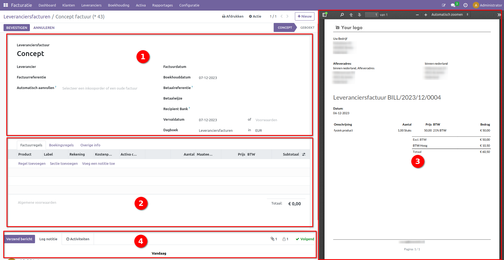

Leveransierfactuur
==================

Open de Facturatie/Boekhouding module in Odoo.

.. image:: leveransierfactuur/Leveransierfactuur001.png

Kies "Leveranciers" boven in het scherm en selecteer in het dropdown-menu "Leveranciers Facturatie".In het Leveranciers Facturatie scherm, in het geval dat er een bestaande factuur geïmporteerd moet worden selecteer upload. Wanneer er een nieuwe factuur aangemaakt moet worden klik op "Nieuw" links boven in het scherm.

Het factuurscherm is opgedeeld in verschillende vlakken. Vul de algemene informatie in het hoofdvak in. 
Selecteer de leverancier, waarbij het adres automatisch wordt ingevuld. Je kunt ook refereren naar een bestaande factuur via Factuurreferentie.
Onder Automatische Aanvullen kun je data gebruiken van een inkooporder of een oude factuur.
De factuurdatum is verplicht, en de boekhouddatum staat automatisch op de huidige dag.
Vul de betaalreferentie in, kies de betaalwijze (creditcard, iDeal, SEPA, etc.), en selecteer de bank van de leverancier onder Recipient Bank.
Vul de vervaldatum in, wat de uiterste datum is waarop de factuur betaald moet zijn.
Het dagboek is standaard "Leveranciers Facturen"; laat dit zo staan, tenzij er meerdere dagboeken zijn aangemaakt voor leveranciersfacturen en valuta.

Factuurregels
-------------

- **Factuurregels:** bevatten de details van de factuur. Hier staat wat er is verkocht tegen welke bedrag en met welke BTW.
- **Product:** Vul hier een product in als je gebruik maakt van producten binnen Curq. Een product kan ook een dienst zijn, dan heeft het product het type dienst. Het is niet verplicht om gebruik te maken van producten.
- **Label:** Deze verschijnt op de factuur, dus vul deze correct in. Als je producten gebruikt wordt deze automatisch overgenomen, maar je kan die altijd achteraf aanpassen.
- **Rekening:** Het is verplicht om de juiste grootboekrekening op te geven. De omzet wordt geboekt op deze grootboekrekening. Curq kan deze automatisch invullen op basis van de producten.
- **Aantal:** Het aantal verkocht.
- **Prijs:** De prijs per eenheid.
- **BTW:* Curq stelt automatisch de meest logische BTW code voor. Wijk hier alleen af als er een andere BTW van toepassing is.
- **Subtotaal:** Aantal x Prijs.
- **Algemene voorwaarden:** Links onder de factuurregels zie je de algemene voorwaarden staan. Deze tekst verschijnt op je facturen. TIP: Heb je deze op je website staan, dan kan je daar naar verwijzen.
- **Totalen:** Rechts onder de factuurregels zie je de totalen van de factuur inclusief welke BTW wordt toegepast.

.. image:: leveransierfactuur/Leveransierfactuur003.png

Boekingsregels
--------------

Hier wordt de journaalpost getoond van de factuur. Dit is voor de boekhouder van belangrijke informatie.

.. image:: leveransierfactuur/Leveransierfactuur004.png

Overige informatie
------------------

Hier worden leveringscondities, fiscale positie, automatisch boeken en controle van de factuur kunnen aangegeven.
- **Leveringscondities:** Als INCOTERMS van belang is, dan kan je die hier invullen. In Curq zijn de meest gebruikte aanwezig.
- **Fiscale Positie:** De BTW regime die van toepassing is op de factuur.
- **Automatische boeken:** Alleen op een concept factuur kan dit worden ingesteld. Je kan een factuur al vooruit plannen om die later te laten boeken. Of je kan terugkerende facturen automatisch laten boeken tot een bepaalde tijd door Curq. Dit is handig als je elke maand dezelfde factuur wilt laten aanmaken.
- **Te controleren:** De factuur krijgt de status te controleren. Je kan bijv. jouw boekhouder hiermee attenderen dat deze factuur nog een keer extra moeten worden gecontroleerd.

.. image::leveransierfactuur/Leveransierfactuur005.png

Wanneer een factuur geüpload wordt verschijnt dezen aan de rechter kant van het scherm en kan de informatie direct overgenomen worden.

Logging van de factuur
----------------------

Alle belangrijke wijzigingen met betrekking tot de factuur worden hier bijgehouden. Je ziet hier ook de mailtjes die verzonden zijn. Als je ook nog gebruik maakt van de volledige integratie met mailfunctionaliteit, dan verschijnt hier ook het antwoord van de klant als hij reageert op de mail.

- **Verzend bericht:** Hiermee verzend je een mail naar de klant.
- **Log notitie:** Dit is een interne notitie die alleen intern zichtbaar is. Voor de klant is deze niet zichtbaar.
- **Activiteiten:** Je kan een bepaalde activiteit inplannen voor iemand. Dit kan een todo zijn, maar ook een afspraak.

.. image::leveransierfactuur/Leveransierfactuur006.png

- **Volgers:** Contacten, medewerkers kunnen volgers zijn van het documenten. Afhankelijk van hun aanmelding worden deze volgers op de hoogte gehouden van wijzigingen op dit document.

Wanneer alle informatie is ingevuld, selecteer "Bevestigen" links boven in de hoek.

.. image:: leveransierfactuur/Leveransierfactuur007.png

Hierna kan de betaling geregistreerd worden, een creditfactuur voor de huidige factuur worden aangemaakt en de factuur teruggezet worden naar een consent om aanpassingen te maken

.. image:: leveransierfactuur/Leveransierfactuur008.png

