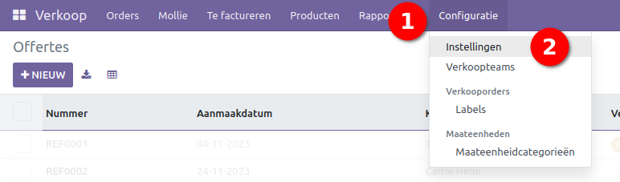
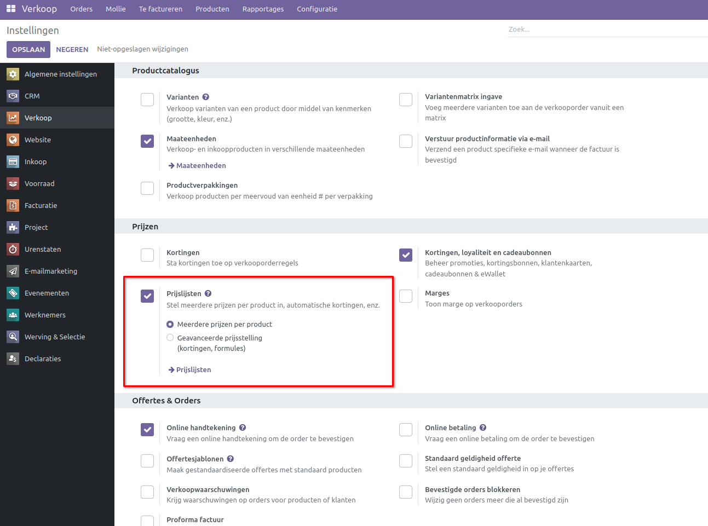
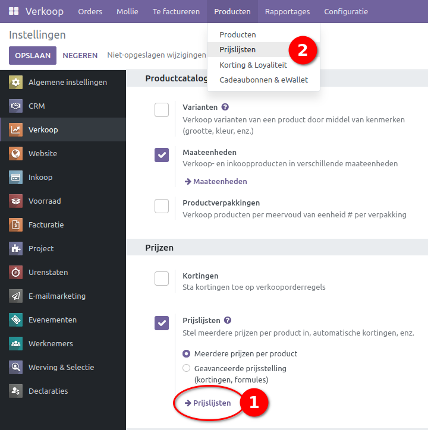
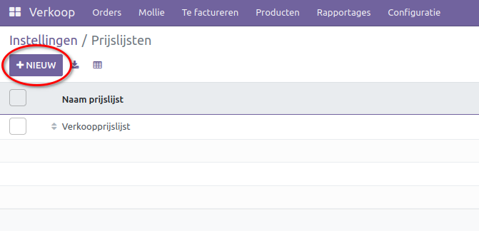
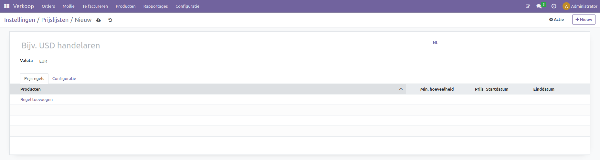
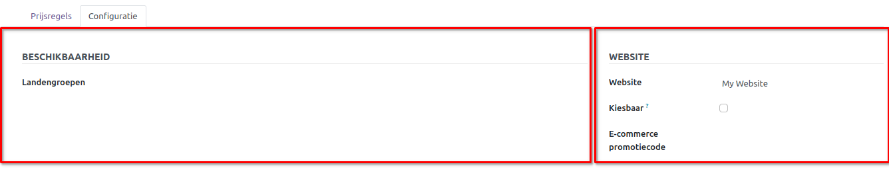
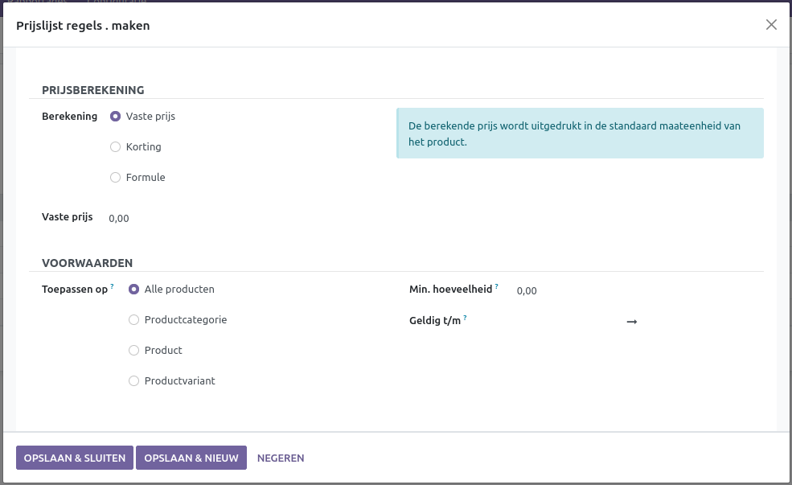
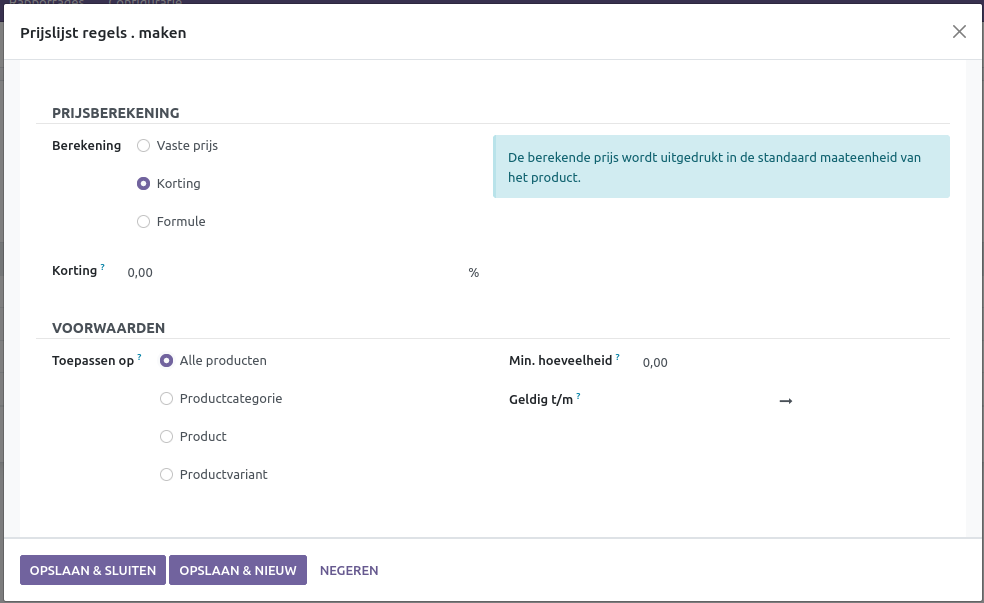
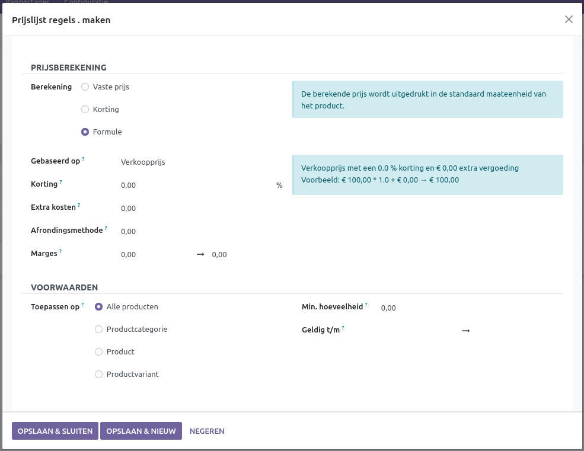

Prijslijsten
====================================================================

Prijslijsten zijn noodzakelijk wanneer groepen klanten aangepaste prijzen moeten krijgen. Denk hierbij aan kortingen zoals loyaliteitskorting of Black Friday-kortingen. 

Om prijslijsten te gebruiken, moeten deze eerst worden ingeschakeld in de instellingen van verkoop.

In de verkoopmodule ga je naar Configuratie > Instellingen. Onder de sectie Prijzen, vink Prijslijsten aan. Onder Prijslijsten zijn er twee opties: Meerdere prijzen per product en Geavanceerde prijsstelling

Om naar de pagina met prijslijsten te gaan, selecteer je in de instellingen de -> Prijslijsten-knop of ga je naar het kopje Producten > Prijslijsten. Op de prijslijstpagina selecteer je de +Nieuw-knop. Hierna kom je op de pagina voor het aanmaken van een nieuwe prijslijst.

  
Meerdere prijzen per product
---------------------------------------------------------------------------------------------------
De optie Meerdere prijzen per product is ideaal wanneer er eenvoudig en snel tijdelijke wijzigingen moeten worden aangebracht aan een aantal specifieke producten. 
Op de nieuwe prijslijstpagina zijn verschillende opties aanwezig. Geef de prijslijst een naam; dit is verplicht om de prijslijst op te slaan. Selecteer hierna de valuta waarin de prijslijst wordt weergegeven; dit is voorgeselecteerd als de standaard valuta. 
Onder het kopje Prijsregels kunnen de artikelen worden geselecteerd waarvoor een andere prijs moet worden ingesteld.

Selecteer eerst Regel toevoegen, kies hierna het product dat een nieuwe prijs moet krijgen. Kies vervolgens de minimumhoeveelheid van het product die gekocht moet worden om de nieuwe prijs in te laten gaan. Vul hierna onder Prijs de nieuwe prijs voor het product in. Achter Prijs staan de start- en einddatum; hier kun je de datums aangeven gedurende welke tijd het product de aangepaste prijs moet hebben. Wanneer deze leeg gelaten wordt, geldt de prijs tot de prijslijst verwijderd wordt.
Onder Configuratie zijn enkele opties aanwezig. Onder Beschikbaarheid staat de optie Landgroepen; hier kun je selecteren voor welke groepen de prijslijst geldt, zoals Europa, Noord-Amerika, SEPA-landen of enige andere die te selecteren en aan te maken zijn.
Onder het kopje 'Website' staan drie opties:

* **Website:**

voor welke website de prijslijst geldt.

* **Kiesbaar:**

of de klant de prijslijst in de webshop kan selecteren.

* **E-commerce promotiecode:**

de code die een klant kan invullen op de webshop om toegang te krijgen tot de prijslijst.

Geavanceerde prijsstelling
---------------------------------------------------------------------------------------------------
De geavanceerde prijsstellingsoptie is bedoeld voor complexere prijslijsten, zoals kortingen voor alle producten of wanneer de nieuwe prijs moet worden gedefinieerd via een formule. 

In deze optie ziet de pagina er hetzelfde uit als in de Meerdere prijzen per product-optie. Het verschil wordt merkbaar wanneer Regel toevoegen wordt geselecteerd; er verschijnt nu een pop-up menu met verschillende opties.

Prijsberekening
---------------------------------------------------------------------------------------------------

De bewerkingsoptie bepaalt wat de regel aan de prijs aanpast. Er zijn drie opties: vaste prijs, korting en formule. Onder Vaste prijs wordt de prijs aangepast naar de opgegeven prijs, hetzelfde als bij de Meerdere prijzen per product-optie.

Wanneer korting wordt geselecteerd, wordt het ingevoerde percentage van de prijs afgetrokken. Ook kan er een negatief getal worden ingevoerd om een percentage aan de prijs toe te voegen.

De Formule-knop is complexer en bevat meerdere velden die de prijs beïnvloeden.

Het eerste veld is gebaseerd op. Dit beïnvloedt waarop de nieuwe prijs wordt gebaseerd.

1. Verkoopprijs: De prijs wordt berekend op basis van de prijs die is aangegeven op de productpagina.

2. Kostprijs: Hier wordt de prijs gebaseerd op de kosten die zijn gemaakt om het product te kunnen verkopen, zoals de inkoopprijs. Het kan ook andere kosten bevatten, zoals de productiekosten als het product in-house wordt gemaakt.

3. Eerder gemaakte prijslijst: Denk aan eerst een prijslijst om de verkoopprijs te berekenen van de kostprijs en hierna met de nieuwe prijslijst korting op de berekende verkoopprijs.

Het tweede veld is korting. Hier wordt de korting berekend per percentage. Dit kan ook een negatief nummer zijn om het product een bepaald percentage duurder te maken.

Het derde veld zijn extra kosten. Dit is een vast getal dat aan de prijs wordt toegevoegd. Dit kan ook een negatief getal zijn, denk aan -0,01 om de prijs te laten eindigen op 0,99. Om dit goed te berekenen is het vierde veld nodig.

Het vierde veld is de afrondmethode. Dit is de manier waarop de berekening wordt afgerond, zoals op een heel getal, op een getal achter de komma, per vijf of per tiental. Hiermee kun je in één keer een mooi rond getal krijgen of met de negatieve getallen in het extra kosten-veld een strategisch verantwoorde prijs.

Het laatste veld, marges, kan een minimum- en maximumwinstmarge worden ingesteld, gebaseerd op de kostprijs

Voorwaarden
---------------------------------------------------------------------------------------------------

Onder voorwaarden staan drie velden. 

Toepassen op heeft vier opties: alle producten, productcategorie - deze zijn per product in te stellen en groeperen producten onder een naam, zoals bijvoorbeeld broeken, product - dit is een specifiek product, zoals een soort spijkerbroek, en productvariant - dit is een specifieke variant van een product, zoals een donkerblauwe spijkerbroek. Voor meer informatie over productvarianten, ga naar onze documentatie over productvarianten.
Minimum hoeveelheid is de minimale hoeveelheid van de producten die gekocht moeten worden om de regel te laten gelden.
De laatste optie is Geldig tot hier kan de begin- en einddatum ingesteld worden gedurende wanneer de regel geldig is. Wanneer dit leeg gelaten wordt, is dit tot de regel of prijslijst verwijderd wordt.

Wanneer alle benodigde informatie is toegevoegd kan onder aan het pop-up scherm gekozen worden voor opslaan en sluiten waneer alle wijzegingen zijn doorgevoerd en opslaan en nieuw wanneer er meer regels moeten worden toegevoegd.
