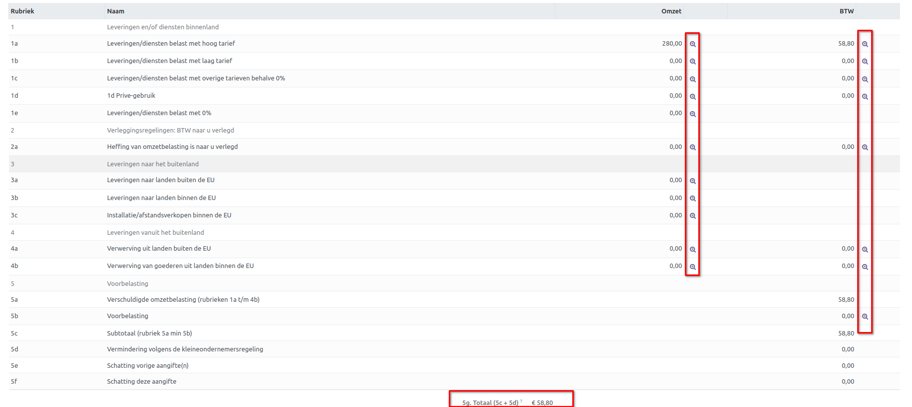

BTW-Aangifte
============

Bedrijven met een geregistreerd BTW-nummer dienen periodiek belastingaangiften in, hetzij maandelijks of kwartaal, afhankelijk van de omzet en registratieregels. Een BTW-aangifte, ook wel bekend als een belastingaangifte, verschaft de belastingautoriteiten gedetailleerde informatie over belastbare transacties. Deze aangifte is essentieel om de uitvoerbelasting op verkochte goederen en diensten te berekenen en de invoerbelasting op aangekochte goederen en diensten te registreren. Op basis van deze gegevens kan een bedrijf nauwkeurig het verschuldigde belastingbedrag bepalen of in sommige gevallen een teruggave aanvragen.

Naast het voldoen aan wettelijke verplichtingen draagt de correcte indiening van de BTW-aangifte bij aan de financiële transparantie van het bedrijf en biedt het inzicht in de fiscale gezondheid. Het proces is van cruciaal belang om boetes en juridische complicaties te vermijden, en het vergemakkelijkt deelname aan internationale handel door de juiste belastingdocumentatie te waarborgen. Kortom, de BTW-aangifte is niet alleen een administratieve formaliteit, maar ook een waardevol instrument voor bedrijven om financiële integriteit te handhaven en fiscale verplichtingen na te komen.

.. Note::
   Meer informatie over BTW Omzetbelasting vind je hier op de website van de belastingdienst `BTW (omzetbelasting) <https://www.belastingdienst.nl/wps/wcm/connect/nl/btw/btw>`_

BTW-Aangifte aanmaken
---------------------

In Curq is het mogelijk om een BTW-aangifte aan te maken via Facturatie > Rapportages > BTW Aangifte.

.. image:: Media/rapportages_BTW001.png

- **BTW Aangifte:** Hier geef je de naam van de BTW-aangifte op. Indien nodig, kun je dit naar eigen wens aanpassen.
- **Tijdvak:** Kies een van de beschikbare tijdvakken.
- **Datums:** Voer eventueel een start- en einddatum in.
- **boekdatum:** De datum wordt automatisch ingevuld zodra je op de knop [versturen] klikt, waardoor de aangifte als verzonden wordt beschouwd. Het indienen van de daadwerkelijke aangifte bij de belastingdienst moet echter nog steeds handmatig worden gedaan.
- **Wijzigingsdatum:** Dit is de laatste datum waarop aanpassingen in de aangifte zijn gemaakt.

Zodra alle gegevens zijn ingevoerd, klik dan op de bijwerkknop. Op dit moment wordt de BTW-aangifte opgebouwd en worden de BTW-vakken automatisch gevuld met gegevens uit de administratie. Als er al gegevens aanwezig zijn, worden deze bijgewerkt.

BTW-Aangifte Controleren
------------------------

Onder de BTW-vakken hieronder kun je je aangifte verifiëren. Door het vergrootglaspictogram te gebruiken, kun je gedetailleerde informatie opvragen en de onderliggende boekingen bekijken. Hierdoor krijg je snel inzicht in de opbouw van het bedrag.

Bovendien bestaat de mogelijkheid om de BTW-Aangifte af te drukken of te downloaden als een Excel-bestand. Dit kan eenvoudig worden gedaan door te klikken op de [Afdrukken]-knop bovenaan.

Zodra de BTW-aangifte is voltooid, kun je deze markeren als [verstuurd]. Op dit punt ga je naar de website van de belastingdienst om je BTW-aangifte in te dienen. Na voltooiing keer je terug naar Curq en klik je op [Definitief]. Nu is je aangifte ook in Curq definitief vastgelegd.

