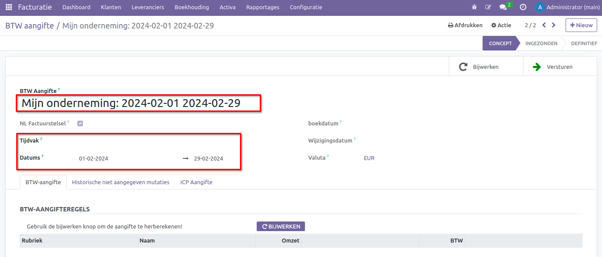
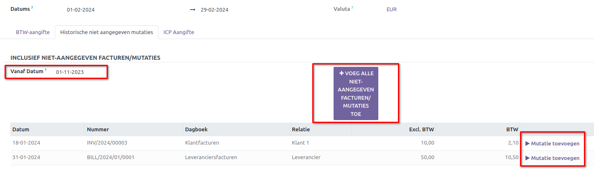

BTW-Suppletie
=============

Een BTW-aangifte suppletie is een correctie op een eerder ingediende BTW-aangifte. Als een ondernemer ontdekt dat er fouten of onvolledigheden zijn in een reeds ingediende BTW-aangifte, kan hij of zij een suppletieaangifte indienen om de fouten te corrigeren.

Dit kan bijvoorbeeld nodig zijn als er een fout is gemaakt bij het invoeren van bedragen, het verkeerd toepassen van BTW-tarieven, of als er transacties zijn die niet zijn opgenomen in de oorspronkelijke aangifte. De suppletieaangifte zorgt ervoor dat de Belastingdienst op de hoogte wordt gebracht van de correcties, en zo wordt voorkomen dat er onjuiste informatie in de administratie blijft staan.

Het indienen van een BTW-aangifte suppletie is belangrijk om de fiscale situatie nauwkeurig en up-to-date te houden, en het stelt ondernemers in staat om eventuele fouten te corrigeren om boetes te voorkomen.

.. Note::
    Meer informatie over Btw-aangifte corrigeren vind je hier op de website van de belastingdienst `Btw-aangifte corrigeren <https://www.belastingdienst.nl/wps/wcm/connect/bldcontentnl/belastingdienst/zakelijk/btw/btw_aangifte_doen_en_betalen/aangifte_corrigeren/>`_

Oude facturen meenemen in eerstvolgende aangifte
------------------------------------------------

Een suppletieaangifte moet worden ingediend via de belastingdienst. Binnen Curq hebben we echter de mogelijkheid om oude facturen toe te voegen aan de huidige aangifte.

Het kan gebeuren dat je oude facturen later ontdekt of dat een zakenrelatie per ongeluk een factuur te laat verstuurt. Ondertussen is alles al verwerkt in je administratie en is de BTW-aangifte al definitief ingediend. Je wilt deze facturen echter nog op de juiste datum boeken.

In Curq is het mogelijk om deze oude facturen mee te nemen in de eerstvolgende aangifte. Maak een BTW-aangifte aan voor deze periode via Facturatie > Rapportages > BTW Aangifte.

Laten we een situatie als voorbeeld nemen:

- De aangifte voor januari 2024 is al definitief.
- De eerstvolgende aangifte is voor februari.
- Na de definitieve aangifte voor januari 2024 zijn er nog facturen ingeboekt voor die maand.
 
Vul de aangifte in voor de periode februari 2024.

Klik op [Bijwerken] om de gegevens van je aangifte op te halen. Op het tabblad "Historische niet aangegeven mutaties" kun je de oude facturen bekijken.

Met de **Vanaf Datum** kun je instellen vanaf wanneer Curq de facturen moet ophalen. Vervolgens kun je via de grote knop in het midden alle facturen meteen meenemen in de huidige aangifte. Als je slechts bepaalde facturen wilt toevoegen, kun je per regel op [Mutatie toevoegen] klikken. Mocht je een fout hebben gemaakt, dan kun je de factuur ook weer meteen verwijderen uit de aangifte.

Ga nu terug naar de tabblad [BTW-aangifte] en klik op [Bijwerken]. Je zult zien dat de cijfers nu worden bijgewerkt met de oude facturen. Eenmaal gecontroleerd, dan kan deze aangifte bij de belastingdienst worden ingediend.
