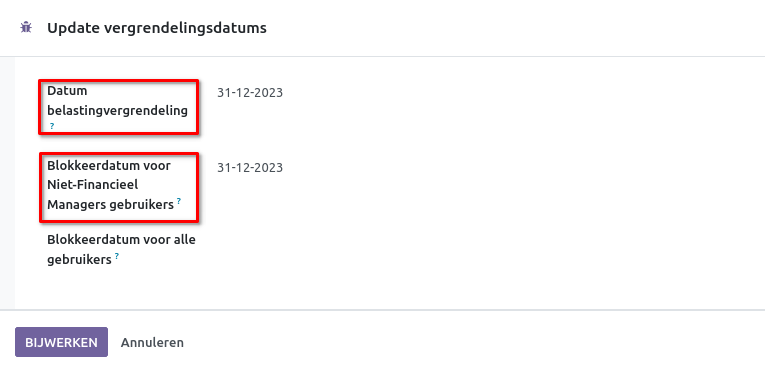
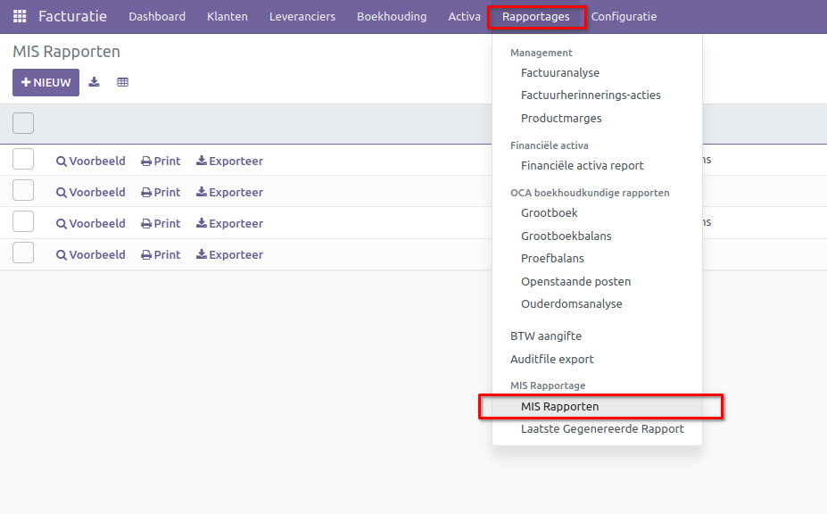

Jaarafsluiting
==============

De jaarafsluiting vormt een cruciaal onderdeel van de boekhouding, waarbij alle financiële activiteiten aan het einde van het boekjaar worden afgerond. Tijdens dit proces worden financiële overzichten voltooid, rekeningen nauwkeurig gecontroleerd en benodigde documentatie voor de Belastingdienst voorbereid. Taken omvatten onder andere het afstemmen van financiële records, beoordelen van afschrijvingen en waardeverminderingen, en het updaten van voorzieningen. Het opstellen van gedetailleerde financiële overzichten, zoals de balans en resultatenrekening, biedt een alomvattend beeld van de financiële gezondheid. De jaarafsluiting dient niet alleen als formele afsluiting, maar ook als strategisch moment om de financiële prestaties te evalueren en voor te bereiden op een succesvol nieuw boekjaar.

Datum gebonden boekhouding
--------------------------

De boekhouding van Curq is gebaseerd op datums en indirect op tijdsperiodes, zoals maanden, kwartalen en jaren. Elke boeking is voorzien van een specifieke datum, die vervolgens wordt toegewezen aan een van deze vooraf gedefinieerde perioden. Deze tijdsperiodes worden veelvuldig gebruikt in de rapportages binnen Curq.

De periodes in Curq zijn standaard ingesteld en volgen de reguliere kalendermaanden, kwartalen en jaren. Hoewel er geen standaard ondersteuning is voor gebroken boekjaren, is het wel mogelijk om deze handmatig aan te maken als dat nodig is.

De configuratie van periodes wordt uitgelegd in de handleiding voor Datumreeksen.

Jaarafsluiting Accountant
-------------------------

Een correcte jaarafsluiting in de boekhouding vereist verschillende stappen om ervoor te zorgen dat financiële gegevens nauwkeurig en volledig worden afgesloten aan het einde van het boekjaar. Hier zijn enkele algemene stappen die vaak worden genomen:

- **Afschrijvingen en waardeverminderingen:** Beoordeel en boek afschrijvingen op activa en beoordeel eventuele waardeverminderingen.

- **Voorzieningen en reserveringen:** Evalueer voorzieningen voor oninbare vorderingen, garantiekosten en andere mogelijke verplichtingen.

- **Inventarisatie:** Controleer en update de inventaris van activa en passiva, inclusief het verifiëren van voorraden.

- **Openstaande posten afhandelen:** Rond openstaande facturen, betalingen en andere transacties af om alle financiële gegevens bij te werken.

- **Financiële overzichten opstellen:** Maak gedetailleerde financiële overzichten zoals de balans, resultatenrekening en kasstroomoverzicht.

- **Belastingaangifte voorbereiden:** Verzamel en organiseer alle benodigde documentatie voor de belastingaangifte, inclusief het naleven van fiscale verplichtingen.

- **Gebroken boekjaren afhandelen (indien van toepassing):** Als het bedrijf een gebroken boekjaar hanteert, zorg dan voor de juiste aanpassingen en boekingen.

- **Documentatie archiveren:** Bewaar alle relevante documentatie en rapporten volgens wettelijke voorschriften.

- **Evaluatie en planning:** Evalueer de financiële prestaties van het afgelopen jaar en gebruik de inzichten voor strategische planning en besluitvorming voor het komende jaar.

Het is belangrijk op te merken dat de specifieke stappen kunnen variëren afhankelijk van de bedrijfsomstandigheden, boekhoudmethoden en wettelijke vereisten. Het raadplegen van een boekhoudprofessional of accountant kan nuttig zijn om ervoor te zorgen dat de jaarafsluiting correct wordt uitgevoerd.

Stappen Jaarafsluiting binnen Curq
----------------------------------

Om een correcte jaarafsluiting te bereiken binnen Curq, dien je de volgende stappen te volgen.

**Afletteren financiële rekeningen:** Voer een aflettering uit aan het einde van het boekjaar voor al je bankrekeningen, creditcards, tussenrekeningen en andere financiële rekeningen. Controleer of het saldo in het grootboek overeenkomt met het saldo op de bankrekeningen.
 
**Controleer facturen en betalingen:** Controleer alle uitstaande posten en betalingen en letter deze indien nodig met elkaar af. Verwerk eventuele facturen die nog niet zijn verwerkt. Controleer of alle betalingen zijn uitgevoerd of voltooid.

**Voorraad tellen en evalueren:** Verifieer of alle inkomende en uitgaande zendingen zijn verwerkt. Tel de voorraad en controleer of de waarde van de voorraad overeenkomt.

**Verwerk afschrijvingen en uitgestelde kosten / omzetten:** Registreer de afschrijvingen en onderzoek of er nog uitgestelde kosten en omzetten moeten worden geboekt.

**Verwerk alle declaraties:** Verifieer alle goedgekeurde declaraties en boek ze, of voer de betaling uit.

Als alles hierboven klaar is, kunnen we de volgende stappen uitvoeren, eventueel in samenwerking met de accountant.

**Doe de BTW-aangifte:** Zorg ervoor dat je alle verplichte BTW-aangiften hebt ingediend en dat aan de BTW-verplichtingen is voldaan. Voer indien nodig eventuele BTW-correcties uit voordat je de aangifte indient.

**Sluit de periode (datum) voor BTW en andere boekingen:** Sluit de BTW-datum af via Facturatie > Boekhouding > Update vergrendelingsdatum. Vul de "Datum belastingvergrendeling" in voor de aangifteperiode om te voorkomen dat er na die datum nog boekingen met facturen worden gemaakt. Op deze manier blijven de cijfers voor de BTW-aangifte ongewijzigd. Daarnaast blokkeer je tevens de mogelijkheid om andere boekingen te maken door een datum in te voeren bij "Blokkeerdatum voor Niet-Financiële Managers gebruiker".

**Stel de Balans en Winst & Verlies:** De Balans en de Winst & Verlies-rapporten zijn essentieel bij het afsluiten van het boekjaar. Je kunt deze rapporten raadplegen door naar Facturatie > Mis Rapportage > Mis Rapporten te gaan. Een gedetailleerde uitleg over het gebruik van de MIS Rapporten is beschikbaar in de handleiding voor MIS Rapportages.

**Maak correctieboekingen:** De accountant zal de gehele boekhouding inspecteren en eventuele fouten rectificeren door middel van een memoriaalboeking of, indien haalbaar, door aanpassingen aan de boekingen.

**Bereken de winst of verlies:** Nadat de volledige boekhouding is gecontroleerd, kun je de huidige jaarwinst overboeken naar een eigen vermogensrekening via een memoriaalboeking.

Tot slot sluit je het boekjaar af door een blokkeringsdatum in te stellen voor alle gebruikers (Facturatie > Boekhouding > Update vergrendelingsdatum). 
Gebruikers kunnen geen boekingen meer invoeren voor de opgegeven datum.
