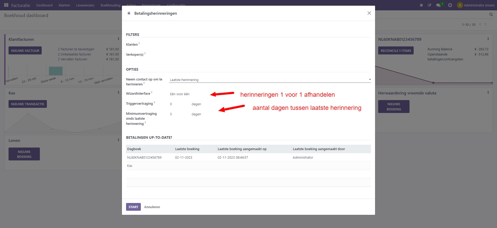

Herinneringen in Curq
====================================================================

Via menu Klanten -> Betalingsherinneringen kun je vervallen
klantfacturen opvolgen.

.. image:: Media/betalingsherinneringen_1.png
   :width: 6.3in
   :height: 2.90069in

Via dit menu start je een wizard die je door het herinneringenproces heen
helpt. In de wizard geef je aan welke klanten je wil herinneren
(geen keuze betekent dat Curq alle in aanmerking komende relaties zal
presenteren). Ook kun je in de wizard aangeven naar wie de herinnering
toe wordt gestuurd.

Bij Filters kun je op klant en/of verkoper filteren.

Bij opties kun je aangeven of je alle herinneringen 1 voor 1 wil
afhandelen of in 1 keer. Ook kun je hier het aantal dagen aangeven dat
tussen de volgende herinnering zit.

Na selectie start het proces door op ‘Start’ te klikken

Het resultaat wordt per klant weergegeven. Je kunt
facturen handmatig van de lijst te verwijderen. Indien gewenst kan de email
tekst per klant worden aangepast.

.. image:: Media/betalingsherinneringen_3.png
   :width: 6.3in
   :height: 2.90069in

.. image:: Media/betalingsherinneringen_4.png
   :width: 6.3in
   :height: 2.90069in

Met de knop ‘valideren’ verstuur je de mail en werkt Curq de status
automatisch bij.

Bij de factuur zelf zie je dat deze vervallen is en op het tabblad
‘Betalingsherinnering’ zie je de status. Hier kun je ook
aanvullende informatie kwijt, bijvoorbeeld als je de klant gaat nabellen.

.. image:: Media/betalingsherinneringen_5.png
   :width: 6.3in
   :height: 2.90069in
