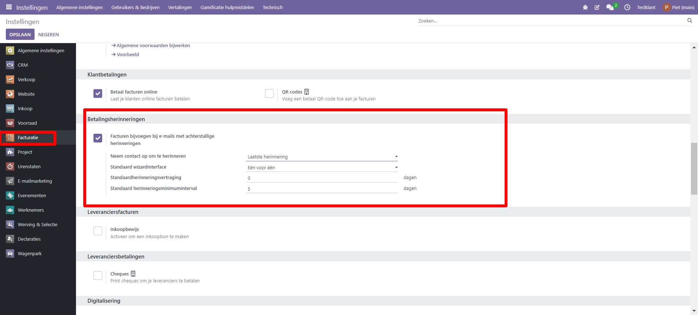

Herinneringen in Curq
====================================================================

In het instellingen menu kun je een aantal standaard waarden bepalen voor het herinneringproces. Ga hiervoor naar Instellingen > Facturatie > Betalingsherinneringen

Je kunt hier de volgende zaken aangeven:

* **Checkbox Facturen bijvoegen**. Als je deze optie activeert dan stuurt Curq standaard een kopie van alle facturen met de herinnering mee.

* **Neem contact op om te herinneren**. Hiermee kies je wie binnen de organisatie je wil benaderen over de herinnering. Je hebt de keuze uit de contactpersoon van de laatst verstuurde herinnering, de laatst verstuurde factuur of de standaard factuurrelatie.

* **Standaard Wizard interface**. Hier kun je aangeven of je alle herinneringen 1 voor 1 wil bekijken of dat je alle klanten in 1 keer wil verwerken.

* **Standaard herinneringsvertraging**. Dit kun je gebruiken om een aantal extra dagen in te geven tussen de vervaldatum en het daadwerkelijk meenemen in de lijst met te herinneren facturen. 

* **Standaard herinnerings minimuminterval**. Hier kun je het aantal dagen aangeven dat tussen de volgende herinnering zit.

Betalingsherinneringen sturen
---------------------------------------------------------------

Via menu Facturatie > Klanten > Betalingsherinneringen kun je vervallen
klantfacturen opvolgen.

.. image:: Media/betalingsherinneringen_1.png
   :width: 6.3in
   :height: 2.90069in

Via dit menu start je een wizard die je door het herinneringenproces heen
helpt. In de wizard geef je aan welke klanten je wil herinneren
(geen keuze betekent dat Curq alle in aanmerking komende relaties zal
presenteren). Ook kun je in de wizard aangeven naar wie de herinnering
toe wordt gestuurd.

Bij Filters kun je op klant en/of verkoper filteren.

De standaard instellingen die je eerder rondom de onderdelen 'Neem contact op met', 'Wizard interface', 'Triggervertraging' en 'Minimum vertraging' hebt ingegeven, kun je hier eventueel aanpassen.

Na selectie start het proces door op de knop ‘Start’ te klikken

.. image:: Media/betalingsherinneringen_2.png
   :width: 6.3in
   :height: 2.90069in

Het resultaat wordt per klant weergegeven. Je kunt facturen handmatig van de lijst te verwijderen. Indien gewenst kan de email
tekst per klant worden aangepast.

.. image:: Media/betalingsherinneringen_3.png
   :width: 6.3in
   :height: 2.90069in

.. image:: Media/betalingsherinneringen_4.png
   :width: 6.3in
   :height: 2.90069in

Met de knop ‘valideren’ verstuur je de mail en werkt Curq de status
automatisch bij. Wanneer een herinnering verstuurd is dan krijgen de facturen die zijn aangemaand een volgnummer (1). Je kunt dit volgnummer ook in de lijstweergave van de facturen terugvinden.

Bij de factuur zelf zie je dat deze vervallen is en op het tabblad
‘Betalingsherinnering’ zie je de status. Hier kun je ook aanvullende informatie kwijt, bijvoorbeeld als je de klant gaat nabellen.

Het e-mail sjabloon is ook zo ingericht dat er verschillende teksten worden getoond per volgnummer. Bij de derde aanmaning (volgnummer 3) zie je dwingende tekst dat de klant direct moet betalen. Je kunt de tekst eventueel ook zelf aanpassen in het e-mail sjabloon.

.. image:: Media/betalingsherinneringen_5.png
   :width: 6.3in
   :height: 2.90069in
