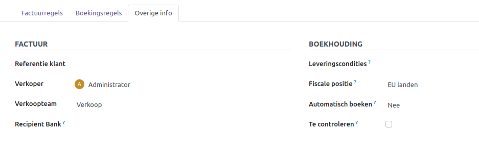
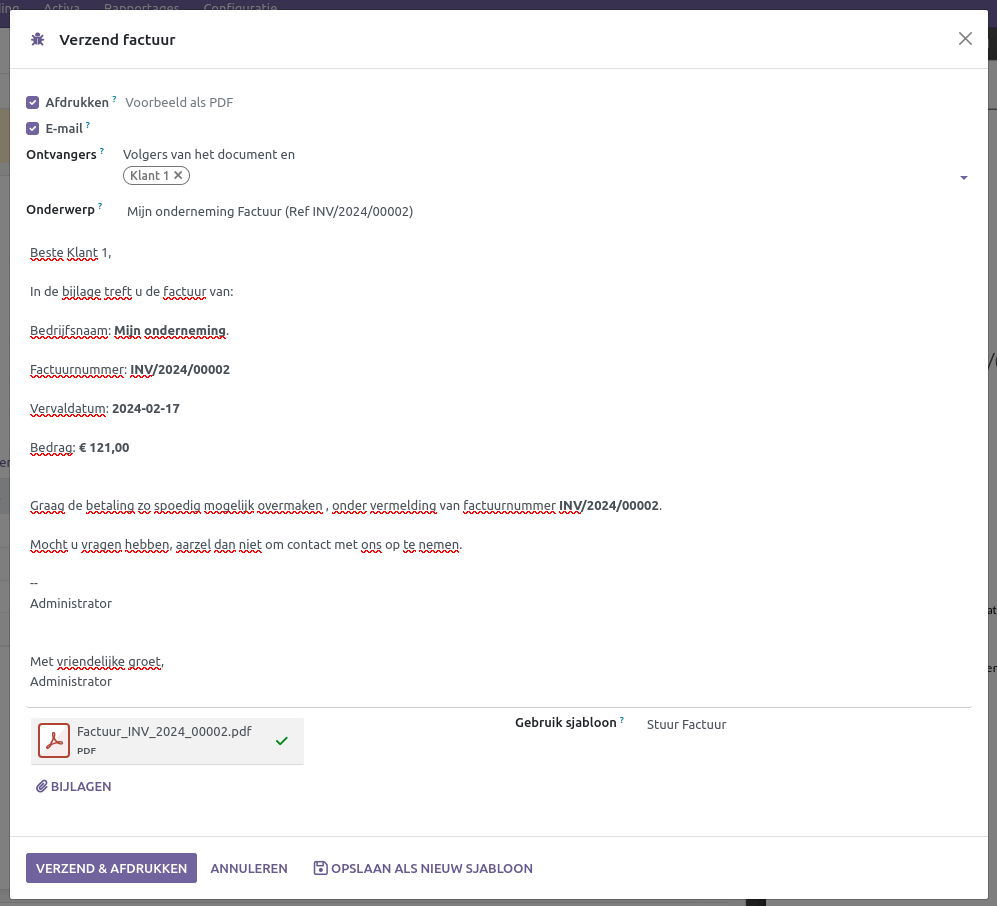

Verkoopfacturen
====================================================================

Het opstellen van facturen is een essentieel onderdeel van een goede boekhouding. Een fraaie en professionele factuur fungeert als een soort visitekaartje. Door aan klanten te laten zien dat je zorgvuldig en professioneel bent, verklein je de kans op betalingsproblemen. Met Curq kun je eenvoudig een factuur opstellen en verzenden naar je klanten. Via Curq kun je moeiteloos jouw huisstijl toevoegen door kleuren en jouw logo te integreren. Vervolgens verstuur je deze facturen gemakkelijk met slechts een paar klikken.

Aanpassen huisstijl
---------------------------------------------------------------------------------------------------
Als je je huisstijl niet hebt opgegeven tijdens de aanmaak van je omgeving, kun je dit alsnog doen via Instellingen > Algemene instellingen, onder het kopje Bedrijven.

.. image:: Media/verkoopfacturen001.png
   :width: 800

Kies "Configureer documentlay-out". In het volgende scherm heb je de mogelijkheid om jouw huisstijl toe te voegen.

.. figure:: Media/verkoopfacturen002.png

- **Lay-out:** Hier zijn vier opties beschikbaar om het ontwerp van jouw facturen of andere documenten te configureren.
- **Lettertype:** Kies hier een van de beschikbare lettertypes
- **Bedrijfslogo:** Upload hier je Bedrijfslogo.
- **Kleuren:** Curq stelt de kleuren voor op basis van je bedrijfslogo.
- **Achtergrond lay-out:** Kies een optie of upload je eigen achtergrond.
- **Bedrijfsslogan:** Vul hier jouw slogan in. Dit is optioneel.
- **Bedrijfsgegevens:** Vul hier jouw bedrijfsgegevens in.
- **Voettekst:** Vul hier de voettekst in. Denk aan je telefoonnummer, website, mailadres, KvK, BTW-Nummer of je bankrekeningnummer.
- **Papierformaat:** Kies het juiste formaat.

Aan de rechterkant zie je meteen hoe jouw documenten in Curq eruit zullen zien. Onder dit voorbeeld kun je ook nog een PDF downloaden om te zien hoe jouw klanten jouw factuur ontvangen. Nu kunnen we verdergaan met het opstellen van jouw verkoopfactuur.

Aanmaken verkoopfactuur
---------------------------------------------------------------------------------------------------

Heb je een uitgebreidere versie van Curq, dan kunnen verkoopfacturen ook worden aangemaakt vanuit bijvoorbeeld een verkooporder of een website-order. Hier volgt de handmatige procedure voor het aanmaken van een verkoopfactuur: ga naar Facturatie > Klanten > Facturen. In dit scherm zie je al jouw verkoopfacturen in een mooi overzicht. Je kunt meteen zien of een factuur openstaat of al reeds betaald is.

Voor het aanmaken van een factuur klik je linksboven op [Nieuw]. Mochten de facturen vanuit een ander softwarepakket zijn verstuurd, maar je wilt ze wel in Curq bijhouden, dan kun je ook gebruikmaken van de knop [UPLOADEN].

Het volgende scherm verschijnt wanneer je een nieuwe factuur aanmaakt.

.. figure:: Media/verkoopfacturen003.png

Het scherm is opgebouwd uit 3 gedeeltes.

1. Hoofdgegevens van de factuur.

- Hier vul je de gegevens van de klant in, inclusief het afleveradres indien van toepassing. Als deze gelijk zijn, worden beide velden ingevuld.
- **Factuurdatum:** Laat dit veld leeg als de datum van vandaag moet worden gebruikt.
- **Betaalreferentie:** Dit wordt automatisch ingevuld zodra de factuur wordt bevestigd.
- **Vervaldatum:** Deze wordt berekend aan de hand van de betalingsconditie, die je kunt invullen waar nu "Voorwaarden" staat. Door gebruik te maken van een betalingsconditie hoef je niet handmatig de vervaldatum te berekenen. De vervaldatum is belangrijk, omdat op die dag de factuur uiterlijk betaald moet worden. Spreek daarom met je klanten de juiste betalingsvoorwaarden af. Volgens een Europese richtlijn geldt een betalingstermijn van 30 dagen als er geen termijn is overeengekomen.
- **Dagboek:** Laat dit op "Klantfacturen" staan, tenzij je meerdere dagboeken hebt voor verkoopfacturen. Een dagboek is een soort subadministratie binnen de boekhouding waarmee je facturen, boekingen en transacties groepeert naar de soort waar ze bij horen. Via het bankdagboek verwerk je alle banktransacties, het verkoopboek bevat een overzicht van al je verkoopfacturen, en het inkoopboek geeft een overzicht van je inkoopfacturen.

2. Factuurregels of overige info.

   De factuurregels bevatten de details van de factuur, waarin staat wat er is verkocht tegen welk bedrag en met welke BTW.

- **Product:** Vul hier een product in als je gebruikmaakt van producten binnen Curq. Een product kan ook een dienst zijn; in dat geval heeft het product het type "dienst". Het is niet verplicht om gebruik te maken van producten.
- **Label:** Dit verschijnt op de factuur, dus vul dit correct in. Als je producten gebruikt, wordt dit automatisch overgenomen, maar je kunt het altijd achteraf aanpassen.
- **Rekening:** Het is verplicht om de juiste grootboekrekening op te geven. De omzet wordt geboekt op deze grootboekrekening. Curq kan deze automatisch invullen op basis van de producten.
- **Aantal:** Het aantal verkochte eenheden.
- **Prijs:** De prijs per eenheid.
- **BTW:** Curq stelt automatisch de meest logische BTW-code voor. Wijk hier alleen van af als er een andere BTW van toepassing is.
- **Subtotaal:** Aantal x Prijs.
- **Algemene voorwaarden:** Links onder de factuurregels zie je de algemene voorwaarden staan. Deze tekst verschijnt op je facturen. TIP: Als je deze op je website hebt staan, kun je daarnaar verwijzen.
- **Totalen:** Rechts onder de factuurregels zie je de totalen van de factuur, inclusief toegepaste BTW.

Tabblad [Boekingsregels]

   Hier wordt de journaalpost van de factuur getoond. Dit is belangrijke informatie voor de boekhouder.

Tabblad [Overige Info]

- **Referentie klant:** Hier kun je extra informatie vastleggen die voor de klant van belang kan zijn, bijvoorbeeld hun inkoopnummer of een afdelingsnaam binnen het bedrijf. Zodra je hier iets invult, wordt dit ook afgedrukt op de factuur.
- **Verkoper:** De verkoper die gebruikt kan worden in rapportages.
- **Verkoopteam:** Het verkoopteam dat gebruikt kan worden in rapportages.
- **Recipient Bank:** Alleen van toepassing als je je klanten incasseert.
- **Leveringscondities:** Als INCOTERMS van belang zijn, dan kun je die hier invullen. In Curq zijn de meest gebruikte aanwezig.
- **Fiscale Positie:** Het BTW-regime dat van toepassing is op de factuur.
- **Automatische boeken:** Alleen op een conceptfactuur kan dit worden ingesteld. Je kunt een factuur al vooruit plannen om deze later te laten boeken, of je kunt terugkerende facturen automatisch laten boeken tot een bepaalde tijd door Curq. Dit is handig als je elke maand dezelfde factuur wilt laten aanmaken.
- **Te controleren:** De factuur krijgt de status "te controleren". Je kunt bijvoorbeeld jouw boekhouder hiermee attenderen dat deze factuur nog een keer extra moet worden gecontroleerd.

3. Logging van de factuur.

   Alle belangrijke wijzigingen met betrekking tot de factuur worden hier bijgehouden. Je ziet hier ook de e-mails die zijn verzonden. Als je ook gebruikmaakt van de volledige integratie met mailfunctionaliteit, verschijnt hier ook het antwoord van de klant als hij reageert op de mail.

- **Verzend bericht:** Hiermee verzend je een mail naar de klant.
- **Log notitie:** Dit is een interne notitie die alleen intern zichtbaar is. Voor de klant is deze niet zichtbaar.
- **Activiteiten:** Je kunt een bepaalde activiteit inplannen voor iemand. Dit kan een to-do zijn, maar ook een afspraak.

.. image:: Media/verkoopfacturen005.png

- **Volgers:** Contacten en medewerkers kunnen volgers zijn van het document. Afhankelijk van hun aanmelding worden deze volgers op de hoogte gehouden van wijzigingen op dit document.

Zodra de factuur gereed is, kan de factuur worden bevestigd via de knop [BEVESTIGEN]. De factuur wordt op dit moment dan financieel geboekt.

.. image:: Media/verkoopfacturen006.png

De factuur staat nu open in de boekhouding en de status verandert naar "geboekt". Er verschijnen nu andere knoppen. Wil je nog eerst de factuur controleren, dan kun je via de knop midden in het scherm eerst een afdruk downloaden. Bij het afdrukken kies dan voor "Facturen". Als je de factuur wilt verbeteren, dan kun je de factuur terugzetten via de knop [TERUGZETTEN NAAR CONCEPT].

.. image:: Media/verkoopfacturen007.png

Met de knop [VERZEND & AFDRUKKEN] kun je meteen de factuur via de mail versturen. Als er een e-mailadres ontbreekt, zal Curq om deze informatie vragen. Het volgende verzendscherm verschijnt.

In dit scherm heb je de optie om een factuur af te drukken en te mailen. Zorg dat de juiste optie is geselecteerd. Hier kun je ook de mail aanpassen en een persoonlijk tintje meegeven. Curq zal de factuur als PDF-bestand meesturen naar de klant.

Eenmaal goed, dan kun je jouw factuur versturen via [VERZEND & AFDRUKKEN].

Heb je een persoonlijke mail aangemaakt en wil je die de volgende keer weer gebruiken, dan kun je die opslaan via de knop [OPSLAAN ALS NIEUW SJABLOON].

Zodra de factuur is verzonden binnen Curq, is dit meteen zichtbaar in het loggingsdeel. Je ziet jouw mail terug en aan de hand van de enveloppe kun je de status van jouw mail terugvinden. Je kunt eventueel corrigerende acties ondernemen door te klikken op de enveloppe.

.. image:: Media/verkoopfacturen009.png

.. toctree::
    :maxdepth: 2

    verkoopfacturen_algemene_voorwaarden
    verkoopfacturen_afleveradres_factuuradres
    verkoopfacturen_creditnota
    verkoopfacturen_omzetspreiding
    betalingen_herinneringen
    verkoopfacturen_betalingskorting
    verkoopfacturen_incoterms
