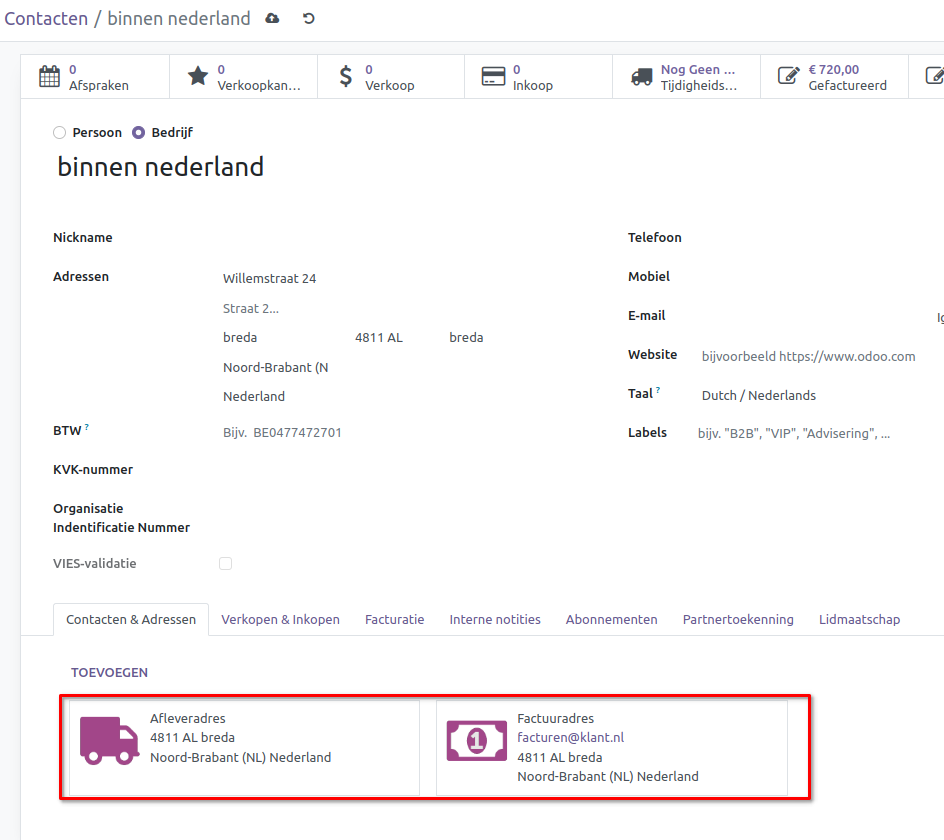
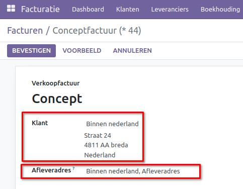
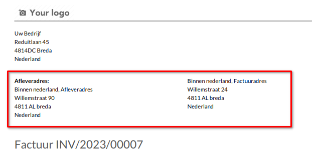

Verkoopfacturen Afleveradres en Factuuradres
====================================================================

Met Curq kun je ook jouw klanten bedienen als ze over meerdere adressen of e-mailadressen beschikken. Vaak hebben bedrijven een afwijkend afleveradres voor het magazijn in vergelijking met hun bezoekadres. Facturen en orders worden verstuurd naar andere e-mailadressen dan bijvoorbeeld het algemene of persoonlijke e-mailadres.

De verschillende afleveradressen en factuuradressen zijn zichtbaar bij het contact onder de tab [Contacten & Adressen].

Een afleveradres herken je aan het symbool van de **vrachtwagen**, terwijl het factuuradres wordt aangeduid met het symbool van het **geldbiljet**. Raadpleeg de handleiding voor contacten voor instructies over het aanmaken en bewerken van deze contacten.

Verkooporder
---------------------------------------------------------------------------------------------------

Indien je gebruikmaakt van de integratie met de verkooporder, kun je meer informatie hierover vinden in de desbetreffende handleiding.

Verkoopfactuur
---------------------------------------------------------------------------------------------------

In de factuur kun je een klant invoeren. Dit is het adres waarnaar de factuur wordt verzonden en dat ook op de factuur verschijnt als afnemer. Als je een contactpersoon hebt zonder extra adressen, vul dan dit adres in. Als je er een hebt met extra adressen, controleer dan welk adres je moet gebruiken. Geef bij voorkeur het factuuradres op in plaats van het algemene contactadres.

Het afleveradres wordt automatisch ingevuld vanuit het geselecteerde contact. Als je geen apart afleveradres hebt, wordt hier het algemene contactadres ingevuld.
Het is ook mogelijk om een ander adres/afleveradres in te voeren. Dit kan handig zijn als jouw klanten aan dropshipment doen. Bijvoorbeeld: jij factureert dan aan jouw afnemer (zoals Bol.com), maar levert aan de consument.

Voor een voorbeeldfactuur waarvan alle adressen gelijk zijn, zie onderstaande afbeelding:

.. image:: Media/verkoopfacturen_afleveradres_factuuradres003.png

Voor een voorbeeldfactuur waarvan het afleveradres verschilt, zie onderstaande afbeelding:

