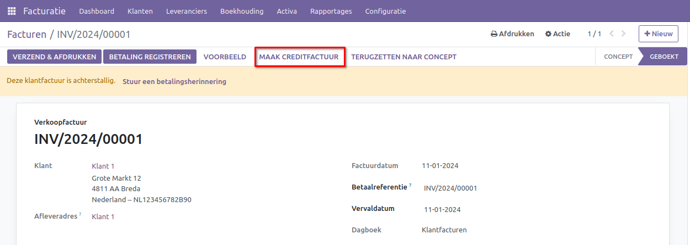

Verkoopfacturen - Creditnota
============================

Het opstellen van een creditnota speelt een cruciale rol in het financiële beheer van een bedrijf. Dit document draagt bij aan de financiële organisatie en heeft diverse nuttige toepassingen die bijdragen aan het beheer van de financiën. Laten we enkele van deze essentiële aspecten nader bekijken:

**Fouten verbeteren:**
Af en toe maken we vergissingen bij het opstellen van facturen. Het kan zijn dat we de onjuiste hoeveelheid noteren of een foutief bedrag vermelden. Een creditnota fungeert als een speciaal document waarmee we deze fouten kunnen corrigeren. Het waarborgt dat alle gegevens weer correct en nauwkeurig worden genoteerd.

**Retourzendingen of annuleren van bestellingen:**
Af en toe wensen mensen een aankoop terug te sturen of hun bestelling te annuleren. In dergelijke gevallen is het belangrijk om ervoor te zorgen dat de financiële transactie ook wordt aangepast. Een creditnota fungeert als een soort factuur dat aangeeft dat ze een terugbetaling ontvangen of dat de betaling wordt gewijzigd.

Creditnota vanuit een verkoopfactuur
---------------------------------------------------------------------------------------------------
Om een correctie aan te brengen op een bestaande factuur binnen Curq, is het eenvoudig een creditnota te genereren vanuit de desbetreffende verkoopfactuur. Je kunt de bestaande verkoopfactuur openen via Facturatie > Klanten > Facturen. Bovenaan de factuur kun je met de knop [MAAK CREDITFACTUUR] snel de creditnota aanmaken.

Na het activeren van de knop, verschijnt er een pop-upvenster met aanvullende opties.

.. image:: Media/verkoopfacturen_creditnota002.png

- **Creditmethode:** Er zijn drie beschikbare keuzemogelijkheden.

 - Gedeeltelijk crediteren: Als er een correctie nodig is en je wilt alleen een creditfactuur verzenden, is dit de meest geschikte keuze. Curq genereert een concept-creditfactuur met dezelfde informatie als de originele factuur. De bedragen op de creditnota zijn positief, en je past ze aan conform de afspraken met de klant.
 - Volledig crediteren: Kies deze optie als je de gehele factuur wilt annuleren. Curq maakt een creditnota met alle gegevens van de verkoopfactuur. Deze creditnota wordt onmiddellijk geboekt en afgeletterd met de originele factuur, waardoor zowel de verkoopfactuur als de creditnota niet langer openstaan. Het enige wat nog dient te gebeuren, is het versturen van de creditnota naar de klant.
 - Volledig crediteren en nieuwe conceptfactuur: Gebruik deze optie als de originele factuur volledig incorrect was en de klant een nieuwe factuur verwacht. Op deze manier annuleer je de verkoopfactuur. Vervolgens genereert Curq een nieuwe factuur op basis van de originele, die je naar wens kunt aanpassen en verzenden.

- **Reden:** Hier kun je naar eigen inzicht de reden voor de creditnota opgeven. De reden wordt vastgelegd in de creditnota onder het tabblad [Overige info] bij de klantreferentie. Deze informatie wordt ook weergegeven op de afdruk van de factuur.
- **Creditdatum:** Je kunt kiezen tussen "Specifiek" en "Boekingsdatum". Met "Specifiek" kun je een andere datum selecteren aan de rechterkant. Bij "Boekingsdatum" heb je geen keuze en stelt Curq automatisch de datum van vandaag voor.
- **Gebruik een specifiek dagboek:** Als je met je boekhouder een apart dagboek hebt aangemaakt voor creditnota's, kun je dat hier selecteren. In de meeste gevallen zal het echter niet nodig zijn om dit aan te passen.

Afhankelijk van de geselecteerde opties zal Curq je automatisch doorverwijzen naar de creditnota of nieuwe factuur. Je hebt dan de mogelijkheid om de creditnota/verkoopfactuur te bevestigen en naar je klant te verzenden.

Aparte Creditnota
---------------------------------------------------------------------------------------------------

Je hebt nog steeds de optie om een afzonderlijke creditnota te genereren. Dit kan bijvoorbeeld van toepassing zijn op meerdere facturen of op specifieke afspraken tussen jou en de klant. Een aparte creditnota maak je aan via Facturatie > Klanten > Creditfacturen.

Het genereren van een creditnota verschilt niet van het opstellen van een verkoopfactuur. De procedure is vrijwel identiek. Om de correcte verwerking te waarborgen, dien je de bedragen positief in te voeren. Mocht je echter regels willen toevoegen met een negatief bedrag, zorg er dan in ieder geval voor dat het totaal van de gehele creditnota of verkoopfactuur nooit negatief wordt.
