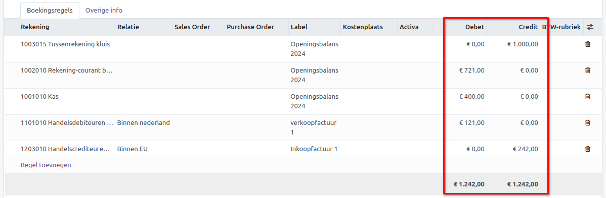

Openingsbalans
==============

Als je begint met het opzetten van een boekhouding, is het gebruikelijk om te starten met een openingsbalans. Dit vormt financieel gezien het vertrekpunt van de boekhouding en wordt vaak in samenwerking met een boekhouder opgesteld.

Indien je een startende ondernemer bent, is het mogelijk dat je een deel van je vermogen investeert in je bedrijf; dit wordt vervolgens opgenomen in je openingsbalans. Voor bestaande bedrijven die willen overstappen naar Curq, kan de boekhouding worden overgedragen met behulp van een openingsbalans.

Een openingsbalans wordt opgesteld in het memoriaal dagboek. Zo'n memoriaalboeking maak je via Facturatie > Boekhouding > Boekingen.

.. image:: Accounting-Media/gettingstarted_openingsbalance001.png

Klik vervolgens op de knop [NIEUW]. Het volgende scherm verschijnt.

.. image:: Accounting-Media/gettingstarted_openingsbalance002.png

- **Referentie:** Geef hier een duidelijke omschrijving mee, zodat je weet waar deze boeking voor bedoeld is.
- **Boekhouddatum:** Dit is de datum van deze boeking. Voor een openingsbalans wordt vaak het einde van een periode gekozen, meestal 31 december voor de meeste bedrijven. Als je ergens in het jaar overgaat, kies dan de laatste dag van de vorige maand. Mocht je twijfelen, overleg dan met je boekhouder welke datum geschikt is.
- **Dagboek:** Kies hier het memoriaal dagboek dat hiervoor bestemd is.

Op de boekingsregels geef je de details van de boeking in.

- **Rekening:** Vul hier de grootboekrekening in.
- **Relatie:** Voeg een relatie toe als je ook openstaande posten of facturen in de openingsbalans opneemt. Maak per relatie een regel aan, zowel voor klanten als leveranciers. Als je veel regels moet invoeren, is het voor overzichtelijkheid aan te raden om meerdere openingsbalansboekingen te maken. Je kunt bijvoorbeeld een aparte boeking maken voor klanten en een aparte voor leveranciers.
- **Label:** Geef hier een duidelijke omschrijving zodat je weet waar deze boekingsregel voor bedoeld is. Als je openstaande facturen meeneemt, vul dan hier de factuurnummers in.
- **Debet:** Bedrag aan de debetzijde. Meer informatie hieronder.
- **Credit:** Bedrag aan de creditzijde. Meer informatie hieronder.

    **Wat is het onderscheid tussen debet en credit?**
    Debet en credit representeren de twee zijden van de balans: de debetzijde en de creditzijde.

    **Debet: linkerzijde**
    De linkerzijde wordt ook wel de debetzijde genoemd. Hier vind je alle bezittingen van een onderneming, ook wel activa genoemd. Deze activa kunnen verder worden onderverdeeld in vaste- en vlottende activa. Bovendien tref je in de debetzijde het geld aan dat jou nog verschuldigd is door andere bedrijven of klanten, ook bekend als debiteuren. Tot slot bevinden zich aan deze zijde de liquide middelen, waaronder jouw kas- en banksaldo.

    **Credit: rechterzijde**
    De rechterkant van de balans staat bekend als de creditzijde. Hier vind je het eigen vermogen van een onderneming en alle passiva (schulden). Dit omvat langlopende leningen zoals een hypotheek, maar ook crediteuren. Crediteuren zijn bedrijven of personen aan wie jij nog geld verschuldigd bent, wat valt onder kortlopende leningen.

Curq hanteert het concept van dubbel boekhouden. Bij dubbel boekhouden worden alle transacties op minstens twee verschillende manieren geadministreerd. Elke transactie wordt geboekt op zowel de debet- als creditkant, op een of meer grootboekrekeningen. Het gevolg hiervan is dat het eindresultaat aan zowel de debet- als creditkant gelijk moet zijn, zodat beide zijden in balans zijn.

Om deze reden kun je de openingsbalansboeking pas opslaan wanneer de boeking in balans is. Controleer voordat je de boeking opslaat of het totaal aan zowel de debet- als creditkant gelijk aan elkaar is.