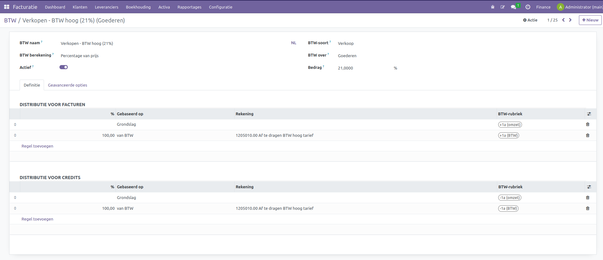
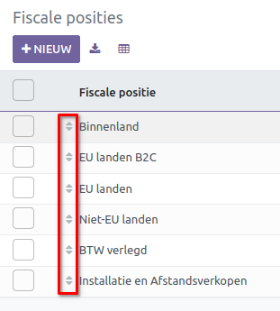
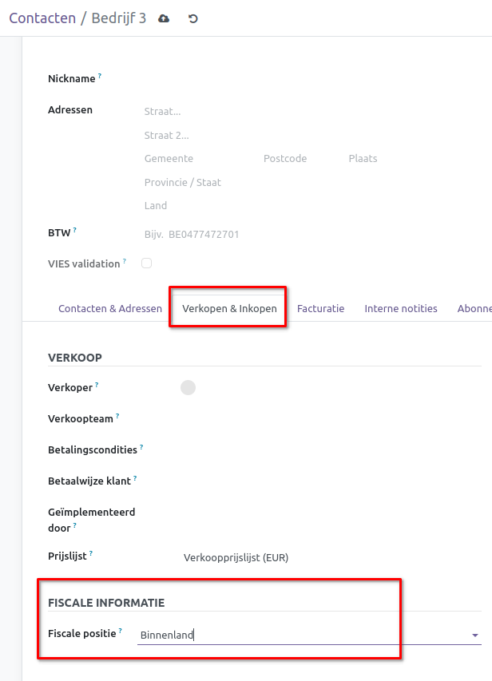

BTW en Fiscale Posities
=======================

Het bepalen van de juiste BTW-belastingen kan een uitdaging zijn voor jouw boekhouding. Binnen Curq maken we gebruik van BTW-codes en de Fiscale Posities om je hiermee te helpen.

De BTW-codes zijn al voorgedefinieerd door Curq. Met de Fiscale Posities bepaalt het systeem automatisch de juiste BTW op basis van slimme regels. Deze slimme vertaling kan gebaseerd worden op de verplichting van het BTW-nummer en het land (geleverd of herkomst). De standaard BTW en Grootboekrekeningen kunnen via de regels van de Fiscale Posities vertaald worden naar een andere BTW of Grootboekrekeningen.

Binnen Curq zijn de standaard Fiscale Posities al ingericht. Afhankelijk van jouw bedrijfsvoering kun je in overleg met de Accountant dit verder aanpassen specifiek voor jouw bedrijf.

BTW Codes
---------

De BTW-codes vind je terug onder Facturatie > Configuratie > BTW. Je kunt ze hier aanpassen door op de BTW-code te klikken.

- **BTW naam:** Hier kun je een naam opgeven voor je BTW-code. Deze verschijnt overal binnen Curq, dus geef een herkenbare naam mee.

- **BTW berekening:** Je krijgt hier een aantal opties.

* **Groep van BTW:** Hiermee kun je meerdere BTW-codes combineren in 1 BTW-code.
* **Vast:** Een vast bedrag als Belasting.
* **Percentage van prijs:** Een percentage als Belasting.
* **Percentage van prijs, inclusief BTW:** Een percentage als Belasting die rekening houdt met het totaalbedrag inclusief BTW.

- **BTW-soort:** Hiermee bepaal je waar deze BTW-code kan worden geselecteerd binnen Curq.
- **BTW-over:** HHiermee bepaal je tot welke soort producten je deze BTW-code kunt toepassen.
- **Bedrag:** Afhankelijk van de instelling bij BTW berekening geef je hier het percentage of bedrag in.

.. image:: Accounting-Media/taxes_vat_fiscalpositions002.png

In het definitie tabblad leg je de belastingregels vast voor facturen of creditnota's. Het is verplicht om minimaal 1 regel te hebben voor grondslag en voor BTW. Je kunt hier bepalen welk percentage van de berekende BTW op de grootboekrekening en BTW-vak wordt geboekt. Bij de creditnota's worden de regels en vakken vaak omgedraaid.

.. image:: Accounting-Media/taxes_vat_fiscalpositions003.png

Bij Geavanceerde opties kun je de BTW-code nog verder instellen.

- **Label op facturen:** Dit is de omschrijving die op de facturen verschijnt.
- **BTW-groep:** Dit wordt onderaan in een factuur of order bij het totaal getoond. Het totaal van alle BTW-codes wordt opgeteld in deze groep.
- **In de analytische kost inbegrepen?:** Moet de berekende BTW ook worden opgenomen in de kostenplaats.
- **Land:** In welk land is deze BTW-code geldig.
- **Inclusief BTW:** Wordt de BTW inclusief berekend.
- **Beïnvloed grondslag van daarop volgende BTW's?:** Als er meerdere BTW-codes worden toegepast, beïnvloedt deze BTW-code de grondslag van de volgende BTW-code. Als er meerdere codes worden toegepast, houdt Curq rekening met de volgorde van de BTW-codes. De codes met een hogere volgorde worden als eerst toegepast.

In Curq zijn de BTW-codes al voor je ingericht. Het kan zijn dat sommige BTW-codes niet van toepassing zijn. Deactiveer deze door de optie Actief uit te zetten.

Fiscale Posities
----------------

De Fiscale Posities vind je terug onder Facturatie > Configuratie > Fiscale Posities. De BTW-regio's zijn reeds ingedeeld in Curq. Bijvoorbeeld, voor zakenrelaties in de EU worden andere BTW-tarieven gehanteerd. Curq zorgt op deze manier ervoor dat de correcte BTW op de orders en facturen staat.

Op het tabblad [Vervangingstabel BTW] worden de BTW-codes vertaald naar de juiste. Aan de linkerkant vind je de standaard BTW die je op de producten kunt definiëren. Zodra deze Fiscale Positie is toegepast op jouw order of factuur, wordt eerst de standaard BTW herleidt. Vervolgens wordt de BTW-code aan de rechterkant toegepast op jouw order of factuur.

Op het tabblad [Vervangingstabel Grootboekrekeningen] worden de grootboekrekeningen vertaald naar de juiste. Daar wordt hetzelfde principe toegepast.

Automatische toepassing
-----------------------

Voor de automatische toepassing van een Fiscale Positie zijn de instellingen rechtsboven van belang. Deze zullen we hier even toelichten.

- **Automatisch detecteren:** Voor automatische toepassing aan of uit.
- **BTW verplicht:** De relatie moet voorzien zijn van een BTW-nummer voor automatische toepassing.
- **Landengroep:** De relatie bevindt zich in een land binnen de Landengroep.
- **Land:** De relatie bevindt zich in het opgegeven land.

Als er meerdere Fiscale Posities automatisch worden toegepast dan is de volgorde waar deze in staat van belang. In de lijst van alle Fiscale Posities zie je in welke volgorde ze staan. Het is mogelijk om deze volgorde te wijzigen door ze te slepen.

.. image:: Accounting-Media/taxes_vat_fiscalpositions006.png

Handmatige toepassing
---------------------

In sommige gevallen wil je afwijken van de automatisch voorgestelde Fiscale Positie. Dit kan voorkomen als de relatie waar je zaken mee doet in een apart BTW-regime valt. Je kunt de Fiscale Positie vastleggen bij een relatie of in een order / factuur. We adviseren om zoveel mogelijk dit in te stellen op de relatie. Zodra deze relatie wordt gebruikt bij een order / factuur, wordt de Fiscale Positie hiervan afgeleid. Je kunt dit instellen bij het contact.

.. image:: Accounting-Media/taxes_vat_fiscalpositions007.png

Wil je toch bij een order of factuur dit toepassen dan kan dit onder het tabblad [Overige info].

.. image:: Accounting-Media/taxes_vat_fiscalpositions008.png