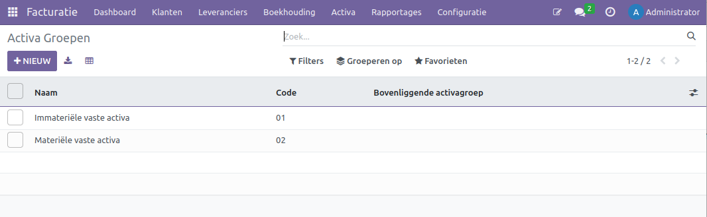
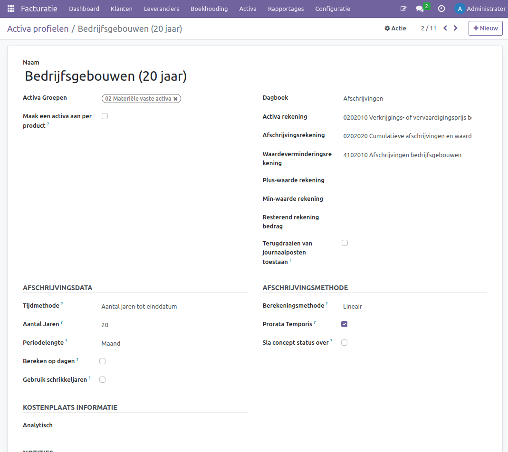
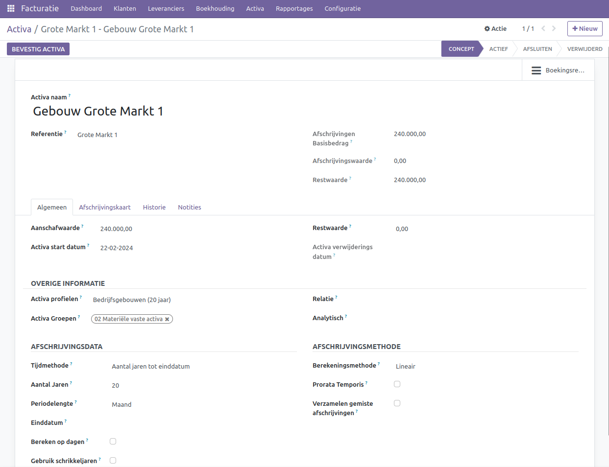
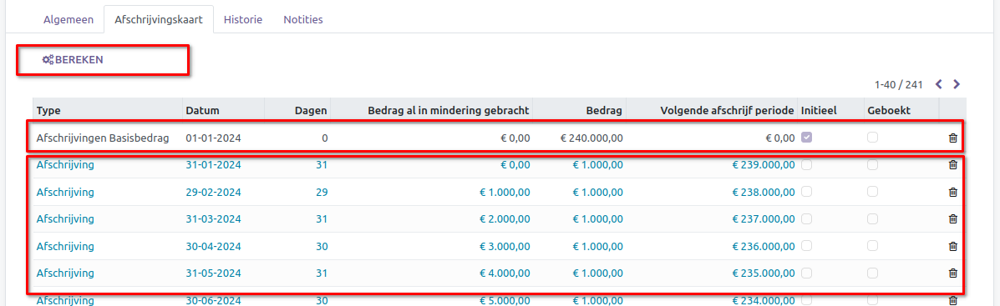
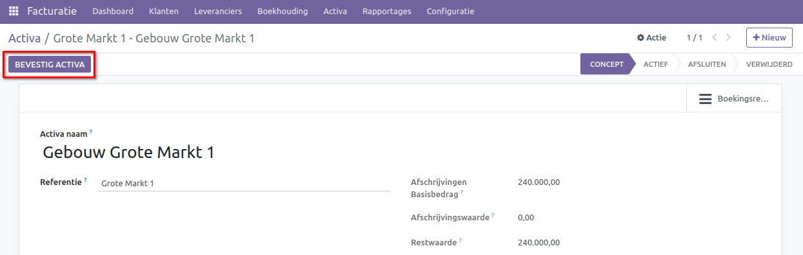
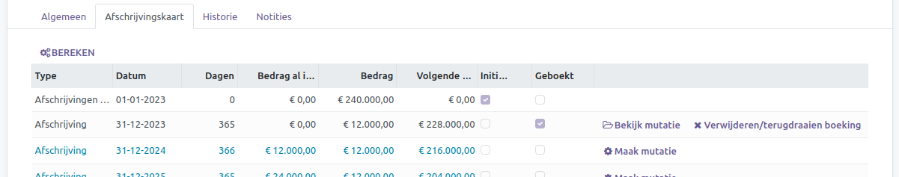
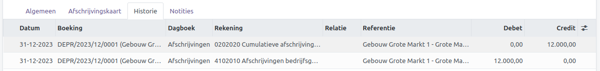
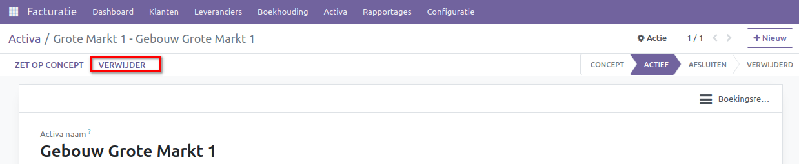
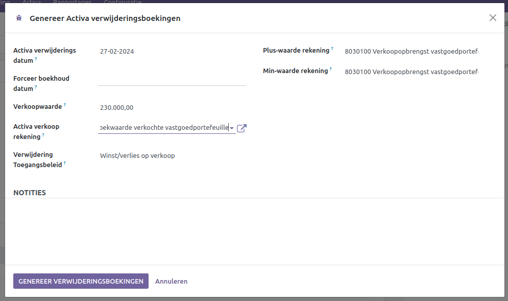
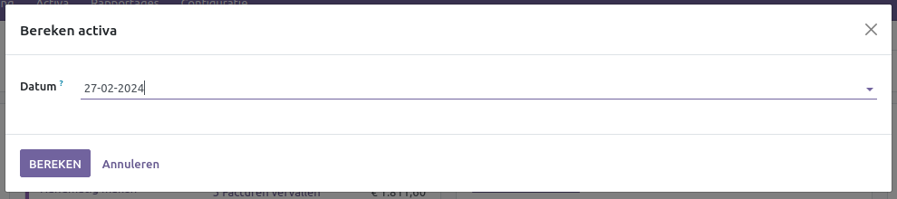

Activa beheer
=============

Het managen van activa in financiële boekhouding is als het zorgvuldig bijhouden en beheren van alles wat een bedrijf in bezit heeft, variërend van fysieke apparatuur tot financiële investeringen en innovatieve concepten. Het begint met het nauwkeurig documenteren van al deze bezittingen en het toekennen van de juiste waarde aan elk item. Om rekening te houden met het feit dat dingen in de loop van de tijd minder waard kunnen worden door bijvoorbeeld slijtage, past activabeheer regelmatig afschrijving toe. Hierdoor wordt de boekwaarde van de activa in de boeken aangepast. Activabeheer houdt ook rekening met potentiële uitdagingen, zoals veroudering van activa en grote economische verschuivingen, en zorgt ervoor dat het bedrijf voldoet aan de geldende regels en voorschriften voor rapportage.

Hier zijn verschillende activa die in de boekhouding worden opgenomen: gebouwen, machines, voertuigen, grond en computerapparatuur. Deze bezittingen vertegenwoordigen de fysieke en technologische middelen van een bedrijf. Ze worden op de balans vermeld om de financiële positie van het bedrijf te weerspiegelen en vormen een belangrijk onderdeel van de totale bedrijfswaarde.

Stel dat jouw bedrijf een machine heeft aangeschaft voor €10.000 met een geschatte levensduur van 5 jaar en een restwaarde van €2.000. De jaarlijkse afschrijving kan worden berekend met de formule:

Afschrijving per jaar= 
(10.000 − 2.000) / 5 = 1600

Dus, de machine zou jaarlijks worden afgeschreven met €1.600. Na het eerste jaar zou de boekwaarde van de machine dan €10.000 - €1.600 = €8.400 zijn, en dit proces zou doorgaan totdat de boekwaarde gelijk is aan de restwaarde na 5 jaar. Afschrijvingen worden vaak toegepast om de kosten van de activa over hun bruikbare levensduur te spreiden in de boekhouding.

Activa Groepen
--------------

Om een duidelijk overzicht te behouden van de activa, is het verstandig om ze te categoriseren in groepen. Deze groepen zullen later de basis vormen voor de indeling in het activarapport. De groepen kan je aanmaken via Facturatie > Configuratie > Activa Groepen.

- **Naam:** Geef de groep een naam.
- **Code:** Vul een code in.
- **Bovenliggende activagroep:** Koppel een bovenliggende groep als deze groep daaronder valt.

Activa profielen
----------------

Een activaprofiel wordt ingezet om de afschrijvingsmethode van een actief te bepalen. De afschrijvingen worden op basis van dit profiel berekend en financieel verwerkt. Bovendien kan een activaprofiel worden gekoppeld aan een grootboekrekening, zodat bij het boeken van een factuur direct een actief wordt aangemaakt.
Een activaprofiel kan worden aangemaakt via Facturatie > Configuratie > Activa profielen.

- **Naam:** Geef het activaprofiel een passende naam.
- **Activa Groepen:** Selecteer hier de juiste Activa Groep.
- **Maak een activa aan per product:** Creëer een activa op basis van het product in de boekingsregel, in plaats van alleen op een boekingsregel.
- **Dagboek:** Koppel het dagboek waarin de afschrijvingsboekingen worden aangemaakt.
- **Activa rekening:** Dit is de balansrekening waarop de waarde van de activa wordt bijgehouden.
- **Afschrijvingsrekening:** Hierop worden de waarden van alle afschrijvingen geregistreerd.
- **Waardeverminderingsrekening:** Dit is de kostenrekening waarop de periodieke afschrijvingskosten worden geboekt.
- **Plus-waarde rekening:** Gebruik deze grootboekrekening om pluswaarden te boeken bij verkoop.
- **Min-waarde rekening:** Gebruik deze grootboekrekening om minwaarden te boeken bij verkoop.
- **Resterend rekening bedrag:** Dit is de grootboekrekening voor de restwaarde van het actief.
- **Terugdraaien van journaalposten toestaan:** Maak het mogelijk om boekingen tegen te boeken in plaats van ze te verwijderen.
- **Tijdmethode:** Kies of de afschrijving gebaseerd is op een aantal jaren tot einddatum of een aantal afschrijvingen.
- **Aantal Jaren:** Geef het aantal jaren op.
- **Periodelengte:** Bepaal of de periode per maand, per kwartaal of per jaar is.
- **Bereken op dagen:** Het bedrag van de afschrijving wordt bepaald door het aantal werkelijke dagen in een periode, in plaats van een standaard periode. Bijvoorbeeld, een maand met 30 dagen resulteert in een lager afschrijvingsbedrag dan een maand met 31 dagen.
- **Gebruik schrikkeljaren:** Bij de berekening van afschrijving wordt rekening gehouden met schrikkeljaren, en dit wordt niet gelijkmatig verdeeld over alle jaren.
- **Berekeningsmethode:** Je kunt een van de volgende methoden kiezen om de afschrijvingsregels te berekenen:
  
  * Lineair: Bereken op basis van de formule: Afschrijvingsbasis / Aantal afschrijvingen. Hierbij is de afschrijvingsbasis gelijk aan de aanschafwaarde minus de restwaarde.
  * Lineair-Limiet: Lineair afschrijven tot aan de restwaarde. De afschrijvingsbasis is gelijk aan de aanschafwaarde.
  * Degressief: Bereken op basis van de formule: Restwaarde * Degressieve Factor.
  * Degressief-Lineair (alleen van toepassing bij Tijdsmethode = Jaar): De degressieve afschrijving wordt lineair wanneer de jaarlijkse lineaire afschrijving groter is dan de jaarlijkse degressieve afschrijving.
  * Degressief-Limiet: Degressief afschrijven tot aan de restwaarde. De afschrijvingsbasis is gelijk aan de waarde van het actief.
  
- **Prorata Temporis:** Bij deze methode wordt de eerste afschrijving berekend op basis van de dag waarop de afschrijving plaatsvindt. Anders wordt een volledige periode gebruikt.
- **Sla concept status over:** Een activum wordt direct geactiveerd als het vanuit een factuur is aangemaakt.
- **Analytisch:** De analytische gegeven die wordt toegepast op dit profiel.

Activa aanmaken
---------------

Een activum aanmaken kan via Facturatie > Activa > Activa.

- **Naam:** Geef het actief een geschikte naam.
- **Referentie:** Voeg indien mogelijk een referentie toe aan het actief, zoals een code.
- **Afschrijvingen Basisbedrag:** Het bedrag waarop Curq de afschrijvingen baseert.
- **Afschrijvingswaarde:** Het tot nu toe afgeschreven bedrag.
- **Restwaarde:** De huidige restwaarde van het actief.

Tabblad Algemeen

- **Aanschafwaarde:** De waarde van de aanschaf.
- **Activa start datum:** De datum waarop de afschrijvingen in Curq beginnen. Indien het actief eerder is afgeschreven, moet je handmatig de afschrijvingen voor die periodes zelf aanmaken.
- **Restwaarde:** De verwachte restwaarde van het actief. De berekening van de afschrijvingen houdt hier rekening mee. Bijvoorbeeld: Aanschafwaarde - Restwaarde = Te Afschrijven Waarde.
- **Activa verwijderingsdatum:** De datum waarop het actief wordt verwijderd, zoals bij verkoop.
- **Activa profielen:** Gekoppelde activaprofiel.
- **Activa Groepen:** Gekoppelde activagroep.
- **Relatie:** De relatie van het actief, zoals de leverancier van waar het actief is gekocht. Als je direct een actief aanmaakt vanuit een leveranciersfactuur, wordt de relatie automatisch overgenomen vanuit de factuur.
- **Analytisch:** De analytische gegeven die wordt toegepast op dit actief.
- **Tijdmethode:** Kies of de afschrijving gebaseerd is op een aantal jaren tot einddatum of een aantal afschrijvingen.
- **Aantal Jaren:** Geef het aantal jaren op.
- **Periodelengte:** Bepaal of de periode per maand, per kwartaal of per jaar is.
- **Einddatum:** Beschikbaar als tijdmethode gebaseerd is op einddatum. Tot deze datum wordt het actief afgeschreven.
- **Bereken op dagen:** Het bedrag van de afschrijving wordt bepaald door het aantal werkelijke dagen in een periode, in plaats van een standaard periode. Bijvoorbeeld, een maand met 30 dagen resulteert in een lager afschrijvingsbedrag dan een maand met 31 dagen.
- **Gebruik schrikkeljaren:** Bij de berekening van afschrijving wordt rekening gehouden met schrikkeljaren, en dit wordt niet gelijkmatig verdeeld over alle jaren.
- **Berekeningsmethode:** Je kunt een van de volgende methoden kiezen om de afschrijvingsregels te berekenen:
  
  * Lineair: Bereken op basis van de formule: Afschrijvingsbasis / Aantal afschrijvingen. Hierbij is de afschrijvingsbasis gelijk aan de aanschafwaarde minus de restwaarde.
  * Lineair-Limiet: Lineair afschrijven tot aan de restwaarde. De afschrijvingsbasis is gelijk aan de aanschafwaarde.
  * Degressief: Bereken op basis van de formule: Restwaarde * Degressieve Factor.
  * Degressief-Lineair (alleen van toepassing bij Tijdsmethode = Jaar): De degressieve afschrijving wordt lineair wanneer de jaarlijkse lineaire afschrijving groter is dan de jaarlijkse degressieve afschrijving.
  * Degressief-Limiet: Degressief afschrijven tot aan de restwaarde. De afschrijvingsbasis is gelijk aan de waarde van het actief.
  
- **Prorata Temporis:** Bij deze methode wordt de eerste afschrijving berekend op basis van de dag waarop de afschrijving plaatsvindt. Anders wordt een volledige periode gebruikt.
- **Verzamelen gemiste afschrijvingen:** Wanneer een actief wordt gecreëerd in een reeds afgesloten periode, worden de nog uit te voeren afschrijvingen samengevoegd en uitgevoerd in de huidige open periode.

Tabblad Afschrijvingskaart

Zodra alle gegevens zijn ingevoerd kan afschrijvingen berekend worden via de knop [BEREKEN].

Na de berekening toont Curq alle individuele afschrijvingen. Hier kun je verifiëren of de afschrijvingen correct worden uitgevoerd. De eerste regel geeft het oorspronkelijke afschrijvingsbedrag weer, gevolgd door opvolgende regels die de afzonderlijke afschrijvingen vertegenwoordigen.

Het is tevens mogelijk om correcties direct op de regels uit te voeren door erop te klikken of ze te verwijderen. In de meeste gevallen is correctie echter niet noodzakelijk.

Activa activeren
----------------

Zodra alles gereed is, kan het Actief worden bevestigd via de knop [BEVESTIG ACTIVA], waarna de afschrijvingen zullen plaatsvinden.

Zodra de eerste afschrijving is geboekt, wordt dit weergegeven op het tabblad [Afschrijvingskaart].

Hier kun je de details van de afschrijving bekijken of direct de financiële journaalpost raadplegen. In geval van een onverhoopte fout, heb je de mogelijkheid om de journaalpost op dit tabblad te verwijderen of terug te draaien.

De individuele boekingsregels zijn te vinden onder het tabblad [Historie].

Activa verkopen / verwijderen
-----------------------------
Bij het verkopen van een activum in de boekhouding zijn verschillende stappen van belang. Allereerst moet de actuele waarde van het activum worden vastgesteld, inclusief de originele aanschafwaarde verminderd met de totale afschrijvingen. Vervolgens moet het verschil tussen de verkoopprijs en de geboekte boekwaarde worden bepaald, wat resulteert in een boekwinst of -verlies. Deze financiële aspecten moeten nauwkeurig worden verwerkt in de boekhouding, waarbij afschrijvingen moeten worden aangepast, de verkoopopbrengst op de juiste rekeningen moet worden geboekt en het verkochte activum uit de balans moet worden verwijderd.

Het actief kan worden verkocht of verwijderd via de knop [VERWIJDER].

Het volgende scherm verschijnt.

- **Activa verwijderingsdatum:** Datum van verwijdering van het actief.
- **Forceer boekhouddatum:** Als de boeking op een andere datum moet worden geboekt dan de verwijderingsdatum.
- **Verkoopwaarde:** De waarde bij verkoop.
- **Activa verkoop rekening:** De grootboekrekening waarop de verkoopwaarde wordt geboekt. Deze optie verschijnt alleen als er een bedrag bij de verkoopwaarde is ingevoerd.
- **Verwijdering Toegangsbeleid** Je kunt een van de volgende opties selecteren:
 
  * Restwaarde: De restwaarde van het actief wordt geboekt, zonder rekening te houden met de verkoopwaarde.
  * Winst/verlies op verkoop: De winst/verlies bij verkoop wordt berekend op basis van de afgeschreven bedragen en de verkoopwaarde. 

- **Resterend rekening bedrag:** De rekening voor de restwaarde.
- **Plus-waarde rekening:** De rekening voor winst bij verkoop.
- **Min-waarde rekening:** De rekening voor verlies bij verkoop.

Na verkoop of verwijdering krijgt het actief de status "VERWIJDERD", en de Activa verwijderingsdatum wordt ingevuld. Tevens zijn de diverse boekingen te zien op de tabbladen [Afschrijvingskaart] en [Historie].

Afschrijvingen boeken
---------------------

Curq boekt afschrijvingen automatisch. Indien je deze boekingen handmatig wilt uitvoeren, is dat mogelijk via het menu Facturatie > Activa > Bereken activa.

Alle afschrijvingen tot de opgegeven datum worden financieel geboekt.
