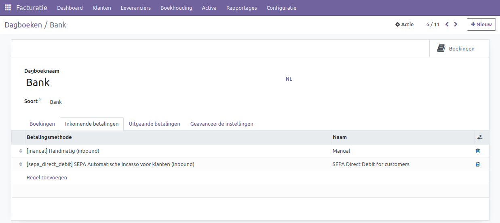

Bank
----

Het bankboek fungeert als een gedetailleerd financieel dagboek waarin alle banktransacties worden vastgelegd, waaronder stortingen, opnames en afschrijvingen. Het zorgvuldig bijhouden van deze transacties via het bankboek biedt niet alleen de mogelijkheid om financiële bewegingen nauwkeurig te monitoren, maar speelt tevens een cruciale rol bij het vaststellen van budgetten en het analyseren van uitgavenpatronen.

Wanneer je start met Curq dan is er al 1 bank dagboek aangemaakt, je dient hier alleen nog je eigen bankrekening aan toe te voegen. Ook kun je de omschrijving aanpassen.
Belangrijk om te weten is dat als je een tweede of aanvullende bankrekening wil toevoegen, je dit doet via het menu 'Toevoegen bank'. Je hoeft in dat menu alleen je bankrekening toe te voegen, Curq zal na opslaan zelf een nieuw dagboek aanmaken dat aan deze bankrekening is gekoppeld. 

Hieronder zie je hoe je een tweede en volgende bankdagboek aanmaakt.

.. image:: My-Ponto-Bank-Feed-Media/bankrekening_toevoegen_1.png
       :width: 6.3in
       :height: 2.93264in

.. image:: My-Ponto-Bank-Feed-Media/bankrekening_toevoegen_2.png
       :width: 6.3in
       :height: 2.93264in

De configuratie van het eerste bankboek ziet er als volgt uit.

.. image:: Boekhouding/boekhouding_starten_dagboeken002.png

- **Bankrekening:** Koppel de juiste grootboekrekening aan de bank hier.
- **Afletteringsmodus:** Bepaal of het mogelijk is om een aflettering op de bank ongedaan te maken na uitvoering.

 * Boekingsbewerking: Afletteringen kunnen ongedaan worden gemaakt en bewerkt. 
 * Tussenrekening behouden: Het is niet mogelijk om een aflettering ongedaan te maken.

- **Tussenrekening:** Bankafschriftregels worden tijdelijk hier geboekt totdat de daadwerkelijke aflettering plaatsvindt.
- **Winstrekening:** Deze rekening behandelt positieve kasverschillen in het eindsaldo van de POS-app
- **Verliesrekening:** Deze rekening behandelt negatieve kasverschillen in het eindsaldo van de POS-app.
- **Specifieke betalingsvolgorde:** Vink dit aan als je niet dezelfde nummerreeks wilt gebruiken voor betalingen en banktransacties die in dit dagboek zijn geboekt.
- **Korte code:** Een korte code voor de weergave. Daarnaast worden transacties voorzien van dit voorvoegsel.
- **Valuta:** De valuta van dit dagboek. Als je een dollarbankrekening hebt, vul dan hier de US dollar in.
- **Rekeningnummer:** Jouw bankrekeningnummer. Maak dit hier aan of koppel jouw rekening.
- **Bank feeds:** Dit bepaalt de manier waarop bankafschriften worden ingelezen. 
  
 * Importeer(camt.053.001.02, camt.054.001.02): Handmatig importeren van een CAMT-bestand. Je kunt dit bestand bij de meeste banken downloaden.
 * Nog niet gedefinieerd: Handmatig of nog onbekend.
 * Mollie Synchronization: Via Mollie payment provider. Meer informatie over Mollie vind je in de Mollie handleiding.
 * Online (OCA): Synchronisatie via een online dienst. In Nederland wordt Ponto gebruikt.

Op het tabblad "Inkomende betalingen" kun je aangeven welke betalingsmethoden beschikbaar zijn in dit dagboek. Als je van plan bent om facturen van je klanten te innen, kun je gebruikmaken van Sepa Direct Debit, dat standaard al voor je is geactiveerd.

Op het tabblad "Uitgaande betalingen" kun je aangeven welke betalingsmethoden beschikbaar zijn in dit dagboek. Als je van plan bent om je leveranciers via de boekhouding te betalen, kun je gebruikmaken van Sepa Credit Transfer. Hiermee genereer je een bestand dat je vervolgens kunt uploaden naar je bank. Daarna kun je de betaling verder afhandelen in je bankomgeving. Hiermee voorkom je dubbele invoer en fouten die kunnen optreden bij handmatige betalingsverwerking.

.. image:: Boekhouding/boekhouding_starten_dagboeken004.png

Op het tabblad "Geavanceerde instellingen" kun je de volgende instellingen configureren.

.. image:: Boekhouding/boekhouding_starten_dagboeken005.png

- **Toegestane rekeningen:** Bepaalt welke grootboekrekeningen mogen worden gebruikt in dit dagboek.
- **Saldolijn toevoegen:** Voegt een extra regel toe aan het bankafschrift voor het saldo.
- **Blokkeer datum:** Vergrendelt het dagboek volledig, zodat niemand wijzigingen kan aanbrengen na de opgegeven datum.
- **Blokkeerdatum voor standaard gebruiker:** Alleen de facturatiebeheerder kan nog wijzigingen aanbrengen in dit dagboek. Dit is handig als de boekhouder wel wijzigingen mag aanbrengen, maar een standaard gebruiker niet.
