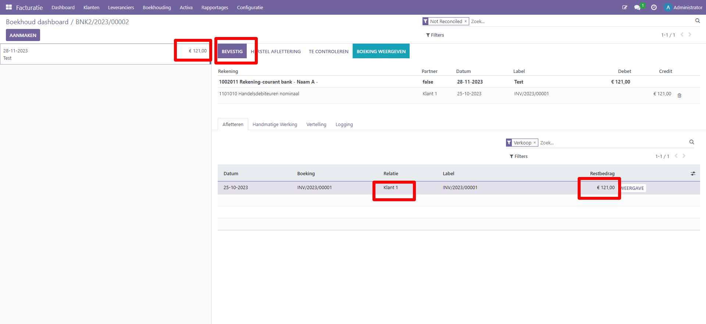
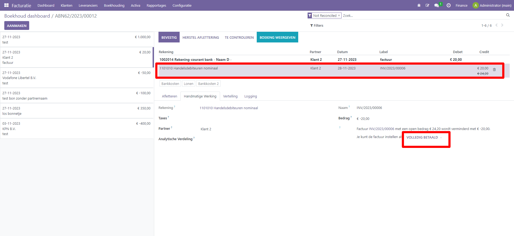
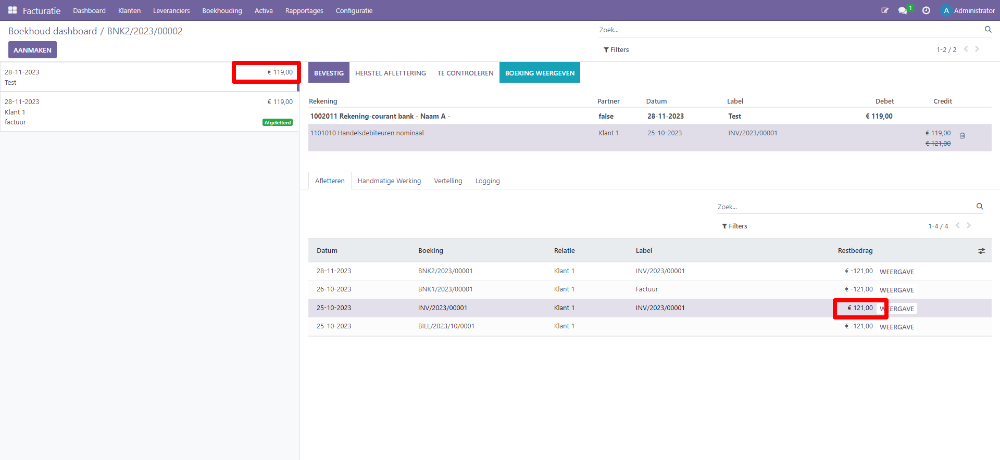

Afletteren (reconciliatie) in Curq
===========
| Bank reconciliatie is het proces van het matchen van je
  banktransacties met je bedrijfsadministratie, zoals klantenfacturen,
  leveranciersfacturen en betalingen.
| Dit is niet alleen verplicht voor de meeste bedrijven, maar het biedt
  ook verschillende voordelen, zoals minder risico op fouten in
  financiële rapporten, detectie van frauduleuze activiteiten en
  verbeterd cashflowbeheer.
| Dankzij de reconciliatiemodellen kan Curq de overeenkomende boekingen
  automatisch vinden en afletteren.

Algemeen
----
Via het boekhoud dashboard zie je via de banktegel(s) of er af te
letteren regels zijn. Wij adviseren om gebruik te maken van de MyPonto
koppeling waarmee je transactieregels automatisch vanuit je
bankomgeving naar Curq synchroniseert.

Naast automatisch synchroniseren is het ook mogelijk om een Camt bestand
te downloaden in je bankapplicatie (Curq ondersteunt de formaten
camt.053.001.02, Camt.054.001.02). Deze download kun je vervolgens
uploaden in het overeenkomstige bankdagboek in Curq.

Alle transactieregels zijn ook te benaderen via de drie
puntjes rechts in de tegel:

.. image:: Afletteren/media/image2.png
       :width: 6.3in
       :height: 2.93264in

| Klik bij het desbetreffende dagboek in het dashboard op de knop 'Afletter regels' om alle transacties weer te geven die Curq
  vooraf heeft geselecteerd voor afstemming. Je kunt het standaard filter uit de zoekbalk verwijderen om ook eerder afgeletterde
  transacties weer te geven.
|
.. image:: Afletteren/media/image3.png
       :width: 6.3in
       :height: 2.93264in

.. Note::
   Bij het afletteren kan het zijn dat je een regel geheel of gedeeltelijk hebt afgeletterd en er op dat moment   
   achter komt dat je een fout hebt gemaakt. 
   Zorg er op dat moment altijd voor dat je eerst de verkeerd afgeletterde regels verwijderd. Je doet dit door die 
   regels in de prullenbak te gooien.

.. image:: Afletteren/media/regels_verwijderen.png
       :width: 6.3in
       :height: 2.93264in

.. Note::
   In onderstaand schermvoorbeeld zie je dat de geselecteerde regel aangeklikt is en van kleur is veranderd. Dit 
   betekent in Curq dat de focus op de regel staat en je bijvoorbeeld de
   BTW code kan toevoegen. Bij enkele scenario's is het belangrijk dat je duidelijk ziet dat de regel staat 
   aangeklikt. Wij geven dit per afletter scenario aan.

.. image:: Afletteren/media/focus.png
       :width: 6.3in
       :height: 2.93264in

Afletter scenario's
===========
Afletteren van een volledig betaalde factuur
----
Wanneer bij de gekozen transactieregel de klant of leverancier staat ingevuld, het bedrag overeenkomt met een openstaande post en het overeenkomstige factuurnummer vermeld staat in de label omschrijving, dan zal Curq de regel automatisch afletteren. Je kunt er voor kiezen ook deze laatste stap te automatiseren. Curq zal dan de gevonden regel direct bevestigen. Stel dit in bij de afletterregels.

Afletteren niet volledig betaalde factuur
----
Het kan zijn dat de betaalregel niet volledig overeenkomt met een af te letteren factuur (klant betaalt voor een aantal facturen tegelijk of betaalt een deelbedrag). 

Scenario 1: klant betaalt minder dan het factuurbedrag. 
Curq zal het betaalde bedrag automatisch afletteren tegen de openstaande post.

Vervolgens kun je het restbedrag ook direct afboeken, je doet dit door de regel aan te klikken zoals je hieronder ziet in het
schermvoorbeeld. Hiermee wordt de optie zichtbaar om de factuur op volledig betaald te zetten. Je kunt er vervolgens voor kiezen om het
restbedrag af te schrijven op een andere grootboekrekening. Je kan hier of een aflettermodel voor gebruiken of de rekening handmatig op te zoeken.

.. image:: Afletteren/media/rest_afboeken_2.png
   :width: 6.69306in
   :height: 3.08125in

Scenario 2: klant bijna gehele factuur, een bedrag van een paar cent blijft open staan.
Indien dit vaker voor komt dan kuj je ervoor kiezen het standaard aflettermodel 'perfecte matching'iets aan te vullen. Wanneer je de tolerantie iets aanpast en vervolgens ook een grootboekrekening toevoegt aan het model, dan zal Curq automatisch het restverschil wegboeken.

.. image:: Afletteren/media/Betalingsverschillen_afboeken.png
       :width: 6.3in
       :height: 2.93264in

Scenario 3: klant betaalt meerdere facturen in 1 bedrag.
in dit geval kun je de klant opzoeken en meerdere facturen achter elkaar aanklikken. Het kan zijn dat de klant ook een factuur betaalt die op een andere naam staat. Je kan een andere klant opzoeken de openstaande post(en) toevoegen. In onderstaand schermvoorbeeld is eerst de factuur 1 voor klant 1 toegevoegd. Vervolgens is bij 'filter' gezocht op klant 2 en is een deel van factuur 2 aan de transactieregel toegevoegd.

.. image:: Afletteren/media/meerdere_facturen.png
       :width: 6.3in
       :height: 2.93264in

Afletteren betaalregel zonder factuur
----
Het kan voorkomen dat er een afschriftregel is met een betaling zonder
onderliggende factuur. In dit scenario kun je op het tabblad handmatige werking zelf een grootboekrekening opzoeken.

.. image:: Afletteren/media/handmatig_afletteren.png
   :width: 6.69306in
   :height: 3.08125in

Afletteren betaalregel zonder factuur met BTW 
----
Het kan voorkomen dat er een afschriftregel is met een betaling zonder
onderliggende factuur, maar wel met BTW. Na kiezen van de juiste kostenrekening is het vervolgens mogelijk om in het BTW de juiste BTW
code te selecteren. Curq rekent dan automatisch de juiste bedragen uit. De extra regel die wordt aangemaakt voor verwerken van de BTW is terug
te vinden op de BTW aangifte in de juiste rubriek.

.. image:: Afletteren/media/btw_handmatige_betaling.png
   :width: 6.69306in
   :height: 3.08125in

Afletteren verstuurde SEPA betaalbatch
----
Wanneer je gebruikt maakt van de SEPA functionaliteit (waarmee je direct een set van inkoopfacturen aan de bank kan aanbieden), dan kun je de afschriftregel van deze betaling kiezen om alle inkoopfacturen van de batch in 1 keer af te handelen.
Na selecteren van de transactieregel zoek je de juiste betaalbatch op 

.. image:: Afletteren/media/SEPA_bankstatementline.png
   :width: 6.69306in
   :height: 3.08125in

Terugdraaien aflettering
----
Heb je een fout gemaakt, dan is het mogelijk om na bevestigen een
afgeletterde regel terug te draaien. Klik hiervoor op de knop 'afletteren ongedaan maken'.

.. image:: Afletteren/media/image8.png
   :width: 6.69306in
   :height: 3.08125in

Overige functionaliteit
===========

Chatter
----
De chatter fuctionaliteit is beschikbaar bij het afletteren van een regel. Hierdoor kun je direct een collega of een klant een bericht sturen bij een vraag over de betaalregel. Ook kun je in de chatter documenten koppelen.

.. image:: Afletteren/media/Chatter_afletteren.png
   :width: 6.69306in
   :height: 3.08125in

Extra controle
----
Wanneer je een extra controle wil uitvoeren op de af te letteren regel,
dan kun je dat bij de regel aangeven met de knop ‘te controleren'. De na te kijken regel kan
vervolgens op diverse plekken in de boekhouding nagekeken worden (zoals hieronder bij de boekingsregel).

.. image:: Afletteren/media/image7.png
   :width: 6.69306in
   :height: 3.08125in

Na controle van de regel klik je op ‘stel in als gecontroleerd’ om aan te geven dat de regel gecontroleerd is.

.. image:: Afletteren/media/image10.png
   :width: 6.69306in
   :height: 3.08125in

.. image:: Afletteren/media/image9.png
   :width: 6.69306in
   :height: 3.08125in

