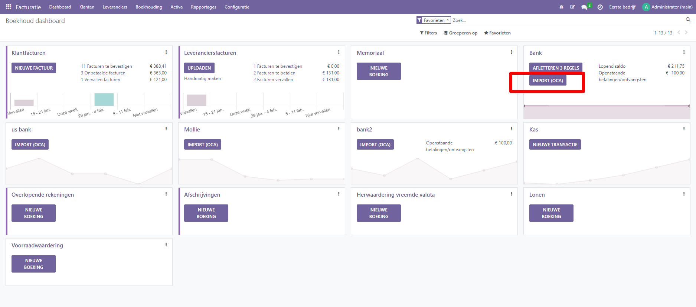

Importeren bank transacties
----

Door transacties uit je bankafschriften te importeren, kun je deze afletteren met de transacties in je boekhouding.
Bank synchronisatie automatiseert dit proces. Als je dit echter niet wilt gebruiken of als je bank nog niet wordt ondersteund, zijn er andere opties:

* Importeren van door je bank aangeleverde banktransacties
* Banktransacties handmatig registreren.

.. Note::
   Het groeperen van transacties per afschrift is optioneel.

Transacties importeren
----

Curq ondersteunt meerdere bestandsformaten om transacties te importeren:

* SEPA aanbevolen Cash Management formaat (CAMT.053)
* SEPA aanbevolen Cash Management formaat (CAMT.054)

Om een bestand te importeren, ga je naar het Boekhouddashboard en klik in het Bankjournaal op de knop 'Import (OCA)'.

Banktransacties handmatig registreren
----
Je kunt je banktransacties ook handmatig registreren. Ga hiervoor naar het Boekhouddashboard, klik op de drie puntjes in de tegel van Bankjournaal en vervolgens op Nieuw bij Transacties. Zorg ervoor dat je de velden Partner en Label invult om het reconciliatieproces te vergemakkelijken.

Afschriften
----
Een bankafschrift is een document van een bank of financiële instelling met een overzicht van de transacties die hebben plaatsgevonden op een bepaalde bankrekening gedurende een bepaalde periode.

In Odoo Accounting is het optioneel om transacties te groeperen per bijbehorend afschrift.

 Belangrijk

Als je de eindsaldi van je bankafschriften wilt vergelijken met de eindsaldi van je financiële administratie, vergeet dan niet om een openingstransactie te maken om het saldo van de bankrekening vast te leggen vanaf de datum dat je begint met het synchroniseren of importeren van transacties. Hiermee zorg je ervoor dat je in de tegel altijd het juiste saldo ziet staan.

Om een lijst met afschriften te openen, ga je naar het Boekhouddashboard, klik je op de verticale ellips (⋮) naast het bank- of kasjournaal dat je wilt controleren en vervolgens op Afschriften.

Afschriften maken vanuit de afletter weergave
----

Open de bankafletter weergave door op de naam van het bankjournaal te klikken en zoek de transactie die overeenkomt met de laatste transactie van je bankafschrift. Klik op de knop 'Aanmaken' om een nieuwe transactieregel handmatig aan te maken.

.. image:: My-Ponto-Bank-Feed-Media/banktransacties_handmatig_aanmaken.png
       :width: 6.3in
       :height: 2.93264in

