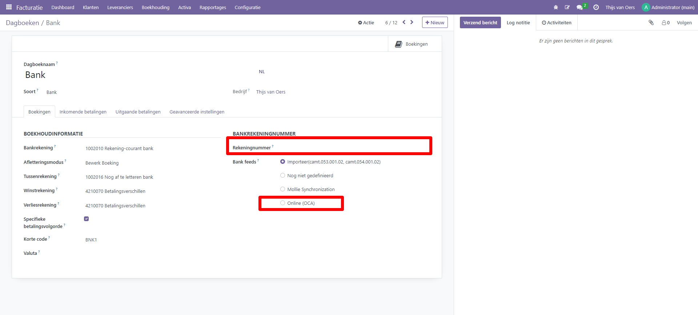
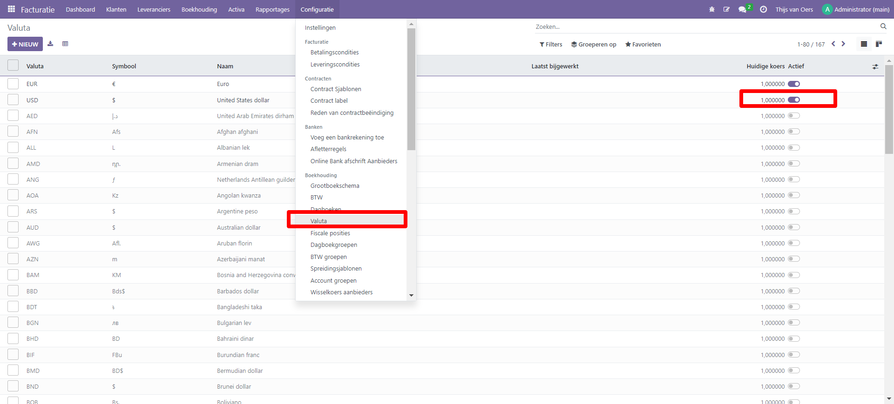

Bankrekening en My Ponto Bank Feed
==================

In Curq kunnen bankafschriften worden gesynchroniseerd met je bank via de MyPonto verbinding. Maak eerst je bank aan in Curq en koppel dit dagboek vervolgens aan my Ponto. 

**Koppelen banknummer**: Standaard hebben we 1 bank geconfigureerd in Curq. Voeg je bankrekening toe, zoals getoond in onderstaand voorbeeld. Activeer ook de optie (OCA)Online, hiermee activeer je de optie voor bank synchronisatie.

Wanneer je extra banknummers wil toevoegen, doe dit dan via menufunctie 'Facturatie'-> 'Configuratie'-> 'Voeg een bankrekening toe'. Je hoeft alleen je banknummer in te geven, Curq zal bij opslaan een nieuw dagboek aanmaken en alle gegevens direct goed invullen. Er is wel een controle of het IBAN nummer dat wordt ingevoerd, correct is, maar dit is alleen een controle.

.. image:: My-Ponto-Bank-Feed-Media/Bank_2.png

Wanneer je een bankrekening hebt met een andere valuta dan EUR (de basisvaluta in Cirq), dan kun je een bankjournaal koppelen aan de andere valuta. Activeer eerst de valuta via onderstaand menu.

Stappen om de verbinding te maken op MyPonto.
-------
1. Stel je My Ponto verbinding in, zie https://myponto.com/en/.

2. Ga na het registreren naar 'Integraties'.

3. Kies 'Maak een aangepaste ingratie'.

4. Vul je bankrekeningnummer in en kies 'Toevoegen'.

5. Als resultaat zie je de klant- en geheime id. Deze
   informatie later nodig in Curq.

.. image:: My-Ponto-Bank-Feed-Media/image1.png
       :width: 6.3in
       :height: 2.93264in

.. image:: My-Ponto-Bank-Feed-Media/image2.png
       :width: 6.3in
       :height: 2.93264in

.. image:: My-Ponto-Bank-Feed-Media/image3.png
       :width: 6.3in
       :height: 2.93264in

Configuratie in Curq
---------------
1. Maak eerst je bankrekening aan in Curq

2. Het bijbehorende Bankjournaal wordt automatisch aangemaakt

3. Ga naar het menu 'Online Bank afschrift aanbieders'

4. Maak een nieuw record aan, kies het juiste Bankjournaal

5. Kies MyPonto

6. Kies tussen een dagelijks, wekelijks of maandelijks overzicht

7. Vul in het veld Login de Client ID string in van de Ponto
   integratie

8. Vul in het veld Secret id het geheim van MyPonto in

9. Je bent nu klaar om gegevens van je bank op te halen

.. image:: My-Ponto-Bank-Feed-Media/image4.png
       :width: 6.3in
       :height: 2.90069in

.. image:: My-Ponto-Bank-Feed-Media/image5.png
       :width: 6.3in
       :height: 2.90069in

.. image:: My-Ponto-Bank-Feed-Media/image6.png
       :width: 6.3in
       :height: 2.90069in

.. image:: My-Ponto-Bank-Feed-Media/image7.png
       :width: 6.3in
       :height: 2.90069in

.. image:: My-Ponto-Bank-Feed-Media/image8.png
       :width: 6.3in
       :height: 2.90069in

    .. image:: My-Ponto-Bank-Feed-Media/image9.png
       :width: 5.50833in
       :height: 0.78333in
