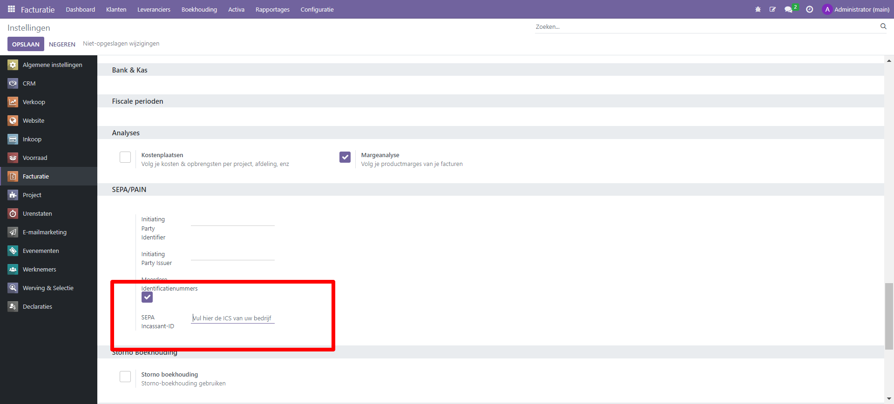

Batch payments: SEPA Direct Debit (SDD)
----

SEPA, de Single Euro Payments Area, is een betalingsintegratie-initiatief van de Europese Unie voor vereenvoudiging van bankoverschrijvingen in euro's. 

Met SEPA Direct Debit (SDD) kunnen je klanten een mandaat ondertekenen dat jou machtigt om toekomstige betalingen van hun bankrekeningen te innen. Dit is vooral handig voor terugkerende betalingen op basis van een abonnement.

Je kunt klantmandaten vastleggen in Curq en .xml-bestanden genereren met lopende betalingen die zijn gedaan met een SDD-mandaat.

Mandaat instellingen
------

De functie SEPA-incasso kan worden geactiveerd via het menu Instellingen van de boekhoudmodule, zoals hieronder weergegeven. Voer na het activeren van deze functie de Creditor Identifier van je bedrijf in de daarvoor bestemde ruimte in.

Aanmaken mandaat van een klant
-----

Je kunt nu een nieuw incassomachtiging configureren vanuit het menu Klanten. Zodra een factuur is gemaakt in Odoo voor een klant met een mandaat actief op de factuurdatum, zal de validatie ervan de automatische betaling activeren, en je hoeft dan alleen nog maar een SEPA Direct Debit (SDD) XML-bestand te genereren met deze bewerking en het naar je bank te sturen.

.. image:: My-Ponto-Bank-Feed-Media/direct_debit_aanmaken_machtiging.png
       :width: 6.3in
       :height: 2.93264in

Na opslaan ziet de definitieve machtiging er alsvolgt uit:

.. image:: My-Ponto-Bank-Feed-Media/direct_debit_bevestigde_machtiging.png
       :width: 6.3in
       :height: 2.93264in

Aanmaken verkoopfactuur
-----
Zorg dat bij de klant als standaard incassowijze 'direct debit staat. Wanneer je een verkoopfactuur voor de klant met machtiging ingeeft, dan neemt Curq de gegevens automatisch over naar de factuur. Je ziet dan ook de machtiging staan bij de verkoopfactuur.

.. image:: My-Ponto-Bank-Feed-Media/direct_debit_aanmaken_verkoopfactuur.png
       :width: 6.3in
       :height: 2.93264in

Aanmaken incasso batch
----
Vanuit menu Boekhouding-> klanten-> betaalopdracht maak je de incassobatch aan. Je kunt binnen dit menu filteren op vervaldatum,

.. image:: My-Ponto-Bank-Feed-Media/direct_debit_aanmaken_incassobatch.png
       :width: 6.3in
       :height: 2.93264in
Afletteren van incassobatch via bank
-----
