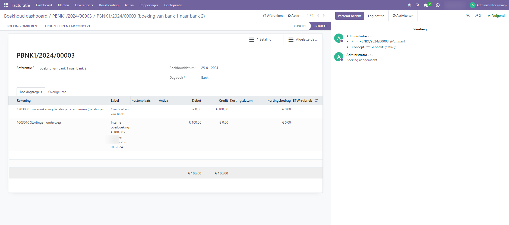

Interne overboekingen
----
Interne overboekingen kunnen worden afgehandeld in Odoo. Er zijn minstens twee bankrekeningen nodig om interne overschrijvingen te doen.

Configuratie
----
Een interne overboekingsrekening wordt automatisch aangemaakt in je database op basis van het in Curq gebruikte RGS. Om de standaardrekening voor interne overschrijvingen te wijzigen, ga naar Boekhouding ‣ Configuratie ‣ Instellingen en scroll naar beneden naar de sectie Standaardrekeningen. Wij adviseren deze aanpassing alleen te doen in oveleg met je boekhouder.

Een interne overschrijving van de ene bank naar de andere registreren
----

Als je geld wilt overmaken van de ene bank naar de andere, gaat dan naar het Boekhouddashboard, klikt u op de keuzeknop (⋮) bij de bank van waaruit u de overschrijving wilt doen en klikt u vervolgens op Betalingen. Selecteer of creëer een betaling, vink Interne overboeking aan en selecteer een Bestemmingsjournaal voordat je de interne overboeking bevestigt.

.. image:: My-Ponto-Bank-Feed-Media/betalingen_interne_transfer_menu.png
       :width: 6.3in
       :height: 2.93264in

Het geld wordt nu geboekt op de overboekingsrekening en er wordt automatisch nog een betaling aangemaakt in het bestemmingsjournaal. Zodra dit is gebeurd, kun je zoals gewoonlijk je bankafschriftregels boeken en afletteren. Bij beide banke zie je dat er een openstaand tussenrekening saldo is. Wanneer je het geld daadwerkelijk overmaakt dan kun je de betaling en de ontvangstregel afletteren met de tussenrekeningen.

.. image:: My-Ponto-Bank-Feed-Media/betalingen_interne_transfer_overzicht.png
       :width: 6.3in
       :height: 2.93264in

De boeking van de 'uitgaande' bankoverschrijving ziet er als volgt uit:

