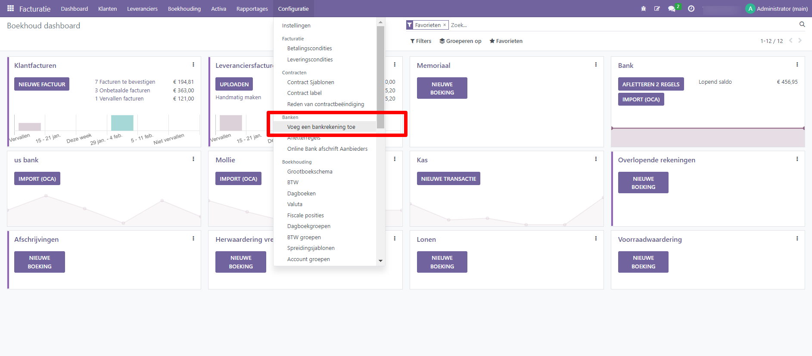

Online payments
----
Om het voor je klanten nog gemakkelijker te maken om de facturen die je verstuurt te betalen, kun je de functie Factuur online betalen activeren, die een knop 'Nu betalen' toevoegt aan hun klantenportaal. Hiermee kunnen je klanten hun facturen online bekijken en direct betalen met hun favoriete betaalmethode, waardoor het betalingsproces veel eenvoudiger wordt.

Om Facturen Online Betalen te activeren, ga je naar Boekhouding ‣ Configuratie ‣ Instellingen ‣ Klantbetalingen, schakel Factuur Online Betalen in en klik op Opslaan.

