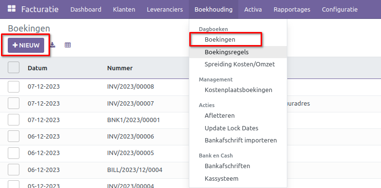
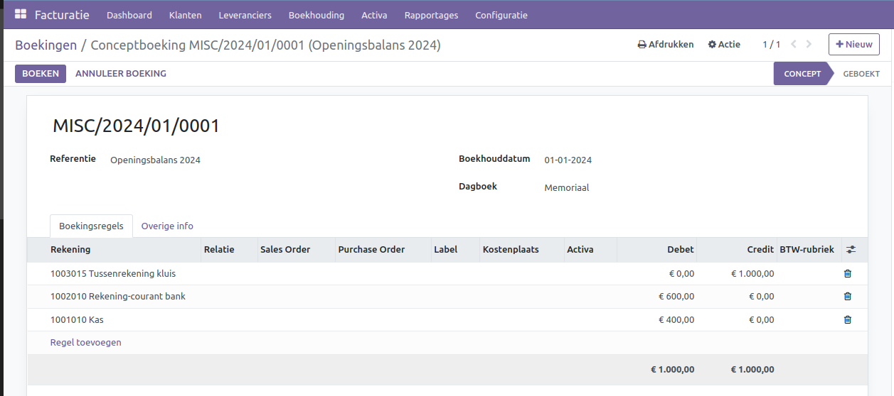

Dagboeken
=========

Dagboeken vormen essentiële onderdelen van een gedegen boekhoudsysteem, waarbij elk dagboek een specifieke subadministratie vertegenwoordigt. Het bankboek behandelt zorgvuldig alle banktransacties, het verkoopboek geeft overzichtelijke informatie over verkoopfacturen, het inkoopboek registreert gedetailleerd inkoopfacturen, en het memoriaalboek vangt alle overige transacties op die niet elders passen.

Bank
----

Het bankboek fungeert als een gedetailleerd financieel dagboek waarin alle banktransacties minutieus worden vastgelegd, waaronder stortingen, opnames en afschrijvingen. Het zorgvuldig bijhouden van deze transacties via het bankboek biedt niet alleen de mogelijkheid om financiële bewegingen nauwkeurig te monitoren, maar speelt tevens een cruciale rol bij het vaststellen van budgetten en het analyseren van uitgavenpatronen. Hierdoor wordt niet alleen financiële transparantie bereikt, maar ook een solide basis gelegd voor strategische besluitvorming.

Verkoop
-------

In aanvulling op het inkoopboek bestaat het verkoopboek, waarin gedetailleerde informatie wordt bijgehouden over alle verkopen. Het omvat niet alleen de datum van de verkoop, maar ook de naam van de klant, de aard van de verkochte goederen of diensten, en het ontvangen bedrag. Dit specifieke dagboek is met name van belang voor bedrijven die frequent goederen of diensten verkopen. Het verkoopboek vormt niet alleen een beheersinstrument voor de cashflow, maar levert ook waardevolle gegevens voor het opstellen van toekomstige verkoopprognoses en het formuleren van doeltreffende bedrijfsstrategieën.

Inkoop
------

Het inkoopboek richt zich op alle aankopen van goederen en diensten door het bedrijf. Het zorgvuldig noteren van gegevens zoals de aankoopdatum, leveranciersnaam, aard van de gekochte goederen en diensten, en het betaalde bedrag biedt waardevol inzicht in de uitgaven van het bedrijf. Het inkoopboek komt vooral van pas voor bedrijven die nauwgezet hun uitgaven willen volgen en financiële gegevens op georganiseerde wijze willen beheren. Dit resulteert niet alleen in een beter begrip van de cashflow, maar versterkt ook de controle over de budgetten.

Diversen / Memoriaal
--------------------

Een bijzonder dagboek is het dagboek memoriaal, dat fungeert als een veelzijdig administratief instrument. Dit dagboek komt van pas voor boekingen die geen specifieke thuisbasis hebben in andere dagboeken. Voorbeelden hiervan zijn correcties, het verrekenen van openstaande en oninbare facturen, salarisboekingen en standaardboekingen.

Klik vervolgens op de knop [NIEUW]. Het volgende scherm verschijnt.

- **Referentie:** Geef hier een duidelijke omschrijving mee, zodat je weet waar deze boeking voor bedoeld is.
