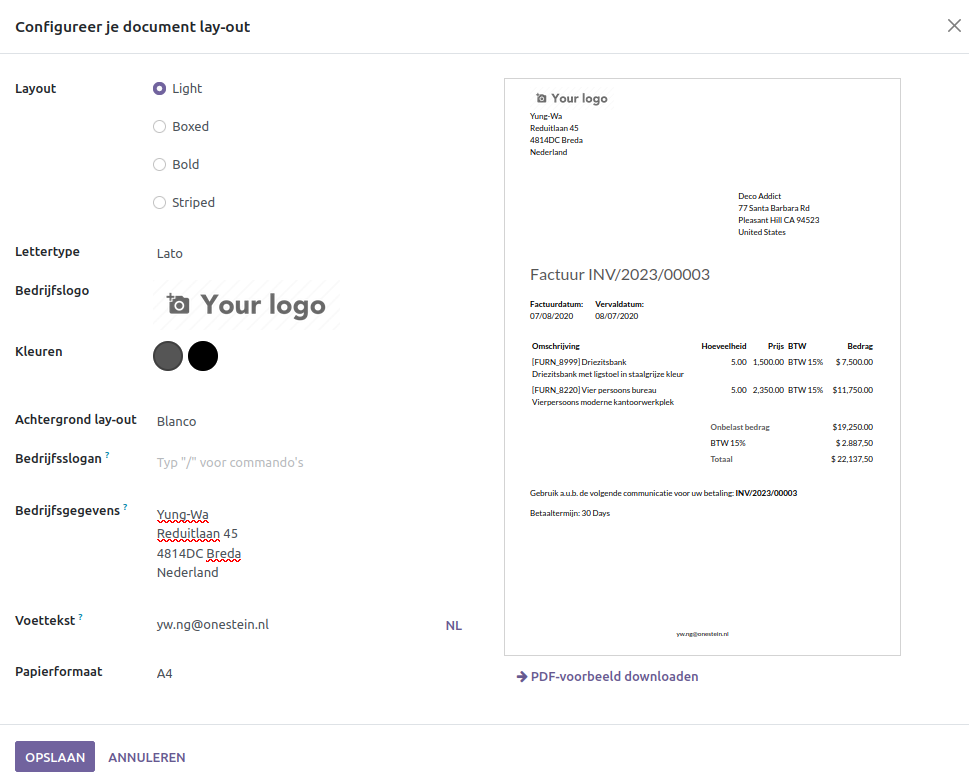

Verkoopfacturen
===============

Facturen maken is een essentieel onderdeel voor een goede boekhouding. Een mooie en professionele factuur is namelijk een soort van visitekaartje. Door klanten te laten zien dat je zorgvuldig en professioneel bent, verlaagt dit de kans op betalingsproblemen. 
Met Curq kan je eenvoudig een factuur opstellen en verzenden naar je klanten. Met Curq kan je eenvoudig jouw huisstijl toevoegen via kleuren en jouw logo. Vervolgens verzend je deze facturen eenvoudig met een paar klikken.

Aanpassen huisstijl
-------------------
Mocht je jouw huisstijl niet hebben opgegeven tijdens de aanmaak van jouw omgeving, dan kan je dit alsnog doen via Instellingen > Algemene instellingen, bij kopje Bedrijven. 

.. image:: Accounting-Media/customer_invoices001.png

Kies voor Configureer document lay-out. In het volgend scherm heb je de mogelijkheid om jouw huisstijl toe te voegen.

- Layout: Hier zijn vier opties beschikbaar om jouw facturen of andere documenten een design te configureren.
- Lettertype: Kies hier een van de beschikbare lettertypes
- Bedrijfslogo: Upload hier je Bedrijfslogo.
- Kleuren: Curq stelt de kleuren voor op basis van je bedrijfslogo.
- Achtergrond lay-out: Kies een optie of upload je eigen achtergrond.
- Bedrijfsslogan: Vul hier jouw slogan in. Dit is optioneel.
- Bedrijfsgegevens: Vul hier jouw bedrijfsgegevens in.
- Voettekst: Vul hier de voettekst in. Denk aan je telefoonnummer, website, mailadres, KVK, BTW-Nummer of je bankrekeningnummer.
- Papierformaat: Kies het juiste formaat.

Aan de rechterkant zie je meteen hoe jouw documenten in Curq er uit gaan zien. Onder dit voorbeeld kan je ook nog een PDF downloaden om te zien hoe jouw klanten jouw factuur ontvangen. Nu kunnen we verder met het opstellen van jouw verkoopfactuur.

Aanmaken verkoopfactuur
-----------------------

Heb je een uitgebreidere versie afgenomen van Curq, dan kunnen verkoopfacturen ook worden aangemaakt vanuit bijv een verkooporder of een websiteorder. Op de volgende manier maak je handmatig een verkoopfactuur aan. Ga naar Facturatie > Klanten > Facturen. In dit scherm zie je al jouw verkoopfacturen in een mooi overzicht. Je kan zien meteen zien of een factuur open staat of al reeds betaald is.

Voor het aanmaken van een factuur klik je linksboven op [Nieuw]. Mocht de facturen vanuit een andere software pakket zijn verstuurd, maar je wilt ze wel in Curq bijhouden, dan kan je ook gebruik maken van de knop [UPLOADEN].

