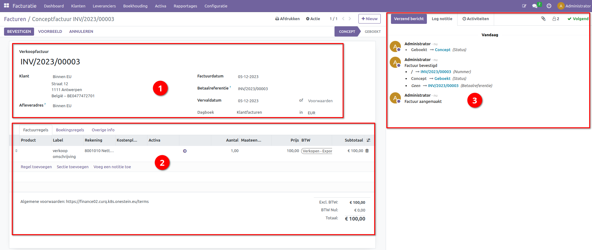
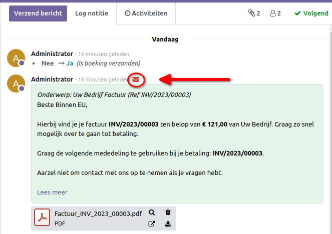

Verkoopfacturen
===============

Facturen maken is een essentieel onderdeel voor een goede boekhouding. Een mooie en professionele factuur is namelijk een soort van visitekaartje. Door klanten te laten zien dat je zorgvuldig en professioneel bent, verlaagt dit de kans op betalingsproblemen.
Met Curq kan je eenvoudig een factuur opstellen en verzenden naar je klanten. Met Curq kan je eenvoudig jouw huisstijl toevoegen via kleuren en jouw logo. Vervolgens verzend je deze facturen eenvoudig met een paar klikken.

Aanpassen huisstijl
-------------------
Mocht je jouw huisstijl niet hebben opgegeven tijdens de aanmaak van jouw omgeving, dan kan je dit alsnog doen via Instellingen > Algemene instellingen, bij kopje Bedrijven.

.. image:: Customer-Invoices/customer_invoices001.png

Kies voor Configureer document lay-out. In het volgend scherm heb je de mogelijkheid om jouw huisstijl toe te voegen.

.. image:: Customer-Invoices/customer_invoices002.png

- Lay-out: Hier zijn vier opties beschikbaar om jouw facturen of andere documenten een design te configureren.
- Lettertype: Kies hier een van de beschikbare lettertypes
- Bedrijfslogo: Upload hier je Bedrijfslogo.
- Kleuren: Curq stelt de kleuren voor op basis van je bedrijfslogo.
- Achtergrond lay-out: Kies een optie of upload je eigen achtergrond.
- Bedrijfsslogan: Vul hier jouw slogan in. Dit is optioneel.
- Bedrijfsgegevens: Vul hier jouw bedrijfsgegevens in.
- Voettekst: Vul hier de voettekst in. Denk aan je telefoonnummer, website, mailadres, KvK, BTW-Nummer of je bankrekeningnummer.
- Papierformaat: Kies het juiste formaat.

Aan de rechterkant zie je meteen hoe jouw documenten in Curq eruit gaan zien. Onder dit voorbeeld kan je ook nog een PDF downloaden om te zien hoe jouw klanten jouw factuur ontvangen. Nu kunnen we verder met het opstellen van jouw verkoopfactuur.

Aanmaken verkoopfactuur
-----------------------

Heb je een uitgebreidere versie afgenomen van Curq, dan kunnen verkoopfacturen ook worden aangemaakt vanuit bijv. een verkooporder of een website-order. Op de volgende manier maak je handmatig een verkoopfactuur aan. Ga naar Facturatie > Klanten > Facturen. In dit scherm zie je al jouw verkoopfacturen in een mooi overzicht. Je kan meteen zien of een factuur open staat of al reeds betaald is.

Voor het aanmaken van een factuur klik je linksboven op [Nieuw]. Mocht de facturen vanuit een andere software pakket zijn verstuurd, maar je wilt ze wel in Curq bijhouden, dan kan je ook gebruik maken van de knop [UPLOADEN].

Het volgende scherm verschijnt als je een nieuwe factuur aanmaakt.

Het scherm is opgebouwd uit 3 gedeeltes.

1. Hoofdgegevens van de factuur.

- Hier vul je de gegevens in van de klant en eventueel afleveradres. Als deze gelijk zijn, dan worden beide gegevens ingevuld.
- Factuurdatum: Deze laat je leeg als het de datum van vandaag moet zijn.
- Betaalreferentie: Deze wordt ook automatisch opgevuld als de factuur wordt bevestigd.
- Vervaldatum: Deze wordt berekend aan de hand van betalingsconditie. Deze kan je opgeven waar nu Voorwaarden staat. Door gebruik te maken van een betalingsconditie hoef je niet handmatig uit te rekenen wanneer een factuur vervalt. De vervaldatum is belangrijk, omdat op die dag de factuur uiterlijk betaald moet worden. Spreek daarom met je de klanten de juiste betalingsvoorwaarden af. Uit een Europese richtlijn geldt een betalingstermijn van 30 dagen als er geen termijn overeen is gekomen.
- Dagboek: Deze laat je staan op Klantfacturen. Hiervan kan je alleen afwijken als je meerdere dagboeken hebt voor verkoopfacturen. Een dagboek is een soort van subadministratie binnen de boekhouding. Je groepeert hiermee de facturen/boekingen/transacties in de soort waar ze bij horen. Via het bankdagboek verwerk je alle banktransacties, in het verkoopboek staat een overzicht van al je verkoopfacturen en in het inkoopboek een overzicht van je inkoopfacturen.

2. Factuurregels of overige info.

- De factuurregels bevatten de details van de factuur. Hier staat wat er is verkocht tegen welke bedrag en met welke BTW.
- Product: Vul hier een product in als je gebruik maakt van producten binnen Curq. Een product kan ook een dienst zijn, dan heeft het product het type dienst. Het is niet verplicht om gebruik te maken van producten.
- Label: Deze verschijnt op de factuur, dus vul deze correct in. Als je producten gebruikt wordt deze automatisch overgenomen, maar je kan die altijd achteraf aanpassen.
- Rekening: Het is verplicht om de juiste grootboekrekening op te geven. De omzet wordt geboekt op deze grootboekrekening. Curq kan deze automatisch invullen op basis van de producten.
- Aantal: Het aantal verkocht.
- Prijs: De prijs per eenheid.
- BTW: Curq stelt automatisch de meest logische BTW code voor. Wijk hier alleen af als er een andere BTW van toepassing is.
- Subtotaal: Aantal x Prijs.
- Algemene voorwaarden: Links onder de factuurregels zie je de algemene voorwaarden staan. Deze tekst verschijnt op je facturen. TIP: Heb je deze op je website staan, dan kan je daar naar verwijzen.
- Totalen: Rechts onder de factuurregels zie je de totalen van de factuur inclusief welke BTW wordt toegepast.

Boekingsregels

- Hier wordt de journaalpost getoond van de factuur. Dit is voor de boekhouder van belangrijke informatie.

Overige Info

.. image:: Customer-Invoices/customer_invoices004.png

- Referentie klant: Hier kan je extra informatie vastleggen die voor de klant van belang kan zijn. Denk aan bijv. hun inkoopnummer of misschien een afdelingsnaam binnen het bedrijf. Zodra je hier iets invult wordt dit ook afgedrukt op de factuur.
- Verkoper: De verkoper welke gebruikt kan worden in rapportages.
- Verkoopteam: Het verkoopteam welke gebruikt kan worden in rapportages.
- Recipient Bank: Alleen van toepassing als je je klanten incasseert.
- Leveringscondities: Als INCOTERMS van belang is, dan kan je die hier invullen. In Curq zijn de meest gebruikte aanwezig.
- Fiscale Positie: De BTW regime die van toepassing is op de factuur.
- Automatische boeken: Alleen op een concept factuur kan dit worden ingesteld. Je kan een factuur al vooruit plannen om die later te laten boeken. Of je kan terugkerende facturen automatisch laten boeken tot een bepaalde tijd door Curq. Dit is handig als je elke maand dezelfde factuur wilt laten aanmaken.
- Te controleren: De factuur krijgt de status te controleren. Je kan bijv. jouw boekhouder hiermee attenderen dat deze factuur nog een keer extra moeten worden gecontroleerd.

3. Logging van de factuur.

- Alle belangrijke wijzigingen met betrekking tot de factuur worden hier bijgehouden. Je ziet hier ook de mailtjes die verzonden zijn. Als je ook nog gebruik maakt van de volledige integratie met mailfunctionaliteit, dan verschijnt hier ook het antwoord van de klant als hij reageert op de mail.
- Verzend bericht: Hiermee verzend je een mail naar de klant.
- Log notitie: Dit is een interne notitie die alleen intern zichtbaar is. Voor de klant is deze niet zichtbaar.
- Activiteiten: Je kan een bepaalde activiteit inplannen voor iemand. Dit kan een todo zijn, maar ook een afspraak.

.. image:: Customer-Invoices/customer_invoices005.png

- Volgers: Contacten, medewerkers kunnen volgers zijn van het documenten. Afhankelijk van hun aanmelding worden deze volgers op de hoogte gehouden van wijzigingen op dit document.

Zodra de factuur gereed is, dan kan de factuur worden bevestigd via de knop [BEVESTIGEN]. De factuur wordt op dit moment dan financieel geboekt.

.. image:: Customer-Invoices/customer_invoices006.png

De de factuur is nu open in de boekhouding en de status verandert naar geboekt. Er verschijnen nu andere knoppen. Wil je nog eerst de factuur controleren dan kan je via de knop midden in het scherm eerst een afdruk downloaden. Bij het afdrukken kies dan voor "Facturen". Als je de factuur wilt verbeteren, dan kan je de factuur terugzetten via de knop [TERUGZETTEN NAAR CONCEPT].

.. image:: Customer-Invoices/customer_invoices007.png

Met de knop [VERZEND & AFDRUKKEN] kan je meteen de factuur via de mail versturen. Als er een e-mailadres ontbreken, dan zal Curq dit vragen. Het volgende verzendscherm verschijnt.

.. image:: Customer-Invoices/customer_invoices008.png

In dit scherm heb je de optie om een factuur af te drukken en te mailen. Zorg dat de juiste optie aanstaat. Je kan hier ook de mail aanpassen en een persoonlijk tintje meegeven. Curq zal de factuur in de bijlage als PDF bestand meesturen naar de klant.

Eenmaal goed, dan kan je jouw factuur versturen via [VERZEND & AFDRUKKEN].

Heb je een persoonlijke mail aangemaakt en je wilt die de volgende keer weer gebruiken, dan kan je die opslaan via de knop [OPSLAAN ALS NIEUW SJABLOON]

Zodra de factuur is verzonden binnen Curq, dan is dit meteen zichtbaar in de logging deel. Je ziet jouw mail terug en aan de hand van de enveloppe kan je de status van jouw mail terugvinden. Je kan eventueel corrigerende acties ondernemen door te klikken op de enveloppe.

