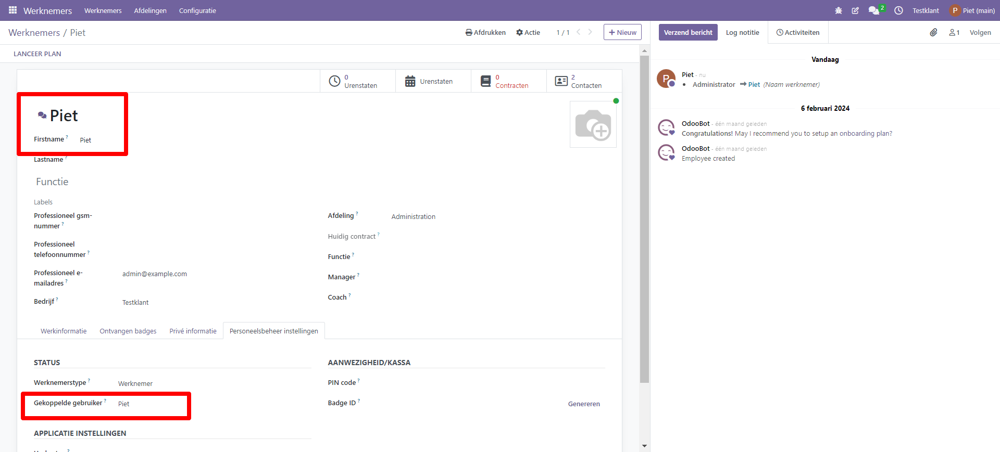
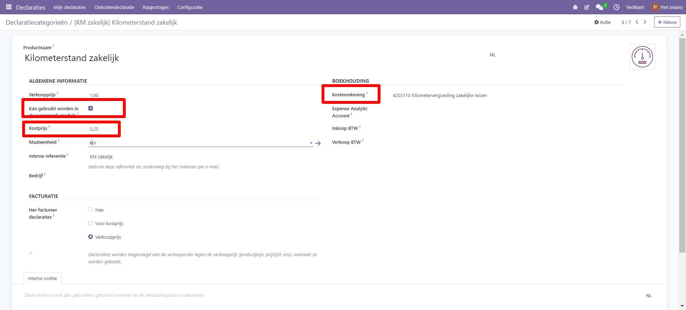
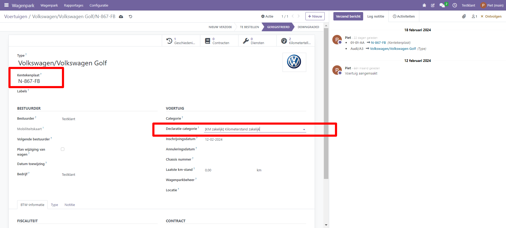
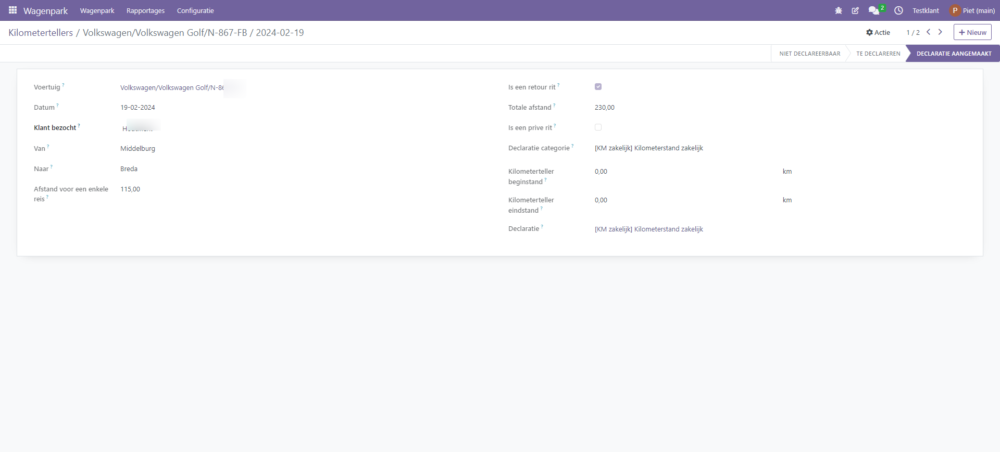
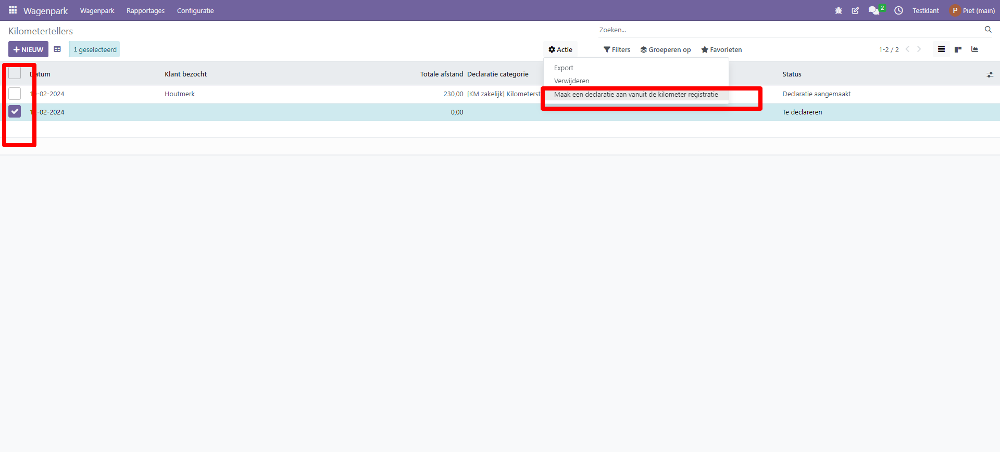

Kilometerregistratie
====================================================================

Deze module is een uitbreiding op de Wagenpark module en geeft de gebruiker de mogelijkheid om zakelijke ritten te registreren en te declareren. De module is gebaseerd op de Nederlandse belastingregels, maar kan ook worden gebruikt voor kilometerregistratie in het algemeen. In Nederland is het soms nodig om ook de privékilometers te registreren, vandaar dat we het (niet verplichte) veld 'Is privérit' hebben toegevoegd. Deze module verbindt de wagenparkmodule met de onkostenmodule.

Op de website van de belastingdienst vind je meer informatie over de wettelijke richtlijnen, zie hiervoor

https://www.belastingdienst.nl/wps/wcm/connect/bldcontentnl/belastingdienst/zakelijk/winst/inkomstenbelasting/inkomstenbelasting_voor_ondernemers/privegebruik_auto/rittenregistratie

Voorbereidingen
---------------------------------------------------------------------------------------------------
Om met de module te kunnen werken dien je de volgende zaken in te richten:

- Via Menu > Werknemers maak je een werknemer aan en koppel je je gebruikersaccount (tab Personeelsbeheer instellingen) aan de werknemer. 

- Om de geregistreerde kilometers te kunnen declareren, ga naar Menu > Declaraties > Configuratie > Declaratiecategorieën. In de onkostencategorie Kilometerstand (of maak een nieuwe categorie aan) moet het selectievakje ‘Kan gebruikt worden in de wagenpark module’ aangevinkt staan en bij **FACTURATIE** de optie ‘Verkoopprijs’ geselecteerd worden. Bij **BOEKHOUDING** is het ook mogelijk om een specifieke kostenrekening (grootboek) of analytisch account (kostenplaats) toe te voegen. Bij **ALGEMENE INFORMATIE** kun je ook de kilometervergoeding (Verkoopprijs) ingeven en kiezen voor de maateenheid km (kilometer) of mi (miles).

- Bij Menu > Wagenpark dien je een auto aan te maken. Merk en Kentekenplaat zijn verplichte velden. Ook kan de standaard onkostencategorie worden toegevoegd (Declaratie categorie), dit vereenvoudigt de invoer van je kilometer registratie.

Invulscherm kilometerregistratie
---------------------------------------------------------------------------------------------------

We hebben nieuwe velden toegevoegd aan het menu 'Kilometerregistratie'.

- **Contact**. Vul hier de klantnaam in van je bezoek. Je ziet in de dropdown lijst je bestaande klanten staan, maar je kunt ook vanaf deze plek direct een nieuwe klant aanmaken. Dit is geen verplicht veld.

- **Van**. Vul hier het vertrekpunt van je rit in.

- **Naar**. Vul hier de bestemming van je rit in.

- **Enkele reis**. Vul hier de afstand van de enkele reis in.

- **Is een retourrit?** Vink dit veld aan als je een heen- en een terugreis wil registreren.

- **Totale km-rit**. Als het veld 'is een retourrit' niet is aangekruist dan zie je de waarde van 'enkele reis', anders verdubbelt Curq de enkele reis waarde.

- **Totaal km's**. Dit is een berekend veld van het totaal aantal kilometers van de rit.

- **Is een prive rit?**. Vink dit veld aleen aan als het een niet-zakelijke rit betreft. Prive rit regels krijgen een niet-declarabele status en kun je niet doorbelasten. De belastingdienst zegt hierover het volgende:

*Als uw rittenregistratie niet voldoet aan deze eisen of als u geen rittenregistratie hebt bijgehouden, dan moet u de bijtelling privégebruik auto verrekenen met de autokosten van uw onderneming. Kunt u echter op een andere manier aantonen dat u op jaarbasis niet meer dan 500 kilometer privé hebt gereden, dan hoeft u niets te verrekenen.*

- **Onkostencategorie**. De waarde wordt overgenomen van de auto, je kan deze overschrijven als je meerdere categorieeen gebruikt.

- **kilometerstand start**. Vul hier de kilometerstand in bij aanvang van de rit. Dit is geen verplicht veld.

- **kilometerstand einde**, Vul hier de kilometerstand in bij einde van de rit. Dit is geen verplicht veld.

Invoerscherm kilometer registratie

Kilometers doorbelasten
---------------------------------------------------------------------------------------------------

Via Menu > Wagenpark > Wagenpark > Kilometertellers kun je vanuit de lijstweergave de regels doorbelasten die de status ‘Te declareren’ hebben. Je selecteert deze regels, en declareert ze vervolgens via de actieknop. De status van de kilometer regels verandert vervolgens naar ‘Gedeclareerd’. Als het veld status in de lijstweergave staat dan zie je aangepaste status staan.

